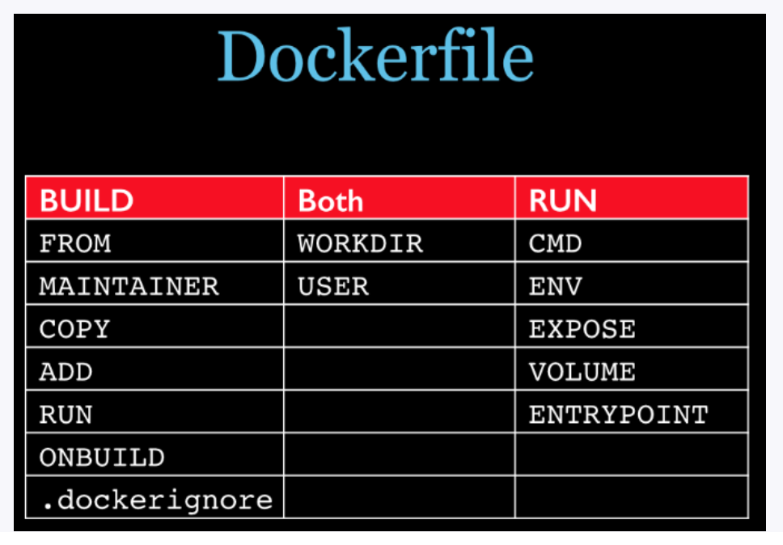

# 是什么

Dockerfile用来构建Docker镜像的构建文件，由一系列命令和参数构成的脚本

- 构建三步骤
  1. 编写Dockerfile文件
  2. docker build
  3. docker run

# Docker基础内容

- 每一条保留字命令必须是大写字母，并且后面至少一个参数
- 指令从上到下依次执行
- \# 表示注释
- 每一条指令都会创建一个新的镜像层，并对镜像进行提交

# Docker执行Dockerfile的大致流程

1. docker从基础镜像中运行一个容器
2. 执行一条指令对容器进行修改
3. 执行类似docker commit的操作提交一个新的镜像层
4. docker再基于刚提交的镜像运行一个新的容器
5. 执行dockerfile中下一挑指令知道所有的指令都执行完成

# Docker保留指令

- FROM 当前镜像是基于哪个基础镜像
- MAINTAINER 镜像维护者的行命和电子邮件
- RUN 镜像构建时需要运行的命令
- EXPOSE 当前容器对外暴露的端口
- WORKDIR 容器创建后，终端默认登录进来的工作目录
- ENV 容器创建中设置的环境变量
- ADD 将宿主计算机目录中的文件拷贝进镜像且自动解压缩
- COPY 将宿主计算机目录中的文件拷贝进镜像
- VOLUME 创建容器数据卷
- CMD 指定一个容器启动时需要执行的命令， 多个CMD指令只会执行最后一个
- ENTRYPOINT 指定一个容器启动时需要执行的命令，追加
- ONBUILD 当构建一个被继承的Dockerfile运行命令，父镜像在被子镜像继承后，父镜像的onbuild被触发。

