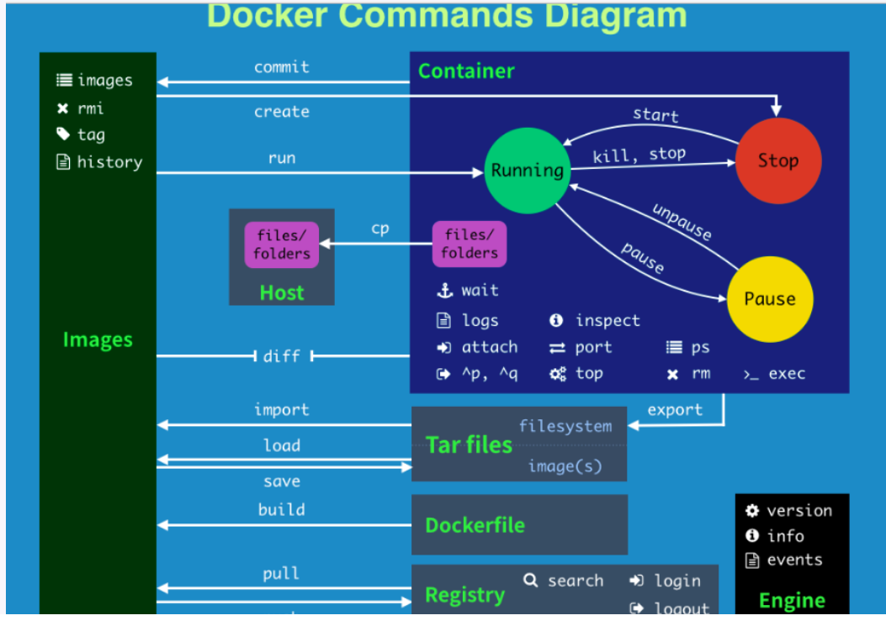

# 帮助命令

- ``docker version``
- ``docker info``
- ``docker --help``

# 镜像命令

- ``docker images [OPTIONS]``
  - 列出本地主机上的镜像
  - OPTIONS:
    - -a：列出本地所有的镜像（包含中间映像层）
    - -q：只显示镜像ID
    - --digest：显示镜像的摘要信息（sha256）
    - --no-trunc：显示完整的镜像ID信息
- ``docker seach [OPTIONS] 镜像名``
  - 在网站https://hub.docker.com进行查找
  - OPTIONS:
    - --no-trunc：显示完整的镜像描述
    - -s：列出收藏数不小于指定值的镜像
    - --automated：列出automated build类型的镜像
- ``docker pull 镜像[:TAG]``
  - 下载某个版本的镜像，默认是latest
- ``docker rmi 镜像名[:TAG]``
  - 删除镜像
  - ``docker rmi -f 镜像名`` 强制删除镜像
  - ``docker rmi -f 镜像名 镜像名 ...`` 删除多个镜像
  - ``docker rmi -f $(docker images -qa)`` 删除所有镜像

# 容器命令

- ``docker run [OPTIONS] 镜像名[:TAG] [COMMAND] [ARGS]``
  - OPTIONS:
    - --name="容器名字"：为容器制定一个名称
    - -d：后台运行容器，并返回容器的ID，也就是启动守护式容器
    - -i：以交互模式运行容器，通常与-t同时使用
    - -t：为容器重新分配一个伪输入终端，通常与 -i 同时使用；
    - -P：随机端口映射
    - -p：制定端口映射，有四种格式
      - ip:hostPort:containerPort
      - ip::containerPort
      - hostPort:containerPort
- ``docker ps [OPTIONS]``
  - OPTIONS说明：
    - -a：列出所有容器，包括正在运行的+历史上运行过并且已经停止的容器
    - -l：latest显示最近创建的容器
    - -n：显示最近n个创建的容器
    - -q：静默模式，只显示容器ID
    - --no-trunc：不截断输出
- 在交互模式中退出容器
  - ``exit`` 停止并退出容器
  - ``Ctrl+P+Q`` 不停止容器，退出容器
- ``docker start 容器ID或者容器名``
- ``docker restart 容器ID或者容器名``
- ``docker stop 容器ID或者容器名``
- ``docker kill 容器ID或者容器名``
- ``docker rm 容器ID`` 
  - 强制删除：正在run的容器先停止，然后删除
  - ``docker rm -f $(docker ps -aq)`` 删除所有容器
  - ``docker ps -aq | xargs docker rm -f`` 同上

## 启动守护式容器

- ``docker run -d 镜像名``
  - 然后docker ps -a 进行查看, 会发现容器已经退出。很重要的要说明的一点: Docker容器后台运行,就必须有一个前台进程.
  - 容器运行的命令如果不是那些一直挂起的命令（比如运行top，tail），就是会自动退出的。
  - 这个是docker的机制问题。nginx为后台进程模式运行,就导致docker前台没有运行的应用, 这样的容器后台启动后,会立即自杀因为他觉得他没事可做了.
  - 最佳的解决方案是,将你要运行的程序以前台进程的形式运行
- ``docker logs -f -t --tail 容器ID`` 查看容器日志
  - -t：加入时间戳
  - -f：跟随最新的日志打印
  - --tail：一开始显示的日志数量。
- ``docker top 容器ID`` 查看容器内运行的进程
- ``docker inspect 容器ID`` 查看容器的内部细节
- 进入正在运行的容器的以命令行交互
  - ``docker exec -it 容器ID  /bin/bash``
  - ``docker attach 容器ID``
  -   
- ``docker cp 容器ID:路径 主机路径`` 将内容从容器拷贝到主机上

# 总结

- attach   Attach to a running container         # 当前 shell 下 attach 连接指定运行镜像

- build   Build an image from a Dockerfile        # 通过 Dockerfile 定制镜像

- commit   Create a new image from a container changes  # 提交当前容器为新的镜像

- cp     Copy files/folders from the containers filesystem to the host path  #从容器中拷贝指定文件或者目录到宿主机中

- create   Create a new container             # 创建一个新的容器，同 run，但不启动容器

- diff    Inspect changes on a container's filesystem  # 查看 docker 容器变化

- events   Get real time events from the server      # 从 docker 服务获取容器实时事件

- exec    Run a command in an existing container     # 在已存在的容器上运行命令

- export   Stream the contents of a container as a tar archive  # 导出容器的内容流作为一个 tar 归档文件[对应 import ]

- history  Show the history of an image          # 展示一个镜像形成历史

- images   List images                  # 列出系统当前镜像

- import   Create a new filesystem image from the contents of a tarball # 从tar包中的内容创建一个新的文件系统映像[对应export]

- info    Display system-wide information        # 显示系统相关信息

- inspect  Return low-level information on a container  # 查看容器详细信息

- kill    Kill a running container            # kill 指定 docker 容器

- load    Load an image from a tar archive        # 从一个 tar 包中加载一个镜像[对应 save]

- login   Register or Login to the docker registry server   # 注册或者登陆一个 docker 源服务器

- logout   Log out from a Docker registry server      # 从当前 Docker registry 退出

- logs    Fetch the logs of a container         # 输出当前容器日志信息

- port    Lookup the public-facing port which is NAT-ed to PRIVATE_PORT   # 查看映射端口对应的容器内部源端口

- pause   Pause all processes within a container     # 暂停容器

- ps     List containers                # 列出容器列表

- pull    Pull an image or a repository from the docker registry server  # 从docker镜像源服务器拉取指定镜像或者库镜像

- push    Push an image or a repository to the docker registry server   # 推送指定镜像或者库镜像至docker源服务器

- restart  Restart a running container          # 重启运行的容器

- rm     Remove one or more containers         # 移除一个或者多个容器

- rmi    Remove one or more images       # 移除一个或多个镜像[无容器使用该镜像才可删除，否则需删除相关容器才可继续或 -f 强制删除]

- run    Run a command in a new container        # 创建一个新的容器并运行一个命令

- save    Save an image to a tar archive         # 保存一个镜像为一个 tar 包[对应 load]

- search   Search for an image on the Docker Hub     # 在 docker hub 中搜索镜像

- start   Start a stopped containers           # 启动容器

- stop    Stop a running containers           # 停止容器

- tag    Tag an image into a repository         # 给源中镜像打标签

- top    Lookup the running processes of a container  # 查看容器中运行的进程信息

- unpause  Unpause a paused container           # 取消暂停容器

- version  Show the docker version information      # 查看 docker 版本号

- wait    Block until a container stops, then print its exit code  # 截取容器停止时的退出状态值