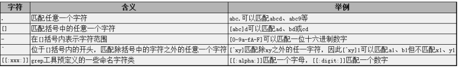
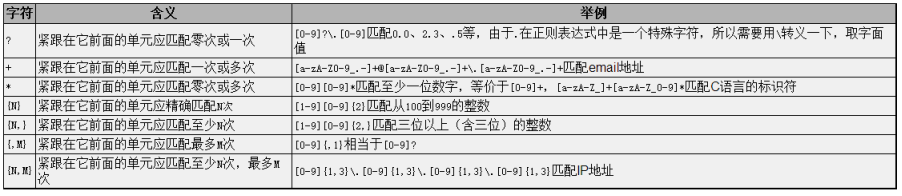
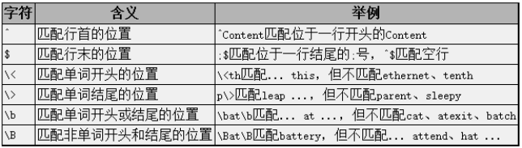
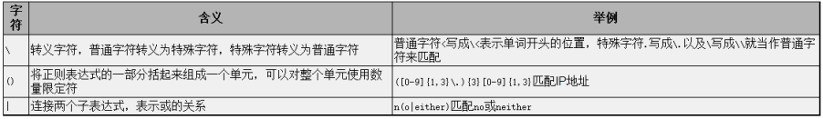

- egrep相当于grep -E，表示采用Extended正则表达式语法。grep的正则表达式有Basic和Extended两种规范，它们之间的区别下一节再解释。另外还有fgrep命令，相当于grep -F，表示只搜索固定字符串而不搜索正则表达式模式，不会按正则表达式的语法解释后面的参数。

- 注意正则表达式参数用**单引号**括起来了，因为正则表达式中用到的很多特殊字符在Shell中也有特殊含义（例如），只有用单引号括起来才能保证这些字符原封不动地传给grep命令，而不会被Shell解掉。

- 除了编程语言之外，很多UNIX命令和工具也都支持正则表达式，例如grep、vi、sed、awk、emacs等等。“正则表达式”就像“变量”一样，它是一个广泛的概念，而不是某一种工具或编程语言的性。

# 字符类

# 数量限定

# 位置限定

# 特殊字符

# Basic正则和Extended正则区别

以上介绍的是grep正则表达式的Extended规范，Basic规范也有这些语法，只是字符**?+{}|()应解释为普通字符**，要表示上述特殊含义则需要加\转义。如果用grep而不是egrep，并且不加-E参数，则应该遵照Basic规范来写正则表达式。

# 注意

注意grep找的是**包含**某一模式的行，而**不是完全匹配**某一模式的行。