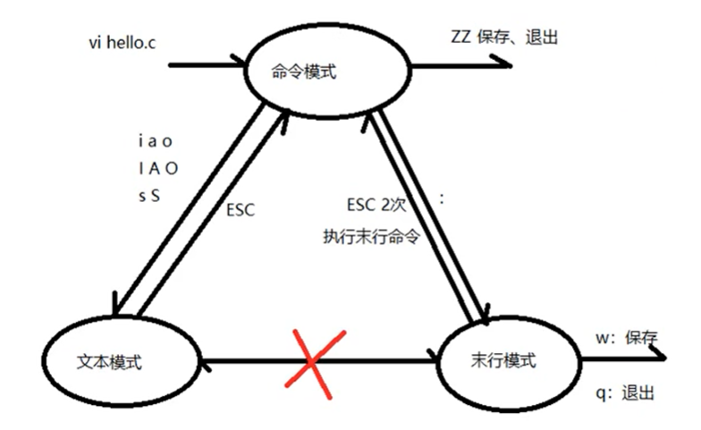

# Vim

## vim的三种模式，及其切换

- 命令模式
- 编辑模式
- 末行模式

## 基本操作

### 进入编辑模式

- i：在光标前插入
- I：在行首插入
- a：在光标后插入
- A：在行尾插入
- o：向下新开一行，在下一行插入
- O：向上新开一行，在上一行插入
- s：删除光标所在的字符，并进入编辑模式
- S：删除光标所在行，并进入编辑模式

### 命令模式下

#### 移动光标，模式不变

- h：前移1格
- j：上移一行
- k：下移一行
- l：后移一格
- nG：命令模式下，跳转到第n行
- ：n：**首行模式**下，跳转到第n行
- gg：跳转到文件开头
- G：跳转到文件结尾
- gg=G：命令模式下，程序代码进行格式缩进
- %：跳转至对应的大括号（各种括号）
- 0：光标到行首
- $：光标到行尾

#### 删除字符，模式不变（这里的删除，其实是剪切）

- x：删除光标所在字符
- X：删除光标所在行
- dw：删除一个单词，（光标应该放在单词第一个字符）
- d$或者D：删除光标到行尾
- d0：删除行首到光标
- r：使用光标选中字符，然后在命令模式下按下r，再按需要换成的字符
- V+d: 将光标移到需要删除的开始位置，按V，移动光标到需要删除的最后一个字符，按d
- dd：删除光标所在的行
- [n]dd：删除光标所在行的连续n行

#### 复制粘贴

- yy：复制一行
- p：粘贴到光标的下一行，向后粘贴
- P：粘贴到光标的上一行，向前粘贴
- [n]yy：复制光标所在行的连续n行
- V+y：先选中，然后复制

#### 查找

- /word（须要查找的内容）：向下查找，n：找下一个，N:找上一个
- ?word：向上查找
- 将光标置于单词的任意一个字符上，按*向下查找，按#向上查找

#### 撤销和反撤销

- u：撤销
- ctrl+r：反撤销

#### 跳转到函数的man page手册

- K：查看第一个匹配的man page
- nK：查看第n章的man page

#### 查看宏定义

- 将光标置于待查看的宏定义单词上，使用[+d查看定义语句

### 末行模式下

#### 替换

- 单行替换：:s /old/new 
- 所有替换：
  - 每一行第一个：:%s /old/new
  - 每一行每一个：:%s /old/new/g
- 指定行替换：
  - 每一行所有：:起始行号,终止行号s /old/new/g
  - 每一行第一个：:起始行号,终止行号s /old/new
- 分屏：
  - sp：上下分屏，可以加文件名
  - vsp：左右分屏，可以加文件名
  - q：退出当前分屏
  - qall：退出所有分屏
  - ctrl+w+w：在多个分屏中切换
  - 启动分屏：vim -on file1 file2：上下分屏
  - 启动分屏：vim -On file1 file2：左右分屏
- 末行模式下执行linux命令   :!命令

## Vim配置

- 针对全部用户的配置文件: /etc/vim/vimrc
- 针对特定用户的配置文件：~/.vimrc 优先级高

