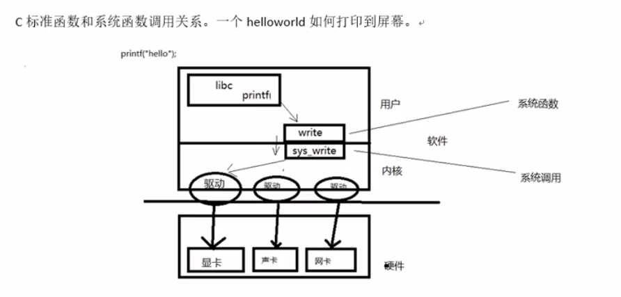
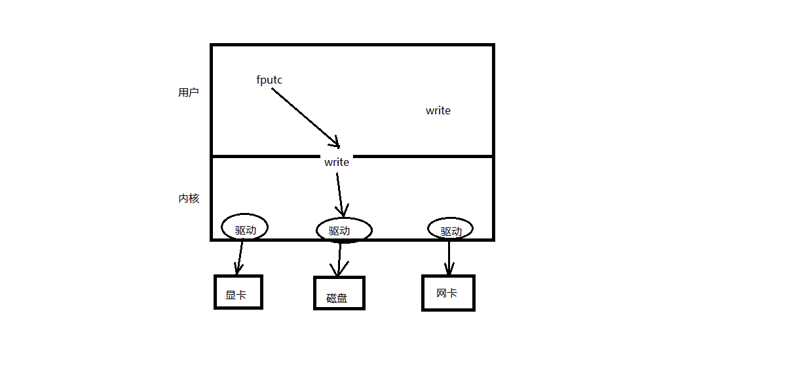
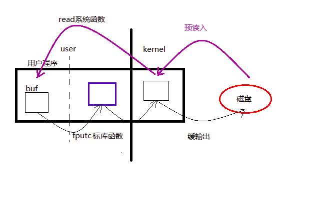
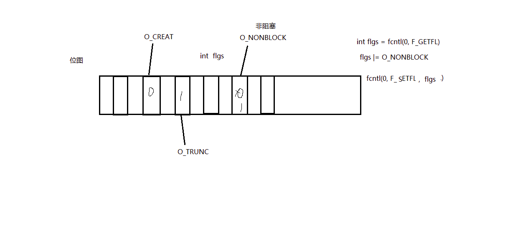
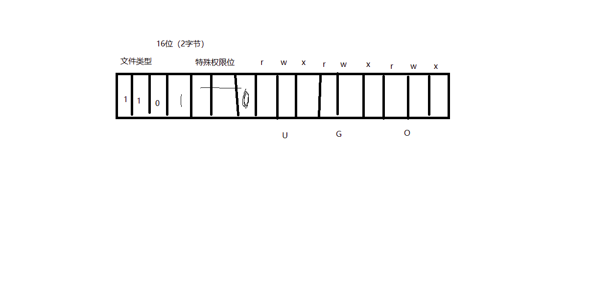
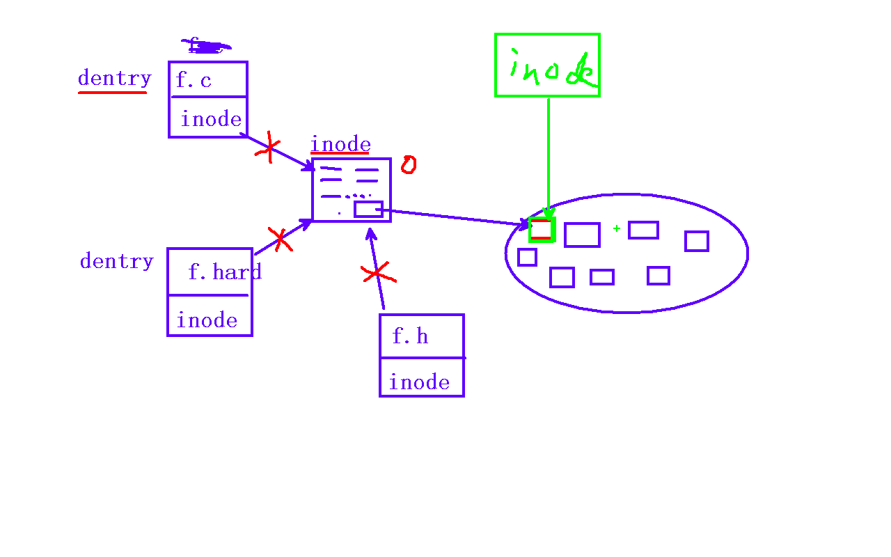

# 文件

## 系统调用

由操作系统实现并且提供给外部应用的编程接口。是应用程序和系统之间数据交互的桥梁



## 二进制文件和文本文件

- 物理上是一样的，只是逻辑上的区别。物理上，二进制文件和文本文件都是以二进制机器码存储的。

- 只不过文本文件通过编辑器使用特定的编码格式来解码。二进制文件使用特定的软件解码器等解码解析。

- 对于操作系统：Windows和Linux。Windows在写入二进制文件和文本文件的表现不同。WIndows写入文本文件时，会将\n隐式转换为\r\n然后再写入，读取的时候由隐式地将\r\n转换为\n。而Linux并不会转换。而对于二进制文件，Linux和windows都不会转化\n，而是直接写入或者读取。

## 系统函数（系统调用）

需要从用户态转换到内核态，这个过程比较耗时。所以标准库函数中含有缓冲区，调用标准库的输入输出函数读写，数据首先存放到标准库中的缓冲区中。



### open函数

```C
#include <unistd.h>
int open(char *pathname, int flags);
```

- 参数：
  - pathname：需要打开的文件的路径
  - flags：文件打开的方式
    - ``O_RDONLY|O_WRONLY|O_RDWR|O_CREAT|O_APPEND|O_TRUNC|O_EXCL|O_NONBLOCK ....``
    - 注意：O_APPEND是在文件尾部写入。每一次写入数据前，会将文件读写位置设置为文件的尾部，所以如果先lseek设置文件读写位置为其他地方，然后再写入数据时，其实lseek相当于没有起作用。还是在文件尾部进行写入。
- 返回值
  - 成功：返回一个非负整数，文件描述符，是当前可用的值最小的描述符，一共有1024个
  - 失败：返回-1，设置errno

```C
int open(char *pathname, int flags， mode_t mode)
```

- 参数
  - mode：当需要创建文件时，指定文件的权限。取值8进制数。
  - 最终文件的权限：mode & ~umask

### close函数

```C
int close(int fd);
```

### 错误处理函数

- ``printf("xxx error : %d", errno);``
- ``char* strerror(int errno);     printf("xxx error : %s", strerror(errno));``
- ``void perror(const char* s);     perror("xxx error"); `` 自动解析errno

### read函数

```C
ssize_t read(int fd, void *buf, size_t count);
```

- 参数
  - fd：文件描述符
  - buf：存数据的用户程序的缓冲区
  - count：缓冲区大小
- 返回值
  - 0：读到文件的结尾
  - \> 0: 成功读取的字节数量
  - -1：读取失败，并且设置errno
    - 1： 并且 errno = EAGIN 或 EWOULDBLOCK, 说明不是read失败，而是read在以非阻塞方式读一个设备文件（网络文件），并且文件无数据。

### write函数

```C
ssize_t write(int fd, const void *buf, size_t count)
```



### 文件描述符表

- 存在PCB中，实际PCB本质是一个结构体
- 文件描述符：0-1023；一共1024个（对该进程而言一共可以使用1024个）。
- 3个默认打开的文件描述符
  - 0 - STDIN_FILENO
  - 1 - STDOUT_FILENO
  - 2 - STDERR_FILENO

### 阻塞、非阻塞

- 是文件（设备文件，网络文件）的属性，而不是write、read的属性
- 产生阻塞的场景：设备文件，网络文件，常规文件通常没有阻塞概念
- /dev/tty 是终端文件
- ``open("/dev/tty", O_RDWR|O_NONBLOCK)	--- 设置 /dev/tty 非阻塞状态。(默认为阻塞状态)``

### fcnl函数

- 常用于设置fd的flags

```C
	int (int fd, int cmd, ...)

	int flgs = fcntl(fd,  F_GETFL);

	flgs |= O_NONBLOCK

	fcntl(fd,  F_SETFL, flgs);

	获取文件状态： F_GETFL

	设置文件状态： F_SETFL
```



### lseek函数

```C
off_t lseek(int fd, off_t offset, int whence);
```

- 参数：

  - fd：文件描述符
  - offset：偏移量
  - whence：起始偏移位置
    - SEEK_SET
    - SEEK_CUR
    - SEEK_END

- 返回值：

  - 失败：-1，设置errno
  - 成功：返回较文件起始位置的偏移量

- 应用场景

  - 设置文件读写位置

  - 文件的读和写使用同一个文件读写位置

  - 使用lseek扩展文件的大小，但是想要真正扩展，需要引起IO操作

    ```C
    lseek(fd, 100, SEEK_END); // 系统用\0天填充
    write(fd, "\0", 1);
    ```

  - 使用 truncate 函数，直接拓展文件。	int ret = truncate("dict.cp", 250);

### 传入传出参数

- 传入参数
  - 指针作为函数参数。
  - 通常有const关键字修饰。
  -  指针指向有效区域， 在函数内部做读操作。
- 传出参数
  - 指针作为函数参数。
  - 在函数调用之前，指针指向的空间可以无意义，但必须有效。
  - 在函数内部，做写操作。
  - 函数调用结束后，充当函数返回值。
- 传入传出参数
  - 指针作为函数参数。
  - 在函数调用之前，指针指向的空间有实际意义。
  - 在函数内部，先做读操作，后做写操作。
  - 函数调用结束后，充当函数返回值。

### stat、lstat函数

```C
int stat(const char *path, struct stat *buf);
```

- 实际读取的是inode的信息，inode本质是一个结构体。
- 参数：
  - path：文件路径
  - buf：传出参数，存放文件属性
- 返回值：
  - 成功：0
  - 失败：-1，设置errno
- 获取文件的大小``buf.st_size``
- 获取文件的权限或者文件的类型``buf.st_mode``



### link、unlink函数

### 隐式回收

### 目录操作函数

- C标准库函数

- 打开目录 ``DIR * opendir(char *name);``
- 关闭目录 ``int closedir(DIR *dp);``
- 读取目录，每次读取一个目录项

```C
struct dirent *readdir(DIR * dp);  #include<dirent.h>

		struct dirent {

			inode

			char dname[256];
		}
```



目录项本质是一个结构体

strace命令可以知道程序运行过程中执行的系统函数。


## 重定向

- dup

```C
int dup(int oldfd)    
```

返回一个最小的未被使用的文件描述符。这个描述符和oldfd指向的是同一个打开文件表项，所以未见读写位置和文件status flags是一致的。

- dup2

```C
int dup2(int oldfd, int newfd);
```

如果newfd已经被打开，那么newfd会被隐式地关闭，然后newfd和oldfd指向同一个打开文件表项。

如果oldfd有效而且等于newfd，那么直接返回newfd

如果oldfd无效，那么dup2调用失败，newfd并不会被close

- fcntl

```C
int fcntl(int fd, int cmd, ...);
int fcntl(int fd, F_DUPDF, n);
```

返回值：出错：-1

​				  成功：返回一个大于等于n的未使用的文件描述符