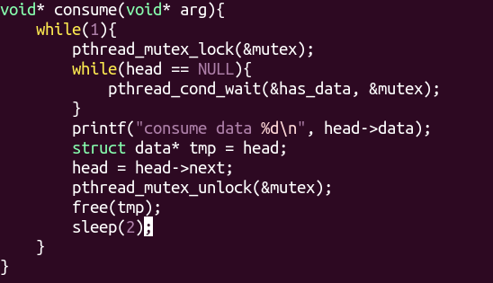

# 线程概念

- 进程：有独立的进程地址空间，有独立的PCB，是资源分配的最小单位。

- 线程：有独立的PCB，没有独立的进程地址空间，是和同一个进程的多个线程共享进程地址空间。是CPU调度的最小最小单位。
- ``ps -Lf 进程号``可以查看某个进程的所有线程，其中LWP（轻量级进程）是线程号，与线程id不一样。线程号是用于CPU调度的，线程id是用于辨识同一个进程的不同线程的，线程id比较长。


# 线程共享与独有

- 独享 内核栈，用户栈，阻塞信号集（信号屏蔽字）不共享，但是创建的新线程会继承主线程的信号屏蔽字。并且新线程的未决信号集清空。（有多份）
- 共享代码段，全局变量，堆（只有一份）
- 每个线程都有本地的errno，多份拷贝，线程安全
- 共享文件描述符表（一份）
- 共享未决信号集
- 共享信号处理函数（只有一份）


# 线程控制原语

## 获取线程id

线程id是用于在进程内部表示线程身份的。

```C
pthread_t pthread_self(void); // 返回自身的线程id，函数调用总会成功
```

## 检查出错返回

```C
fprintf(stderr, "xxx error : %s\n", strerror(ret));
```

pthread函数库中的函数调用出错并不会返回-1，而是直接返回错误号，并且不会设置errno。

## 创建线程

```C
int pthread_create(pthread_t* tid, const pthread_attr_t* attr, void*(*start_rountn(void*)), void* arg);
```

- 参数
  - tid：传出参数，表示新创建的线程的id
  - attr：线程的属性，使用NULL来表示使用默认属性。
  - start_rountn：函数指针，表示如果线程创建成功后，该函数会被调用。
  - arg：作为函数的参数，没有参数传NULL
- 返回值：
  - 成功：0
  - 失败：错误号，并不会设置errno

## 退出当前线程

```C
void pthread_exit(void* retval);
```

- retval：返回值，没有时传NULL。
- exit()，退出进程
- return，返回函数的调用点。主线程return，会退出进程。


## 阻塞回收线程

当该线程是结合的（非分离的），才能被回收。但是可以使用pthread_join来阻塞等待这个分离的线程终止，只不过不会回收这个分离的线程，并且这个函数返回错误号：无效的参数

```C
int pthread_join(pthread_t tid, void** retval);
```

- tid:需要回收的线程id
- retval：线程的返回值，当线程异常终止时，他的返回值是(void*)-1
- 返回值：成功0；失败：错误号

## 设置线程分离

```C
int pthread_detach(pthread_t tid);
```

线程为结合的，那么别的线程可以终止或者回收这个线程。当这个线程设置为分离的时候，别的线程不能杀死回收这个线程。分离的线程终止后的回收工作由系统来完成。pthread_join可以阻塞等待目标的分离的线程终止，但是并不能回收这个线程。

## 杀死线程

```0- C
int pthread_cancel(pthread_t tid);
```

- 真正想通过这个函数杀死线程，需要这个函数被调用功能后，被杀的线程会系统调用进入内核态，完成系统调用后，这个线程才会终止。如果这个函数被调用后，目标的线程并没有机会进入内核，那么这个线程就不可能被杀死。所以需要在目标线程中设置保存点/取消点pthread_testcancel(),实际上这个函数会进入内核态。
- 目标线程只要能被取消，立刻返回0，而不是等目标的线程真正终止这个函数才返回。
- 成功调用pthread_cancel()杀死目标线程后，还需要pthread_join来回收这个线程，这个目标线程的退出值为-1

## 线程和进程的控制原语对比


# 线程的属性

在创建线程时，制定线程的属性。

```C
pthread_attr_t attr;
// 初始化线程属性
pthread_attr_init(&attr); 
// 设置线程属性为分离
pthread_attr_setdetachstate(&attr, PTHREAD_CREATE_DETACHED);
// 创建线程时，指定属性
pthread_create(&tid, &attr, func, arg);
// 销毁线程的属性，创建好线程后可以调用
pthread_destroy(&attr); // attr传出参数
```


# 是否共享标准库IO缓冲区

- 对于父子进程来说，由于用户空间的独立的，而且标准库IO缓冲区是在用户空间上的，所以每个进程都有其独立的标准库IO缓冲区。
- 由于stdin和stdout是全局变量，那么多个线程共享全局变量，所以多个线程用的标准库IO缓冲区是一样。也就是多个线程共享标准库IO缓冲区。


# 线程同步

协同步调，对共享数据或者资源有序互斥的访问。防止数据不一致，产生 和时间有关的错误。

## 锁的使用

是建议锁，不是强制加的，是程序员按照实际需要使用，堆共享数据访问进行保护。任意线程应该在访问共享数据之前，先拿到相应的锁。但是是否加锁不具有强制性。

## 使用mutex互斥量

- 步骤：

1. 创建锁：``pthread_mutex_t lock;``
2. 初始化锁：
   - 动态初始化``pthread_mutex_init(&lock, NULL)``
   - 静态初始化``lock = PTHREAD_MUTEX_INITIALIZER;``
3. 加锁：``pthread_mutex_lock(&lock);``
4. 访问共享数据（临界区）
5. 解锁：``pthread_mutex_unlock(&lock);``
6. 销毁锁：``pthread_mutex_destroy(&lock);``

- 注意事项
  - 在不影响正确性的情况下，加锁的范围应该越小越好。
  - 互斥锁本质是一个结构体，但可以看成是一个整数，初始值为1.
  - 加锁相当于-1，；释放锁+1，唤醒被阻塞的线程
  - try锁：尝试加锁，成功--。失败返回错误号EBUSY
  - restrict关键字：用来限定指针变量，被该关键字限定的指针变量所指向的内存操作，必须由本指针来完成。

## 死锁

对锁使用不恰当导致的现象。

1. 同一个线程对同一个锁反复lock
2. 不同的线程各自持有一把锁，并且请求对方的锁。


## 读写锁

- 锁只有一把。以读方式给数据加锁----读锁。以写方式给数据加锁----写锁。
- 读共享，写独占。
- 写锁比读锁优先级高（1.否则，写操作可能会饥饿；2.读数据应该读最新的数据，所以给写优先）

- 相对互斥量来说，当读线程较多时，能够提高访问效率
- 过程：
- 

## 条件变量

用于同步。本身不是锁，但是要结合锁来使用mutex。

- 初始化条件变量


- 阻塞等待条件满足的信号（消息）

```C
pthread_cond_wait(&cond, &mutex);
```

作用：

1. 阻塞等待条件满足的消息
2. 解锁已经成功加锁的信号量。
3. 当收到条件满足的消息时，重新加锁，函数返回。

- 注意事项
  - pthread_cond_signal(): 唤醒阻塞在条件变量上的 (至少)一个线程。
  - pthread_cond_boardcase();唤醒阻塞在条件变量的 所有 线程
  - ``pthread_cond_wait`` 不能自己检测条件是否满足，而是要靠``pthread_cond_signal``来通知被前面这个函数阻塞的线程。所以在``pthread_cond_signal``被调用前，``pthread_cond_wait``被调用；或者``pthead_cond_signal``被调用后，另一个线程能够判断是否满足条件。eg. while(head == NULL)就是判断是否真正满足条件。



	## 信号量

应用于线程、进程的同步

相当于初始值为 N 的互斥量。 N 表示同时访问共享数据区的线程的数量。

```C
#include <semaphore.h>
sem_t sem; // 定义信号量
int sem_init(sem_t* sem, int pshared, unsigned int value);
// sem：信号量
//pshared：为0，用于同一个进程的不同线程同步。非0：用于进程的同步。
//value:初始值
sem_destroy(&sem);
sem_wait(&sem); //P操作。 一次调用，做一次--操作。当信号量的值为 0 时，再次 -- 就会阻塞
sem_post(&sem); //V操作。一次调用，做一次++ 操作. 当信号量的值为 N 时, 再次 ++ 就会阻塞。
```

- 注意事项

在缓冲区有限的单个生产者和单个消费者问题上，对缓冲区不用加锁。虽然生产者和消费者访问同一个缓冲区，但是从更小的粒度来看，生产者和消费者访问的是同一个缓冲区的不同位置，所以不需要互斥访问缓冲区。