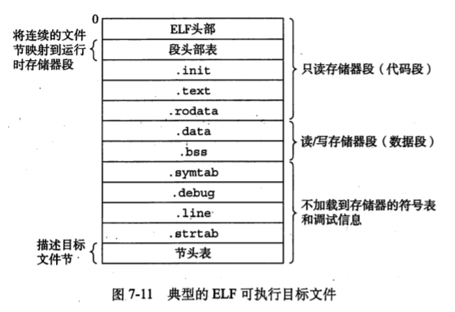

# 编译和链接

## GCC编译步骤

- 预处理：展开宏，头文件，替换条件编译，删除注释，空行和空白。 **gcc -E**    .i文件
- 编译：语法语义的检查，产生汇编文件   **gcc -S** 消耗时间和系统资源最多   .s文件
- 汇编：将汇编语言翻译为机器指令 **gcc -c**   .o文件
- 链接：数据段合并，地址回填

## GCC常用参数

- -I参数 : 	指定头文件所在的位置
- -c参数：   只做预处理，编译和汇编
- -g参数：   编译时添加编译信息，使得可以被调试
- -On参数：n=0-3，默认为2，n越大优化越多
- -Wall参数：显式所有的警告信息
- -D 宏名：      在编译时，注册宏定义

## 静态库和动态库（共享库）

### 目标文件的形式

- 可执行文件，可以执行运行的二进制文件
- 可重定位目标文件，包含了二进制的代码和数据，可以和其他可重定位目标文件合并，并创建出一个可执行文件
- 共享目标文件。一种在加载或者运行时进行链接的特殊可重定位目标文件。

### 静态库和动态库（共享库）

- 库中的不是源代码，而是目标文件

- 动态库：库文件并不会加入可执行文件。动态库可以被不同的可执行i文件共享。
  - 空间开销小，但是调用时间开销大。
  - 动态库和静态库类似，但是它并不在链接时将需要的二进制代码都“拷贝”到可执行文件中，而是仅仅“拷贝”一些重定位和符号表信息，这些信息可以在程序运行时完成真正的链接过程。linux中通常以.so（shared object）作为后缀。
- 静态库：库文件和源文件一起进行编译，得到的可执行文件就包含了库文件。
  - 空间开销大，但是调用时间开销小。
  - 将可重定位的目标文件以一种特殊的方式打包成一个单独的文件，并且在链接生成可执行文件时，从这个单独的文件中“拷贝”它自己**需要的内容**到最终的可执行文件中。这个单独的文件，称为静态库。linux中通常以.a(archive)为后缀

### 静态库的制作

1. 首先将源代码编译为目标文件
2. ``ar rcs libxxx.a xx1.o xx2.o`` 
   1. ``ar``将目标文件归档
   2. ``r``替代库中现有的文件或者插入新的文件
   3. ``v``输出详细信息
   4. ``s``写入一个目标文件索引到库中，或者更新一个存在的目标文件索引。
3. 库的使用
   1. 在编译时 ``gcc  xx.c libxxx.a -o xxx.out``，注意源码在前，库在后，可以使用``-L``参数指定库所在的路径，使用``-l``参数指定库名
   2. ``-static``参数告诉编译程序，链接器应该构建一个完全链接的可执行目标文件。(完全静态库)

### 静态库的头文件对应

- 如果编译器遇到一个函数函数时，之前并没有函数的定义和声明，那么编译器隐式对函数进行声明。

- 写一个和静态库相关的头文件，头文件对静态库中的函数进行声明。

### 动态库的制作

动态库在执行或者加载时才链接。

1. -c产生.o文件，生成一个与位置无关的代码（**PIC**）

   ​	``gcc -c xx.c -o xx.o -fPIC``

2. 使用gcc -shared 制作动态库

   ``gcc -shared -o lib库名.so xx1.o xx2.o``

3. 编译使用动态库

   ``gcc xx.c -o xx.out -l库名 -I 头文件路径 -L 动态库路径``

4. 注意定义相应的头文件

   - 头文件守卫，防止同一个头文件被多次include

5. 执行可执行程序时出错：

   

   原因：

   ​		链接器：只是链接阶段，工作时需要-l和-L

   ​		动态链接器：工作于程序运行阶段，工作时需要提供动态库所在目录位置

   解决：通过修改环境变量

   ``LD_LIBRARY_PATH``环境变量用于在***程序加载运行期间***查找动态链接库时指定除了系统默认路径之外的其他路径，注意，``LD_LIBRARY_PATH``中指定的路径会在系统默认路径之前进行查找。

   方法1，2适合在终端上运行的程序，3不推荐，4推荐。

   - 临时修改（只在当前终端有效），运行时设置的环境变量是属于该进程的，并不影响其他进程
     - ``export LD_LIBRARY_PATH=动态库路径`` 
     - ``.xx.out``
   - 永久修改（所有终端有效）
     - ``vi ~/.bashrc``
     - 写入``export LD_LIBRARY_PATH=动态库路径`` 保存
     - ``. .bashrc``或者``source .bashrc`` 或者重启终端，让修改后的.bashrc生效
     - ``.xx.out``运行成功
   - 拷贝自定义的动态库到C的库中``/lib/``
   - 配置文件
     1. ``sudo vi /etc/ld.so.conf``
     2. 写入 动态库的绝对路径 保存
     3. ``sudo ldconfig -v`` 使得配置文件生效,更新/etc/ld.so.cache文件，更新内存中的内容。
     4. ``./xx.out``运行 （使用``ldd xx.out``查看需要动态库及其所在目录）

   总结：系统默认搜索/lib和 /usr/lib，在其他路径下的库文件就需在这些文件中指定。或者，还有个方法，就是设置LD_LIBRARY_PATH环境变量，添加其他路径。

### 注意事项

- 动态库是否加载到内存，取决于程序是否被运行。
- 动态库加载的位置不固定。
- 当静态库和动态库共存时，优先动态库。

## 链接

### 静态链接

链接器有两个主要的任务

- 符号解析，将符号的引用和符号的定义联系起来。
- 重定位，编译器和汇编器生成从地址0开始的代码和数据节，链接器将符号的定义和存储器位置联系起来，然后修改符号的引用指向之歌存储器位置。

### 目标文件的分类

- 可重定向目标文件，由编译器和汇编器产生
- 可执行目标文件，由链接器产生
- 共享目标文件

### 可重定位目标文件

可重定位的目标文件的格式

- ELF文件头：以16字节的序列开始，描述了字的大小，字节序。剩下的部分包含了帮助链接器语法分析和解释目标文件的信息，包括ELF头大小，目标文件的类型，机器类型，节头部表的文件偏移，节头部表中条目的大小和数量。
- .text 已编译程序的机器代码
- .rodata 只读数据
- .data 已初始化的全局变量
- .bss 未初始化的全局变量，这个节不占实际的空间，仅仅是一个占位符。目标文件区分初始化和未初始化变量是为了空间效率，目标文件中，未初始化的全局变量不需要占据实际的磁盘空间。
- .symtab 符号表，存放在程序中定义和引用的函数和**全局变量**的信息。不包含局部变量信息。
- .rel .data 被模块引用或定义的任何全局变量的重定位信息。
- .rel .text 一个.text节中位置的列表，当链接其把这个目标文件和其他文件结合时，需要修改这些位置。调用外部函数或者引用全局变量的指令都需要修改。
- .debug 调试符号表，条目是程序中定义的局部变量和类型定义，程序中定义和引用的全局变量以及原始的C源文件
- .line 保存了原始代码中的行号和.text中机器指令之间的映射。
- .strtab 字符串表，内容包括了.symtab和.debug节中的符号表，以及节头部中节的名字

### 内核空间和用户空间

对 32 位操作系统而言，它的寻址空间（虚拟地址空间，或叫线性地址空间）为 4G（2的32次方）。也就是说一个进程的最大地址空间为 4G。针对 Linux 操作系统而言，最高的 1G 字节(从虚拟地址 0xC0000000 到 0xFFFFFFFF)由内核使用，称为内核空间。而较低的 3G 字节(从虚拟地址 0x00000000 到 0xBFFFFFFF)由各个进程使用，称为用户空间。**内核空间是被所有的进程所共享的**。这些空间都对应于虚拟空间。

**数据段（静态存储区）：**

　　包括BSS段（Block Started by Symbol）的数据段。BSS段存储未初始化或初始化为0的全局变量、静态变量，具体体现为一个占位符，并不给该段的数据分配空间，只是记录数据所需空间的大小。数据段存储经过初始化的全局和静态变量。

### 符号和符号表

符号分类：对于模块m，符号，包括变量和函数。

- 由模块m定义，可以被其他模块引用的符号**全局符号**。
- 模块m引用，在别的模块定义的符号**外部符号**
- 由模块m定义，只能在本模块中引用**本地符号**

符号表由汇编器构造，使用的符号是编译器输出的汇编文件中的符号。

#### 符号表条目

- name：字符串表中字节偏移，指向符号的以null结尾的字符串名字。
- value：距离定义目标的**节的起始位置**的偏移
- size：目标的大小，以字节为单位
- type：指定符号的类型，是数据还是函数等。
- binding：表示符号是本地的还是全局的。
- reserved：保留字段
- section：指明和哪个节相关联。有三个特殊的伪节，因为这个符号在节头部表中没有条目：
  - ABS：绝对的虚拟地址，不能被重定向。
  - UNDEF：被引用，但是没有被定义的。
  - COMMON：未初始化的全局。

#### 符号解析

链接器解析符号引用的方法就是将每一个引用和可重定位目标文件的符号表中的一个确定的符号定义联系起来。当编译器遇到一个在当前模块中引用但是不在当前模块中定义的符号时，会假定这个符号在其他文件中定义，编译器负责生成一个符号表，交给链接器处理。链接器在其他模块中找不到这个被引用的符号的定义，就会输出错误信息并终止。

##### 链接器如何解析多重定义的全局符号

强符号：函数和被初始化的全局变量；弱符号：未被初始化的全局变量。

- 规则1：不允许有多个相同名字的强符号。
- 规则2：如果有一个强符号和多个弱符号，那么选择强符号。
- 规则3：如果有多个弱符号，那么从这些弱符号中任意选择一个。

##### 与静态库的链接

链接时，会判定引用了哪一个，然后将被引用的部分拷贝到可执行文件中。没有被引用的部分不会被拷贝到可执行文件中。

##### 链接器如何使用静态库来解析引用

库和目标文件的顺序非常关键，一般将库放在命令行的结尾。如果库之间不是相互独立的，那么需要对他们进行排序。

### 重定位

两步组成：

- 重定位节和符号定义：将所有相同类型的节合并为同一类类型的聚合节。然后将运行时存储器地址赋给新的聚合节，赋给输入模块定义的每个节，赋给输入模块定义的每一个符号。
- 重定位节中的符号引用：链接器修改代码中对每个符号引用，使得他们指向正确的运行时地址。需要使用**重定位条目**。

#### 重定位条目

由于汇编时，不知道数据和代码最终存放在存储器的哪一个位置，也不知道引用的外部变量或者全局变量的位置，所以汇编器遇到不能确定最终位置的目标引用时，会产生一个重定位条目，告诉链接器在链接的时候，如何修改这个引用。

- 代码重定位条目放在.rel.text
- 已初始化数据的重定位条目放置在.rel.data

### 可执行目标文件

#### ELF可执行文件的格式

ELF头部描述了程序的入口点。.init节定义了_init小函数，程序初始化代码会调用它。段头部表描述了 可执行文件的连续的片如何被映射到存储器段。

#### 加载可执行文件

代码段从地址0x08048000处开始。数据段是在接下来的下一个4KB对齐地址处。运行时堆在读写/段之后接下来的第一个4KB对齐的地址处。（4KB是从内存一个页的大小）

加载器加载相关内容后，跳转到程序的入口点_start符号地址。__start地址处的启动代码是在ctrl.o中定义的。

在从.text和.init节中调用了初始化例程后，启动代码调用atexit例程，这个程序附加了一系列在应用程序正常终止时应该调用的程序。然后启动代码调用main程序，在main返回后，exit函数会调用atexit注册的函数，然后通过调用_exit将控制返回给操作系统。

### 动态链接共享库

运行时，共享库加载到任意的存储器地址，并和存储器中的程序链接起来。这个过程是动态链接，由动态链接器执行。

共享库两种方式共享：

- 文件系统中，共享共享库。
- 在储存器中，一个共享库的.text节，被不同的正在运行的进程

#### 动态链接分类

- 加载时链接
- 运行时链接

#### 运行时动态链接的好处

- 有利于软件的分发。用新的共享库替代旧的版本，下次运行程序时，应用将链接新的共享库。
- 构建高性能的Web服务器。早期的服务器使用fork和execve创建子进程执行CGI程序生成动态内容。现在可以使用基于共享库的方法来生成动态内容。也就是生成内容的函数打包到共享库中，当请求到达时，加载和链接适当的函数，然后调用这个函数。

### 处理目标文件的指令

