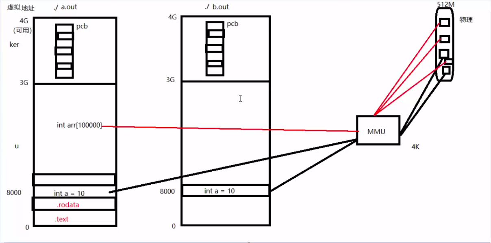
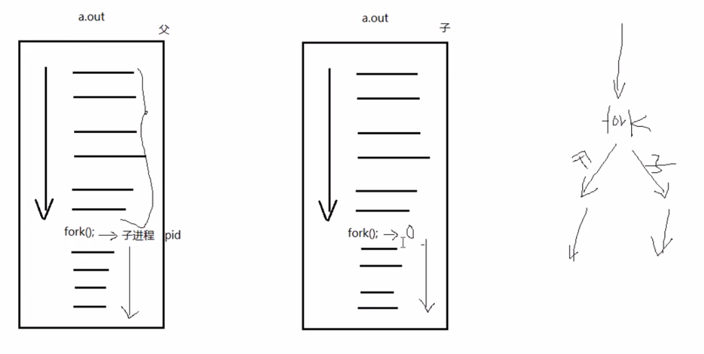

# 进程和程序

- 程序：死的，只占用磁盘空间。
- 进程：活的，运行起来的程序。占用内存、cpu等系统资源。

# 虚拟内存和物理内存的映射



- 进程空间中的1G虚拟内核内存空间是共享的，是公用的。PCB作为一个结构体存储在内核空间上。内核空间保存各个进程的PCB
- 进程空间的用户空间是独立的。
- Linux的权级只有2；Windows是4；MMU执行权级的切换。


# PCB进程控制块、进程描述符

包含的内容

- 进程id
- 文件描述符表
- 进程状态 ： 初始态，就绪态，运行态，终止态，挂起态（阻塞态）
- 进程的工作目录
- umask掩码
- 信号相关信息资源
- 用户id和组id
- 等。。。

# 环境变量

- 属于一个进程，不存在PCB中，位于stack底与3G位置之间的虚拟内存中。

# fork函数



在shell中执行的命令或者可执行程序，都是shell创建的子进程，也就是shell进程通过fork创建了子进程来执行命令或者可执行程序。

- fork

```C
pid_t fort(void);
```

- 父进程返回的是子进程的pid
- 子进程返回0
- 如果fork出错，那么子进程不会创建，父进程返回-1

- getpid 获取当前进程的pid
- getppid 获取当前进程的父进程的pid
- getuid 获取运行当前进程的用户id
- getgid 获取运行当前进程的用户组id
- geteuid 当前的有效用户id
- getegid 当前的有效用户组id
- getpgrp 获取当前进程的进程组id

- uid，euid，gid，egid

linux系统中每个进程都有2个用户ID，分别为用户ID（uid）和有效用户ID（euid），UID一般表示进程的创建者（属于哪个用户创建），而EUID表示进程对于文件和资源的访问权限（具备等同于哪个用户的权限）。C语言中，可以通过函数getuid( )和geteuid（）来获得进程的两个ID值。当一个用户登陆系统时，系统会将UID和EUID都赋值为/etc/passwd文件中的UID，一般情况下2个ID是相同的，但是某些情况下会出现2个ID不同的情况。
gid和egid同理。

首先，修改一下文件属性，setuid或setgid：chmod u+s printid 这样一来，文件在执行阶段具有文件所有者的权限，此时进程的euid为文件所有者的ID；如在使用sudo命令时，euid为root用户，以root用户的身份访问操作文件或执行命令； chmod g+s printid 这样一来，文件在执行阶段具有文件所属组的权限，此时进程的egid为文件所属组的ID。

## 父子进程共享的内容

- 读时共享，写时复制

- 父子进程相同：刚fork后。 data段、text段、堆、栈、环境变量、全局变量、宿主目录位置、进程工作目录位置、信号处理方式
- 父子进程不同：pid，ppid，进程创建的时间，返回值，闹钟、未决信号集
- 父子进程共享：文件描述符一致，共享打开文件表（struct file）。mmap映射区。共享阻塞信号集（信号屏蔽字bitmap）和信号的处理函数（处理动作）

## 父子进程的gdb调试

- 设置跟踪父进程的调试路径：set follow-fork-mode parent
- 设置跟踪子进程的调试路径：set follow-fork-mode child

# exec函数族

```C
int execlp(const char *file, const char *arg, ...);		借助 PATH 环境变量找寻待执行程序
```

- 参1：程序名
- 参2：程序的命令行参数，可变参数
- 哨兵：NULL

```C
int execl(const char *path, const char *arg, ...);		自己指定待执行程序路径。
```

```C
int execvp();
```

```C
ps ajx --> pid ppid gid sid # ps 指令获取进程的pid，ppid，进程组id，会话id
```


# 回收子进程

## 两种子进程

- 孤儿进程，父进程先于子进程结束，子进程沦为孤儿进程，被init进程收养，init进程变为该子进程的父进程，负责子进程终止后的回收。init系统pid为1，用户的init不为1.
- 僵尸进程，子进程结束，但是它的父进程未对它进行回收。这个期间子进程为僵尸进程。kill对僵尸进程无效，因为僵尸进程已经终止了。

## 子进程终止的原因

- 正常终止，return，exit
- 异常终止，与信号相关，信号终止了进程

## 回收子进程的函数

### wait

```C
pid_t wait(int *status)
```

- - 参数：传出参数，进程的状态	
  - 返回值：成功，返回被回收的子进程的pid；失败，返回-1，设置errno（在没有子进程时调用wait或者waitpid时，就会失败）
- 函数作用：
  - 阻塞等待子进程退出
  - 清除子进程残留在内核的PCB资源
  - 通过传出参数，得到子进程的结束状态

### waitpid

```C
pid_t waitpid(pid_t pid, int *status, int options) //指定回收某一个子进程，可以设置为非阻塞
```

参数：

- pid：指定需要回收的子进程的pid
  - \> 0 : 待回收的特定的子进程pid
  - \- 1: 任何一个子进程
  - = 0 ： 和该父进程相同进程组的任意一个子进程
  - < -n（n!=-1）: 回收任意一个属于进程组n的子进程，-号代表进程组。
- status：（传出）回收进程的状态
- options：设置WNOHANG，指定回收方式为非阻塞。waitpid默认阻塞，并且只在指定的子进程终止时返回。可以设置在子进程变为STOP或者CONTINUE状态时返回。如果

返回值：

- \> 0 : 表示成功回收子进程pid
- -1： 失败，设置errno；通常在没有子进程却调用waitpid的时候，就会失败。
- 0 ：当设置为WNOHANG，并且调用时并没有终止的子进程可以回收，则返回0.

### 子进程结束的状态

- 正常退出：
  - WIFEXITED(status) 为真 ----》WEXITSTATUS(status)获取进程退出值
- 异常退出（和信号相关）
  - WIFSIGNALED(status) 为真 ----》WTERMSIG(status) 获取导致进程终止的信号编码

### 回收多个子进程

- wait和waitpid 调用一次只能回收一个子进程
- 父进程并不会隐式回收子进程，需要调用wait或者waitpid来显式回收子进程
- 如果需要回收多个子进程，就要调用多个wait或者waitpid，通常使用while循环，知道wait返回值为-1

# 进程间通信

## 常用方式

- 无名管道pipe，有血缘关系
- 命名管道fifo，非血缘关系
- mmap映射，非血缘关系
- socket 本地套接字，稳定

## 无名管道

- 实现原理：
  - 内核借助环形队列机制，使用内核缓冲区实现。
- 特质：
  - 伪文件，并不是真正的文件，所以文件的大小为0.
  - 管道中的数据只能一次读取，读了后这个数据就没了。
  - 数据在管道中，只能单向流动。
- 局限性
  - 同一个数据不能被反复读，只能被读一次。
  - 半双工模式
  - 血缘关系的进程可用。
- pipe函数

```C
int pipe(int fd[2]);
```

参数：fd[0]：读端的文件描述符；fd[1]写端的文件描述符

返回值：-1，失败，设置errno；0：成功。

### 管道的读写行为

- 读管道
  - 如果有数据，那么read返回实际读到的字节数。
  - 如果没有数据，
    - 如果没有写端，那么相当于读到文件尾，返回0.
    - 如果有写端，那么阻塞等待。
- 写管道
  - 如果没有读端，那么异常终止（SIGPIPE信号）
  - 如果有读端
    - 如果管道已满，那么write阻塞等待
    - 如果管道未满，返回写出的字节个数

## 一些小问题

- 执行ls | wc -l这个指令，如果使用父子进程之间通信，那么应该父进程来执行wc，子进程执行ls。这样子进程比父进程先终止。否则父进程先终止。
- 如果使用兄弟进程来执行ls | wc -l这个指令，而且父进程没有关闭管道两端的描述符。这时候执行ls的子进程写入管道后结束，这时wc等待管道的内容。如果我按下ctrl c，将信号发给父进程之后，父进程管段的读写两端描述符被回收 ，那么wc子进程只有读端，而且这个管道没有了写端，没数据，这时候wc的read返回，返回0，导致wc子进程结束
- 管道可以有多个写端一个读端。
- 管道也可以有一个写端，多个读端。
- 管道可以有多个写多个读。
- 按下Ctrl+c，会发送SIGINT信号给当前终端前台进程组的所有进程。crtl+z发送SIGSTP信号给前台进程组的所有进程。ctrl-d 不是发送信号，而是表示一个特殊的二进制值，表示 EOF。
- 一般情况下 NULL, nullptr 指的地方 (注意 ANSI C 并没定义 NULL 具体值, 只是说 free 一个 NULL 是安全的), 一般用户程序没有读写权限
- 进程中stack的最大容量有限，如果超过这个栈的容量，那么就会导致栈溢出。爆栈。“猜测：堆的容量大小应该也是有最大限制”
- 进程中每个线程都有自己的线程栈。进程的堆一般被所有线程共享共用。
- 管道缓冲区大小和管道的容量？
- 系统调用是原子操作吗？
- write：一定要阻塞直到写完所要写的数据？
- 进程切换和特权模式切换？
- 上下文保存在栈中还是保存在PCB上？
- 中断？
- 写管道是阻塞把数据完全写完，还是当写满缓冲区的时候，就返回，并且返回成功写入的字节数？

## 命名管道FIFO

可以用于非血缘关系的进程之间通信。

### 创建和原理

- 通过命令``mkfifo 命名管道名`` 创建命名管道
- 如果使用标准库函数``int mkfifo(char*)``

### 实现非血缘关系的进程间通信

- 读者以``O_RDONLY``的方式打开命名管道
- 写者以``O_WRONLY``的方式打开命名管道

### 读写

- 读端
  - 没有写端，那么读端阻塞
  - 有写端，
    - 没数据，阻塞
    - 有数据，读取，返回
- 写端
  - 没有读端，阻塞
  - 有读端
    - 满，阻塞
    - 未满，写入，返回
- 命名管道如果两端的其中一端没有被打开，那么被打开的一端阻塞等待。


## 使用文件通信

- 打开的文件是内核的一个缓冲区。多个无血缘关系的进程可以同时访问文件。
- 多个进程打开同一个文件，对文件的操作是作用在文件在内核的缓冲区上，并没有直接写到磁盘上。多个进程同时读写同一个文件，可能会产生预期不到的结果。
- 如果两个进程之间是父子关系，那么fork之后，子进程和父进程的文件描述表是一致的，也就指向了相同的打开文件表项，所以文件的读写位置是共享的。如果是fork之后，或者两个进程不是父子关系，或者在同一个进程中多次打开同一个文件，那么会得到不同的文件描述符，有不同的读写位置。
- 文件打开后，向文件中写内容后，是反映到内核的缓冲区，然后写到磁盘上。不是直接写到磁盘上，只要成功将内容写到内核的缓冲区，就认为写成功。如果多个进程打开同一个文件，那么这个文件在内核的缓冲区只有一份，所以这多个进程是共用一份文件在内核的缓冲区的。


## mmap共享内存映射

```C
void *mmap(void *addr, size_t length, int prot, int flags, int fd, off_t offset);		// 创建共享内存映射
```

- 参数：

  - addr，指定映射的首地址，传NULL，由系统自动分配
  - length，共享内存映射区的大小，（通常<=文件的大小），实际上也可以大于文件的大小，但是超过文件大小的部分被填充为\0，也可以被访问修改，但是不影响原来文件的大小和内容。
  - prot：共享内存映射区的读写属性
    - PROT_READ：内存映射区可读
    - PROT_WRITE：内存映射区可写
    - PROT_EXEC：内存映射区可以执行
  - flags：共享内存映射区的共享属性
    - MAP_SHARED：可共享，而且对内存映射区的修改回写回文件磁盘，prot的读写属性<=open时指定读写属性。
    - MAP_PRIVATE：私有的，对内存映射区的修改不会写回文件磁盘，prot的读写属性设置和open时制定的读写属性无关。
  - fd：用于创建映射区的文件的描述符
  - offset：默认为0，表示映射文件的全部。偏移位置是一个页的整数倍（4K）
- 返回值
- 成功：映射区的首地址
  - 失败：MAP_FAILED, (void*)(-1)，设置errno


```C
int munmap(void* addr, size_t length); // 释放映射区
```

- addr：mmap返回的首地址
- length：映射区的大小


### 使用注意事项

- 用于创建映射区的文件的大小为0，而指定创建的映射区的大小非0，报“总线错误”SIGBUS
- 用于创建映射区的文件大小0或非0，而制定创建的映射区的大小为0，函数返回-1，错误为“无效的参数”
- 用于创建映射区的文件open时指定读写属性为 只读，而mmap时指定读写属性为 读|写，并且共享属性设置为MAP_SHARED时，函数返回-1，错误为“无效参数”
- 创建映射区，需要read权限。当访问权限指定为 “共享”MAP_SHARED是， mmap的读写权限，应该 <=文件的open权限。 但是MAP_PRIVATE时，没有这个限制
- mmap创建完映射区后，fd可以关闭，不影响后续对映射区的操作。后续对文件的操作，只需要像操作内存一样。
- offset 必须是 4096的整数倍。（MMU 映射的最小单位 4k ）
- 对申请的映射区内存，不能越界访问。
- munmap用于释放的 地址，必须是mmap申请返回的地址。
- 映射区访问权限为 “私有”MAP_PRIVATE, 对内存所做的所有修改，只在内存有效，不会反应到物理磁盘上。
- 映射区访问权限为 “私有”MAP_PRIVATE, 只需要open文件时，有读权限，用于创建映射区即可
- mmap函数保险的调用方式
  1. fd = open(文件名, O_RDWR);
  2. mmap(NULL, 文件大小, PROT_READ|PROT_WRITE, MAP_SHARED, fd, 0)


### 父子进程使用mmap通信

1. 父进程先使用mmap创建映射区。open(O_RDWR), mmap(MAP_SHARED);
2. 指定MAP_SHARED权限
3. fork() 创建子进程
4. 一个进程写，一个进程读


### 无血缘关系的进程间mmap通信

1. 两个进程打开同一个普通文件
2. 使用mmap创建映射区，flags共享权限设置为MAP_SHARED.
3. 一个进程写，一个进程读


### 匿名映射

- 只适合具有血缘关系的进程之间通信

- 两种方法

  - flags中使用MAP_ANON或者MAP_ANONYMOUS, fd制定为-1

  ```C
  int* p = (int*)mmap(NULL, 100, PROT_READ|PROT_WRITE, MAP_SHARED|MAP_ANONYMOUS, fd=-1, 0);
  ```

  - 使用特殊文件/dev/zero;这个文件可以看成是任意大小的文件

  ```C
  int fd = open("/dev/zero", O_RDWR); // /dev/zero是任意大小的文件。/dev/zero也是一个特殊的字符设备文件，当我们使用或读取它的时候，它会提供无限连续不断的空的数据流（特殊的数据格式流）。
  int* p = (int*)mmap(NULL, 100, PROT_READ|PROT_WRITE, MAP_SHARED, fd, 0);
  ```

  