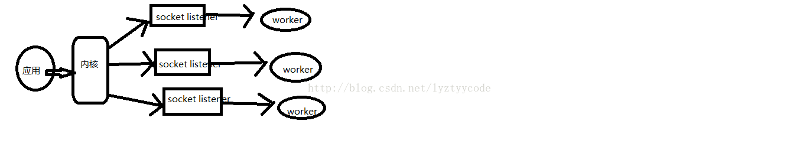
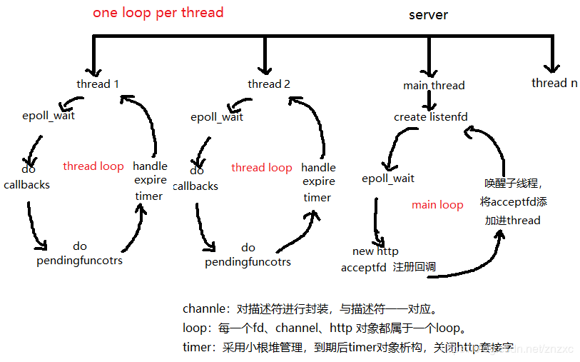

# 关于套接字阻塞或者非阻塞

- 阻塞或者非阻塞是对于文件来说的，而不是对于read、write的操作来说的。所以在非阻塞的listenfd中调用accept，如果没有连接的客户端，那么accept返回-1，设置errno为EAGAIN、EWOULDBLOCK
- epoll只能是设置边缘触发还是水平触发，并不能改变文件描述符是阻塞的还是非阻塞的。
- **监听套接字最好设置为非阻塞+epoll水平触发**，原因如下
  - 使用非阻塞
    - 客户通过connect向TCP服务器发起三次握手
    - 三次握手完成后，触发TCP服务器监听套接字的可读事件，IO复用返回（select、poll、epoll_wait）
    - 客户通过RST报文取消连接
    - TCP服务器调用accept接受连接，此时发现内核已连接队列为空（因为唯一的连接已被客户端取消）
    - 程序阻塞在accept调用，无法响应其它已连接套接字的事件
  - 使用水平触发
    - 如果同时有多个连接建立，监听队列由空变为非空，EPOLLIN事件被触发，那么accept一次只能接受一个连接，如果使用水平触发，那么后续在监听队列中未被接受的连接触发EPOLLIN事件。如果使用边缘触发，那么剩下的连接不能触发EPOLLIN事件，导致不能接收这些连接。
    - 当然可以使用边缘触发，但是需要while循环调用accept，直到监听队列为空（边缘触发，一次性读取所有数据）


# 关于epoll

- LT模式下，读事件触发后，可以按照需要收取想要的字节数，不要把本次收到的数据全部读取。ET模式下，读事件必须把数据全部读取（循环读取），因为不一定有下一次机会有新的数据来，这样造成剩下的数据没有读取。除此之外，上一次没有读完的数据没有及时处理，造成客户端相应延迟。
- LT模式下，不要的写事件一定要即时移除，避免不必要的触发。ET模式下，如果写事件触发后，如果还需要下一次的写事件触发，需要继续注册一次检测可写事件。
- LT模式下，EPOLLIN触发条件
  - socket读缓冲区没有数据==》读缓冲区有数据
  - 读缓冲区有数据
- LT模式下，EPOLLOUT触发条件
  - socket写缓冲区满==》写缓冲非满
  - socket写缓冲非满
- ET模式下，EPOLLIN触发条件
  - socket读缓冲区没有数据==》读缓冲区有数据
  - socket又来了新的数据
- ET模式下，EPOLLOUT触发条件
  - socket写缓冲区满==》写缓冲非满
  - 重新注册可写事件
  - 连接建立并accept后


# 为什么ET模式的epoll需要用非阻塞的IO

因为使用ET模式的话，对于读事件，需要一次性把数据读取

- 为什么需要把数据一次性读取
  - 接收端接收完整的数据后会向对端发送应答报文，对端才会继续向接收端发送数据，从而触发下一次的EPOLLIN，而这时没有读完socket缓冲区中的所有数据，导致接收端无法向对端发送应答报文，而对端没有收到应答报文，也就不会再发送数据触发下一次的EPOLLIN，而没有下一次的EPOLLIN事件，接收端也就永远不知道此socket缓冲区中还有未读出的数据&oq=接收端接收完整的数据后会向对端发送应答报文，对端才会继续向接收端发送数据，从而触发下一次的EPOLLIN，而这时没有读完socket缓冲区中的所有数据，导致接收端无法向对端发送应答报文，而对端没有收到应答报文，也就不会再发送数据触发下一次的EPOLLIN，而没有下一次的EPOLLIN事件，接收端也就永远不知道此socket缓冲区中还有未读出的数据

一次性读取所有的数据的话，就要使用while读取所有的数据。当读取完所有的数据之后，如果使用的是阻塞的IO，那么继续调用recv就会阻塞。所以使用非阻塞的IO，当返回-1，errno为EAGAIN或者EWOULDBLOCK时，就知道已经读取完数据，不会阻塞。


# epoll底层实现

首先epoll_create创建一个epoll文件描述符，底层同时创建一个**红黑树**，和一个**就绪链表**；红黑树存储所监控的文件描述符的节点数据，就绪链表存储就绪的文件描述符的节点数据；epoll_ctl将会添加新的描述符，首先判断是红黑树上是否有此文件描述符节点，如果有，则立即返回。如果没有， 则在树干上插入新的节点，并且告知**内核注册回调函数**。当接收到某个文件描述符过来数据时，那么内核将该节点插入到就绪链表里面。调用epoll_wait时，如果就绪链表非空，数据拷贝至用户态events数组中，清空链表，函数就返回了。

- **在调用epoll_ctl添加文件描述符时，如果这个要监视的fd状态改变，并且还没有加入到就绪链表中，则将当前的  epitem加入到就绪链表中**，也就是说在添加文件描述符到红黑树上时，如果这个文件描述符可读或者可写并且和所关心的事件有交集，那么就将这个文件描述符连接到rdlist上。
- **在调用epoll_ctl修改文件描述符监视的事件，如果这个要监视的fd的状态改变，但是还没有加入到就绪链表中，那么就将他的epitem加入到就绪链表中。**（同上）

只要有事件到达，不管现**在进程处在什么状态**，内核会调用回调函数。**回调函数ep_poll_callback**核心流程：
ep_poll_callback检查**已产生事件与关心事件是否有交集**，如果有：（当前进程可能阻塞在epoll_wait上，或者正在执行其他代码），这一个过程对于LT和ET模式都是一样的。

1. 将文件的epitem节点拷贝到rdlist链表上（就绪句柄拷贝到rdlist）
2. 如果有进程在wq等待队列上（即有进程在调用epoll_wait等待），则唤醒之！
3. 顺便，如果有进程在poll_wait等待队列上（即有进程调用多路复用来监听当前epoll句柄），则唤醒之！


- ET模式下，epoll_wait返回，在处理的过程中新的数据到来。然后再一次调用epoll_wait会触发EPOLLIN吗？
  - 只有有新的数据（事件）到来，回调函数被调用，如果事件就是所关心的事件，那么将对应的epitem节点加入到rdlist。epoll_wait被调用的时候实际上只是扫描rdlist是否非空，如果非空，那么把rdlist中句柄们调用ep_send_events函数（验证是否真的可以读写）拷贝到events数组中，返回拷贝了几个句柄，赋值给res。
  - 对于LT模式，ep_send_events先遍历rdlist上的每一个句柄，对弈每个句柄，再次调用poll获取实际实际
    - 如果与关心事件有交集：如果句柄是水平触发（`EPOLLLT`），则再次把句柄加入到rdlist；否则是ET模式则从rdlist中删除，（也就是说这一次触发返回后，这个epitem还是在rdlist上的，水平模式下次还会准备好，但是可能没有数据可以读（事件没有发生））
    - 如果不是所关心的事件，那么从rdlist上删除

```
问题：如此一来看起来水平模式的句柄永远都不断重新加入rdlist，这就成永远都通知了吧？ 
当事件已经被处理完后，调用poll得到的实际事件与关心事件已经无交集了，于是会被删除的！

ep_send_events函数内再次调用poll获取实际事件就是为了EPOLLLT模式而生的，防止其永远加入rdlist！

于是，EPOLLLT读事件 做到了只要有数据就不停通知，直到没数据就不再通知了
```

epoll_wait调用**ep_poll**，当**rdlist**为**空**（无就绪fd）时**挂起当前进程**，直到**rdlist不空时进程才被唤醒**。然后就将就绪的events和data发送到用户空间（**ep_send_events()**），如果ep_send_events()返回的事件数为0，并且还有超时时间剩余(jtimeout)，那么我们**retry**，期待不要空手而归。（注：ep_send_events()像是一个验证，虽然rdlist有事件了，但是这些事件可能是旧的，通过ep_send_events对是否真正发生事件进行验证）

**ep_send_events**函数，它扫描txlist中的每个epitem，调用其关联的fd对应的的**poll**方法，取得fd上较新的events（防止之前events被更新）即**revents**，之后将**revents**和相应的**data**拷贝（**__put_user()**）到用户空间。如果这个epitem对应的fd是**LT模式**监听且取得的events是用户所关心的，**则将其重新加入回rdlist**，如果是**ET模式**则不再加入**rdlist**。

 **ep_send_events()\**会\**扫描就绪链表**，调用每个文件描述符的**poll**函数返回**revents**，之后将**revents**和**data**从内核空间拷贝到用户空间。如果是**ET模式**, epitem是**不会再进入到就绪链表，除非fd再次发生了状态改变**, **ep_poll_callback**被调用。如果是**LT模式**，不但会将对应的数据返回给用户，并且会**将当前的epitem再次加入到rdllist中**。这样如果下次再次被唤醒就会给用户空间再次返回事件。

所以ET模式不会遗漏数据。LT也不会没有数据读写就返回>0的值。


# EPOLLONESHOT

- **用处（处理的场景）**：socket接收到数据交给一个线程处理数据，在数据没有处理完之前又有新数据达到触发了事件，另一个线程被激活获得该socket，从而产生**多个线程操作同一socket**，即使在ET模式下也有可能出现这种情况。采用EPOLLONETSHOT事件的文件描述符上的注册事件只触发一次，要想重新注册事件则需要调用epoll_ctl重置文件描述符上的事件，这样前面的socket就不会出现竞态。（事件处理过程中，又来了新的事件）
- 解决方法：
  - 一种是在单独的线程或进程里解析数据，也就是说，接收数据的线程接收到数据后立刻将数据转移至另外的线程。
  - 注册EPLLONESHOT，当数据读取、处理完成时，重新调用功能epall_ctl函数重新设置所关心的事件。保证同一*SOCKET*只能被一个线程处理，不会跨越多个线程。如果重新设置关心的事件，那么可以不一次性把现有的数据读完。如果不重新设置关心的事件，那么需要把数据一次性读完。
- epolloneshot在事件触发后，并没有将对应的epitem从红黑树中删除。只是将所关心的事件清空（也就是不关心任何事件），所以使用EPOLL_CTL_MOD来重新设置所关心的事件。


# 多进程、多线程使用同一个epollfd

- 惊群效应
- 有EPOLLONESHOT解决的问题


# 惊群效应

-  **是什么**：惊群效应也有人叫做雷鸣群体效应，不过叫什么，简言之，惊群现象就是多进程（多线程）在同时阻塞等待同一个事件的时候（休眠状态），如果等待的这个事件发生，那么他就会唤醒等待的所有进程（或者线程），但是最终却只可能有一个进程（线程）获得这个时间的“控制权”，对该事件进行处理，而其他进程（线程）获取“控制权”失败，只能重新进入休眠状态，这种现象和性能浪费就叫做惊群。
- accept函数上的惊群
  - Linux的accept确实存在惊群问题，但现在的内核都解决该问题了。即，当多个进程/线程都阻塞在对同一个socket的接受调用上时，当有一个新的连接到来，内核只会唤醒一个进程，其他进程保持休眠，压根就不会被唤醒。

- epoll上的惊群效应

  - 如果多个进程/线程阻塞在监听同一个监听socket fd的epoll_wait上，当有一个新的连接到来时，所有的进程都会被唤醒。
  - epoll_wait不会像接受那样只唤醒一个进程/线程，但也不会把所有的进程/线程都唤醒。

- 解决方式：

  - 通过锁机制解决惊群效应是一种方法，在任意时刻只让一个进程（线程）处理等待的事件。但是锁机制也会造成cpu等资源的消耗和性能损耗。目前一些常见的服务器软件有的是通过锁机制解决的，比如nginx（它的锁机制是默认开启的，可以关闭）；还有些认为惊群对系统性能影响不大，没有去处理，比如lighttpd。Nginx：同一时刻只允许一个nginx worker在自己的epoll中处理监听句柄。它的负载均衡也很简单，当达到最大connection的7/8时，本worker不会去试图拿accept锁，也不会去处理新连接，这样其他nginx worker进程就更有机会去处理监听句柄，建立新连接了。
  - 端口复用。支持不同的套接字绑定到相同的端口。

  


# 边缘触发效率高于水平触发的原因

如果系统中有大量你不需要读写的就绪文件描述符，而它们每次都会返回，这样会大大降低处理程序检索自己关心的就绪文件描述符的效率。


# One loop per thread



每一个线程中一个事件循环。而不是所有的线程共享一个epoll。所以每一个线程处理一些connfd。而一个socket只由一个线程处理。