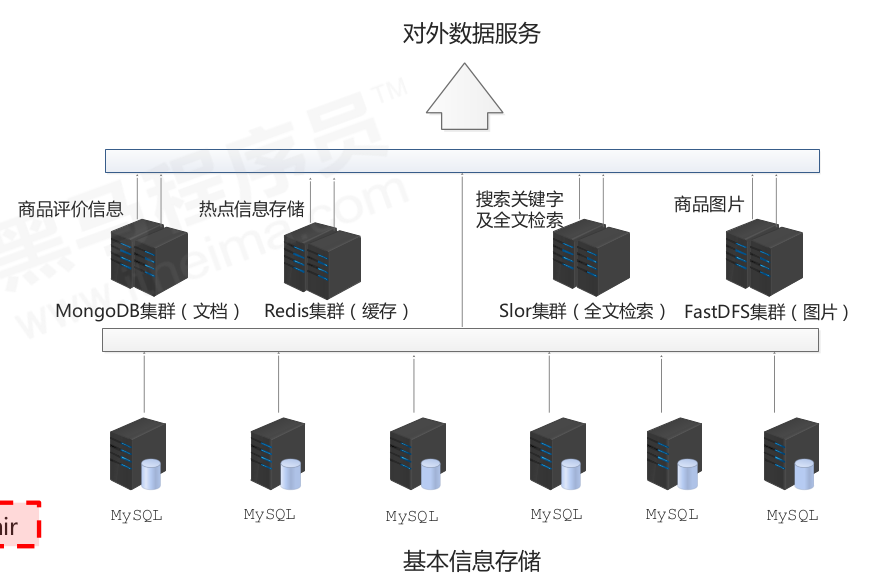
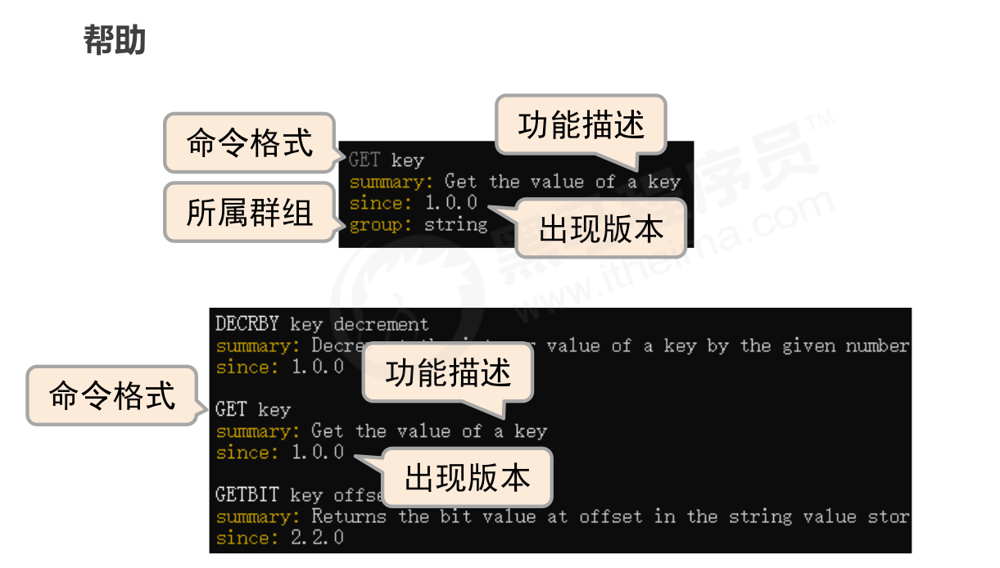

# NoSQL

## 问题现象

当网站在同一时间，有海量用户访问的时候，服务器的压力过大，应付不过来，可能导致宕机。

- 海量用户
- 高并发

## 问题瓶颈

- 性能瓶颈：大量的访问，需要从磁盘中获取数据，然而磁盘的IO性能低下。所以尽可能优化IO，尽量减少从磁盘中存取数据。
- 扩展瓶颈：关系数据库中，数据的关系复杂，扩展性差，不便于大规模集群。如果不存储关系，只存储数据，那么可以降低这个复杂度。

## 解决思路

- 减少磁盘的IO次数，IO访问的次数越少越好。------- 数据存储在内存中，存储数据时访问内存而不是磁盘，从而减少磁盘IO的次数、
- 不关心数据之间的关系，越简单越好。-----去除数据之间的关系，只保存数据本身。

## NoSQL

NoSQL，Not Only SQL，泛指非关系型数据库，作为关系型数据库的补充。而不是替代关系型数据库。

### 作用

应对基于海量用户和海量数据的前提下处理数据的问题

### 特征

- 可扩容，可伸缩
- 大量数据下的高性能
- 灵活的数据模型
- 高可用

### 常用的NoSQL

- Redis
- memcache
- HBase
- MongoDB

## 解决方案（电商场景）

- MySQL主要保存商品的基本信息（关系型）
- MongoDB主要用于保存文本，像评论，描述，详情等商品的附加的。
- 分布式文件系统，保存图片文件
- ES，Lucene，solr，搜索关键字
- Redis，memcache，tair用于热点信息（被高频访问，波段性）

# Redis

Redis， REmote DIctionary Server，使用C语言开发的一个开源的高性能**键值对**数据库

## 特征

- 数据之间没有必然的关联关系
- 内部使用单线程机制工作
- 高性能，支持高并发
- 多数据类型的支持（数据类型是指key-value中value的类型，而不是key-value的类型）
  - 字符串类型--string
  - 链表类型--list
  - 散列类型（字段：值）-- hash
  - 集合类型--set
  - 有序集合类型--sorted_set
- 支持持久化，可以进行数据的灾难恢复

## Redis的应用

- 主要场景是**热点数据加速查询**，如热点商品、热点新闻、热点资讯、推广类等高访问量信息等
- **任务队列**，如秒杀、抢购、购票排队等
- **即时信息查询**， 如各位排行榜、各类网站访问统计、公交到站信息、在线人数信息(聊天室、网站)、设
  备信号等
- **时效性信息控制**，如验证码控制（多少分钟过期），投票控制（多少时间内不能再次投票）
- **分布式数据共享**，如分布式集群架构中的 session 分离
- **消息队列**
- **分布式锁**

# Redis的基本操作

## 功能性命令

- set  [key] [value]，设置字符串类型的数据
- get [key] ,获取字符串类型的数据，如果不存在，返回空nil

## 清除屏幕信息

- clear

## 帮助信息查阅

- help [命令]
- help @[命令组名]
- 按tab键切换【命令组名】

## 退出指令

- exit
- quit

