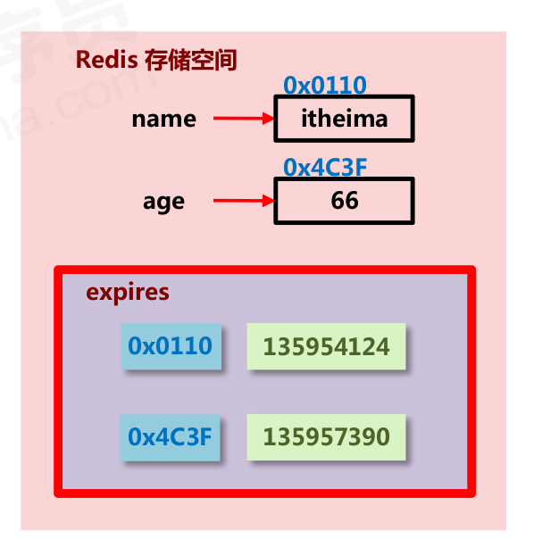
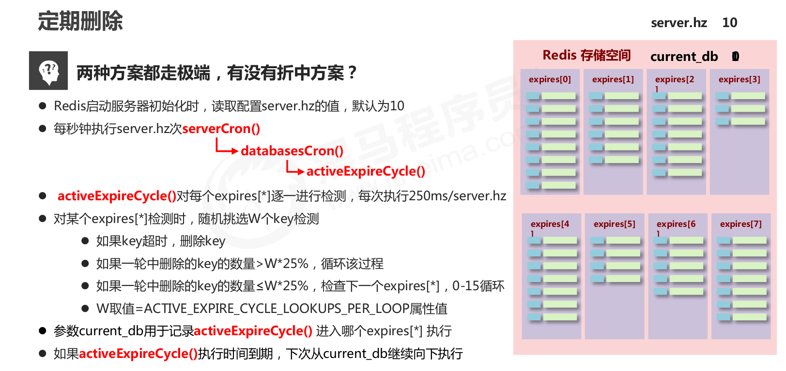
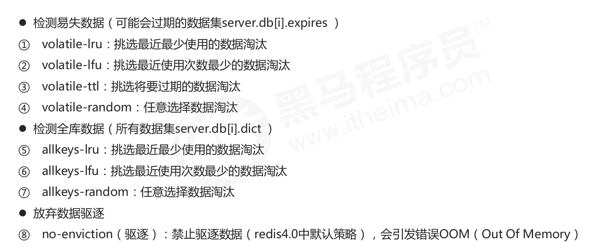

# 过期数据删除策略

## 时效性数据的存储结构

除了保存数据本身，还要记录这个数据保存的地址及其所对应过期时间。

## 删除策略的目标

在内存占用与CPU占用之间寻找一种平衡,顾此失彼都会造成整体redis性能的下降,甚至引发服务器宕机或
内存泄露

## 策略

三种策略

- 定时删除
- 惰性删除
- 定期删除

其中，Redis支持惰性删除和定期删除

### 定时删除

- 创建一个定时器，当key设置有过期时间，且过期时间到达时,由定时器任务立即执行对键的删除操作
- 优点:节约内存,到时就删除,快速释放掉不必要的内存占用
- 缺点:CPU压力很大,无论CPU此时负载量多高,均占用CPU,会影响redis服务器响应时间和指令吞吐量
- 总结:用处理器性能换取存储空间 (拿时间换空间)

### 惰性删除

- 数据到达过期时间,不做处理。等下次访问该数据时
  - 如果未过期，返回数据
  - 发现已经过期，删除，返回不存在
- 使用get获取数据时，实际上先会调用功能expireIfNeeded()函数判断数据是否过期
- 优点:节约CPU性能,发现必须删除的时候才删除
- 缺点:内存压力很大,出现长期占用内存的数据
- 总结：用存储空间换取处理器的性能（空间换时间）

### 定期删除

- 周期性轮询redis库中的时效性数据，采取随机抽取的策略，利用过期数据占比的方式控制删除频度。
- 特点1:CPU性能占用设置有峰值,检测频度可自定义设置
- 特点2:内存压力不是很大,因为长期占用内存的冷数据会被持续清理

## 删除策略对比

# 逐出算法

## 解决的问题

- 当新数据进入redis，如果内存不足怎么办
- Redis使用内存存储数据,在执行每一个命令前,会调用``freeMemoryIfNeeded()``检测内存是否充足。如
  果内存不满足新加入数据的最低存储要求,redis要临时删除一些数据为当前指令清理存储空间。清理数据
  的策略称为逐出算法

- 注意:逐出数据的过程不是100%能够清理出足够的可使用的内存空间,如果不成功则反复执行。当对所
  有数据尝试完毕后,如果不能达到内存清理的要求,将出现错误信息。

## 相关配置

- 最大可使用内存
- ``maxmemory``占用物理内存的比例,默认值为0,表示不限制。生产环境中根据需求设定,通常设置在50%以上。
- ``maxmemory-sample`` 每次选取待删除数据的个数.选取数据时并不会全库扫描,导致严重的性能消耗,降低读写性能。因此采用随机获取数据的方式作为待检测删除数据
- ``maxmemory-policy`` 具体的逐出算法。达到最大内存后的,对被挑选出来的数据进行删除的策略

取值：

# Redis核心配置

配置配置文件.conf

- 设置服务器以守护进程方式运行
  - ``daemonize yes | no``
- 绑定主机地址，如果不绑定，那么通过127.0.0.1,localhost,和本机IP地址，能够连接数据库。如果绑定了IP地址，只有通过这个IP地址才能连接
  - ``bind 127.0.0.1``
- 设置服务器端口
  - ``port``
- 设置数据库数量
  - ``databases 16``
- 设置服务器以指定日志记录级别.日志级别开发期设置为verbose即可,生产环境中配置为notice,简化日志输出量,降低写日志IO的频度
  - ``loglevel debug|verbose|notice|warning``
- 设置日志文件名
  - ``logfile 端口号.log``
- 设置同一时间最大客户端连接数，默认无上限。当客户端连接到达上限,Redis会关闭新的连接。
  - ``maxclients 0``
- 客户端闲置等待最大时长,达到最大值后关闭连接。如需关闭该功能,设置为 0
  - ``timeout 0`` 表示不关闭连接
- 导入并加载指定配置文件信息,用于快速创建redis公共配置较多的redis实例配置文件,便于维护
  - ``include /path/server-端口号.conf``

