# 持久化

## 持久化简介

### 是什么

利用永久性存储介质对数据进行**存储**，在特定的时机将数据进行**恢复**的工作机制

### 为什么

防止数据意外丢失，确保数据安全

### 持久化的种类

- 
  RDB，存储的是快照。直接对当前的数据状态进行存储。存储数据结果，存储格式简单。关注点在数据。
- AOF，存储修改操作的日志。存储操作过程。存储格式复杂，关注点在操作过程。


## RDB

### RDB特殊启动形式

- 全量复制
- 服务器运行过程中重启``debug reload``
- 关闭服务器时制定保存数据``shutdown save``，如果没有开启AOF，那么默认情况在执行shutdown命令时，自动执行``bgsave``

### 手动启动RDB

#### 即时进行

- ``save``命令，手动执行一次保存操作，即时
- ``save``命令作为redis的一条指令，会加入单线程任务执行序列中。由执行任务的单线程执行保存命令，所以执行``save``指令时会阻塞Redis服务器，知道RDB过程完成，可能会造成长时间阻塞，不建议线上环境使用

#### 合理时间执行，非立即执行

- ``bgsave``指令，手动启动后台保存操作，但是不会立即执行
- ``bgsave``指令堆``save``的阻塞问题进行优化。Redis内部涉及到RDB操作都是使用``bgsave``。save命令可以放弃使用。
- ``bgsave``工作原理

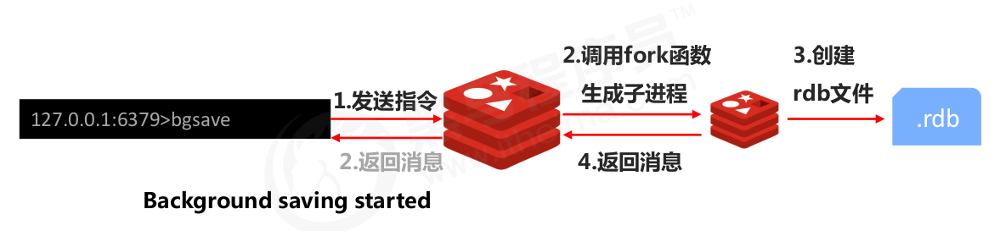

#### RDB相关配置

- ``dbfilename dump.db`` ，设置本地数据库文件名，通常设置为dump-端口号.rdb
- ``dir``，设置rdb文件保存的路径
- ``rdbcompression yes``，设置存储至本地数据库时是否压缩数据，默认yes，采用LZF压缩。通常设置默认状态。如果设置为no，可以节省CPU运行时间，但是会使得存储的文件变大
- ``rdbchecksum yes``，设置是否进行RDB文件格式校验，这个过程在写文件或者读文件时均会执行。默认为开启状态。如果设置为no,可以节约读写性过程约10%时间消耗,但是存储一定的数据损坏风险。

- ``stop-writes-on-bgsave-error yes``，后台存储过程中如果出现错误现象,是否停止保存操作 。经验：通常默认为开启状态。


### 自动启动RDB

- 时机：条件满足
- 发起者：redis服务器

#### 配置方法

``save second changes``

- 作用：满足限定时间范围内key的变化数量达到指定数量即进行持久化（也就是在second秒内，至少changes个key改变，就重写rdb文件）。实际上是在second满足后，检查changes的次数是否满足，如果满足，则进行启动rdb。而不是在second时间内满足changes就立即启动rdb。计时是从启动redis开始，而不是执行指令开始。
- 参数
  - second：监控的时间范围
  - changes：监控key变化量
- 在conf文件中配置

#### key变化量的计算

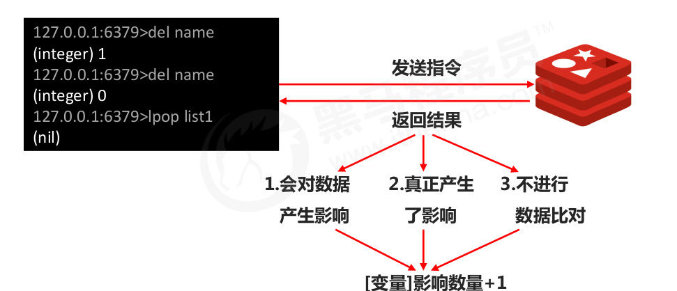

#### 注意事项

- save配置要根据实际业务情况进行设置,频度过高或过低都会出现性能问题,结果可能是灾难性的
- save配置中对于second与changes设置通常具有互补对应关系,尽量不要设置成包含性关系。也就是second大changes小；second小changes大。


### RDB两种启动方式对比

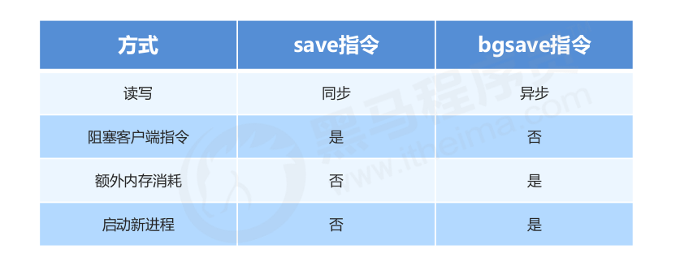

### RDB优缺点

#### 优点

- RDB是一个紧凑压缩的二进制文件,存储效率较高
- RDB内部存储的是redis在某个时间点的数据快照,非常适合用于数据备份,全量复制等场景
- RDB恢复数据的速度要比AOF快很多
- 应用:服务器中每X小时执行bgsave备份,并将RDB文件拷贝到远程机器中,用于灾难恢复。

#### 缺点

- RDB方式无论是执行指令还是利用配置,无法做到实时持久化,具有较大的可能性丢失数据
- bgsave指令每次运行要执行fork操作创建子进程,要牺牲掉一些性能
- Redis的众多版本中未进行RDB文件格式的版本统一,有可能出现各版本服务之间数据格式无法兼容现象


## AOF

### RDB弊端与解决思路

- 弊端
  - 存储数据量较大,效率较低。基于快照思想,每次读写都是全部数据,当数据量巨大时,效率非常低（是指存内存保存到磁盘的数据大）
  - 大数据量下的IO性能较低
  - 基于fork创建子进程,内存产生额外消耗
  - 宕机带来的数据丢失风险
- 解决思路
  - 不写全数据,仅记录部分数据
  - 降低区分数据是否改变的难度,改记录数据为记录操作过程
  - 对所有操作均进行记录,排除丢失数据的风险

### AOF概念

- AOF(append only file)持久化:以独立日志的方式记录每次写命令,重启时再重新执行AOF文件中命令
  达到恢复数据的目的。与RDB相比可以简单描述为改记录数据为记录数据产生的过程
- AOF的主要作用是解决了数据持久化的实时性,目前已经是Redis持久化的主流方式
- AOF持久化由redis服务器完成，不需要用户用命令操控。

### AOF写数据过程

- 命令操作先写到内核缓冲区中，然后再将内核缓冲区的内容同步到磁盘的.aof文件中。

#### 三种写数据的策略

- always每次
  - 每次写入操作均同步到AOF文件中,**数据零误差,性能较低**。实际上写入内核缓冲区后，调用功能fsync，将数据写回磁盘。
- everysec每秒
  - 每秒将缓冲区中的指令同步到AOF文件中,**数据准确性较高,性能较高**。在系统突然宕机的情况下丢失1秒内的数据。实际上写入内核缓冲区后，调用功能fsync，将数据写回磁盘。
- no由系统控制
  - 由操作系统控制每次同步到AOF文件的周期,整体过程**不可控**。实际上数据只写入内核缓冲区中，并不调用fsync，由操作系统控制将缓冲区同步到磁盘中。

### AOF配置

- 开启、关闭AOF ``appendonly yes | no``，默认是no
- 配置同步策略``appendfsync always | everysec | no``
- 配置aof持久化文件名``appendfilename filename``


## AOF重写

### 原因

随着命令不断写入AOF,文件会越来越大,为了解决这个问题,Redis引入了AOF重写机制压缩文件体积。AOF文件重写是将Redis进程内的数据转化为写命令同步到新AOF文件的过程。简单说就是将对同一个数据的若干个条命令执行结果转化成最终结果数据对应的指令进行记录。**重写的是磁盘上的.aof文件**

### 作用

- 降低磁盘占用量,提高磁盘利用率
- 提高持久化效率,降低持久化写时间,提高IO性能
- 降低数据恢复用时,提高数据恢复效率

### 重写规则

- 进程内已超时的数据不再写入文件
- 忽略无效指令,重写时使用进程内数据直接生成,这样新的AOF文件只保留最终数据的写入命令
  - set name 123；set name 234 ===》set name 234
- 对同一数据的多条写命令合并为一条命令
  - lpush list1 a、lpush list1 b、 lpush list1 c ===> lpush list1 a b c。

### 重写规则

- 手动重写 ``bgrewriteaof``

- 自动重写，当满足条件时

  - 在.conf配置文件中设置重写触发条件

    ```shell
    auto-aof-rewrite-min-size size
    auto-aof-rewrite-precentage percent
    # 这里的size和percent，指的是相对于启动时或者上一次rewrite时的.aof文件的增量
    ```

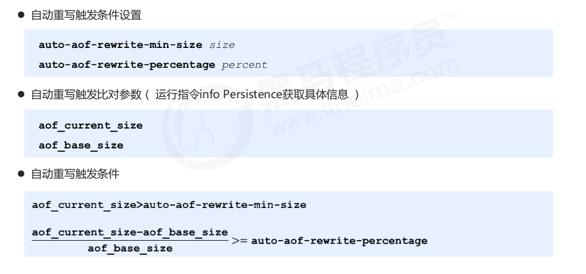

### AOF重写流程

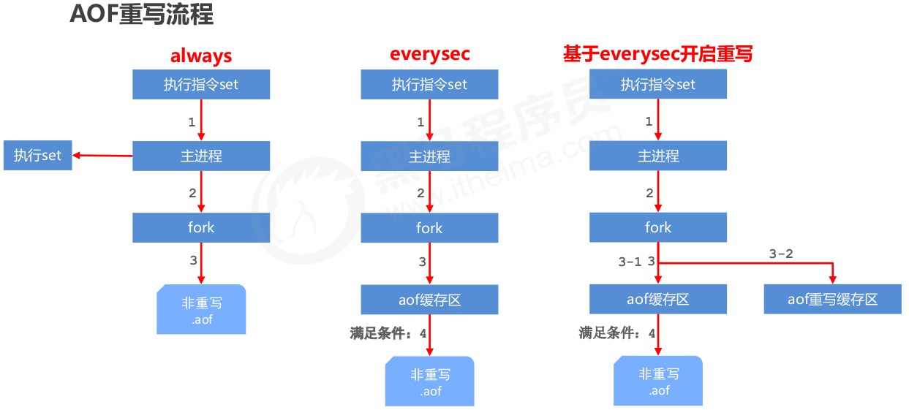

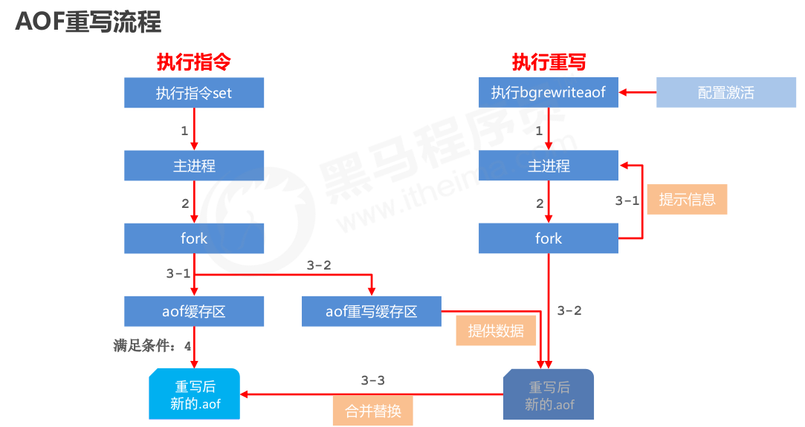


## RDB vs AOF

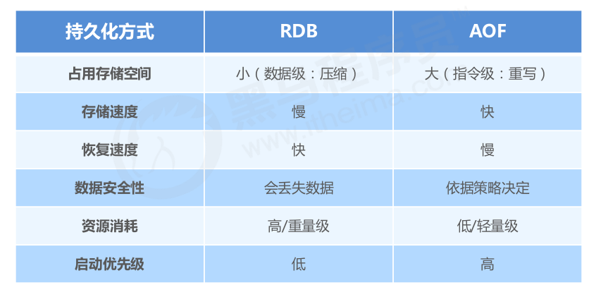

### 选择

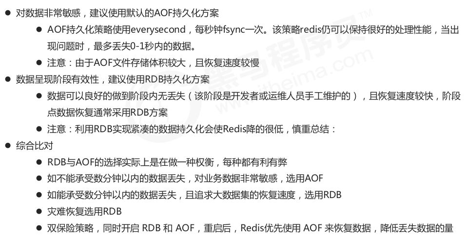


## 持久化应用场景

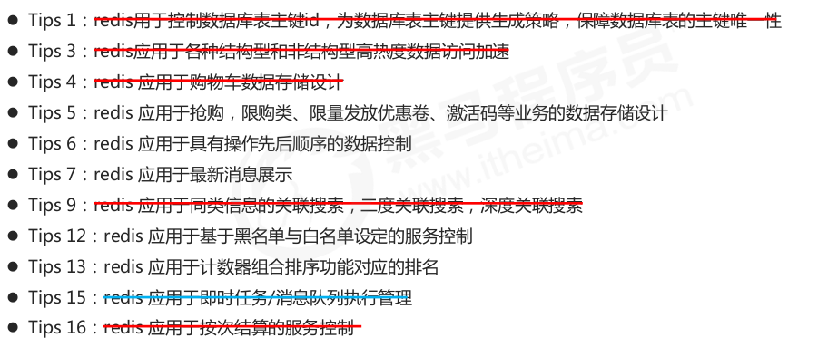


# 事务

## 简介

### 是什么

redis事务就是一个命令执行的队列,将一系列预定义命令包装成一个整体(一个队列)。当执行时,一次性按照添加顺序依次执行,中间不会被打断或者干扰。一个队列中,一次性、顺序性、排他性的执行一系列命令

### 事务的操作

- 开启事务``multi``,设定事务的开启位置,此指令执行后,后续的所有指令均加入到事务中
- 执行事务,``exec``,设定事务的结束位置,同时执行事务。与multi成对出现,成对使用.加入事务的命令暂时进入到任务队列中,并没有立即执行,只有执行exec命令才开始执行
- 取消事务``discard``，终止当前事务的定义,发生在multi之后,exec之前


### 事务的工作流程

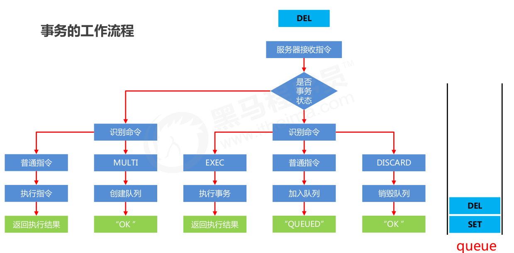

### 事务的注意事项

- 语法有错误。如果定义的事务中所包含的命令存在语法错误,整体事务中所有命令均不会执行。包括那些语法正确的命令。
- 语法正确，但是执行错误。能够正确运行的命令会执行,运行错误的命令不会被执行。已经执行完毕的命令对应的数据不会自动回滚,需要程序员自己在代码中实现回滚。

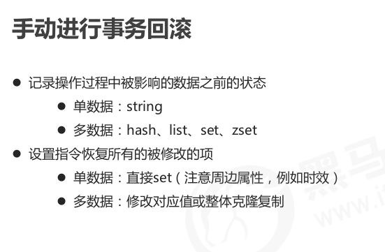

## 锁

### 监视锁

- 作用：对key添加监视锁，在执行exec前key发生变化，那么终止事务
- 添加监视锁``watch key [key]``
- 取消所有监视锁``unwatch``
- Tips:redis应用基于状态控制的批量任务执行

### 分布式锁

- 对于**超卖**问题
- 使用 setnx 设置一个公共锁，操作完毕后通过del释放锁
- 上述解决方案是一种设计概念,依赖规范保障,具有风险性

- Tips：应用于基于分布式锁对应的场景控制


### 分布式锁的改良

#### 分布式锁的问题

- 由于锁操作由用户控制加锁解锁,必定会存在加锁后未解锁的风险
- 需要解锁操作不能仅依赖用户控制,系统级别要给出对应的保底处理方案

#### 解决方案

- 使用expire为锁key设置时间限定，到时不释放，放弃锁（set命令也能制定存活时间）

```shell
expire lock-key seconds
pexpire lock-key milliseconds
```


#### 存在的问题

**问题**：set和expire之间可能宕机，导致锁不能释放。也就是set和expire两个操作不能看成是一个操作。

**解决方法**，使用set

**问题**：一个进程的任务还未执行完，锁的已经到期被释放，并且被别的进程B取得。当前面的进程完成后，调用del删除锁时，删除的不是自己所上的锁，而是被进程B所上的锁。

**解决方法**，设置锁的值时，使用本进程的pid作为锁的value。在释放锁del之前，判断value的值是否和自己的pid一致，一致才调用del释放锁。

**问题**：上面的方法没有避免多个进程方法共享区域。

**解决方法**：每一个进程新开一个守护线程，这个线程在任务还没完成，但是锁快过期时，通过调用功能expire延长锁的过期期限。