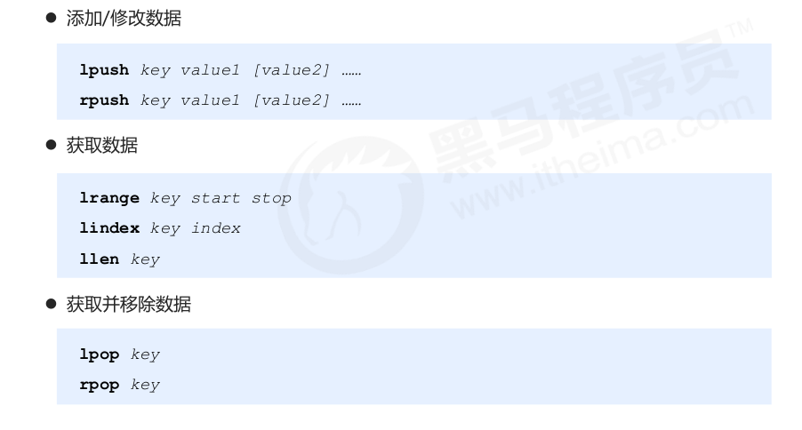

# 数据存储类型的介绍

## 作为缓存使用

1. 原始业务功能设计
2. 运营平台监控到**突发高频**访问数据
3. 高频，复杂的**统计数据** 

## 附加功能

系统功能的优化或者升级

- 单服务器升级为集群
- Session管理
- Token管理

## 数据类型的说明

Redis本身就是一个Map，所有的数据都是通过key：value的形式存储。

数据类型指的是value的类型，而不是key：value的类型，也不是key的类型，key的类型永远是字符串类型

# string类型

- 对应C++中string类型-
- **存储的数据**：单个数据，最简单的数据存储类型，也是最常用的数据存储类型
- **存储数据的格式**，一个存储空间只保存一个数据
- **数据内容**，通常是字符串，如果字符串以整数的形式展示，可以作为数字操作

## 基本操作

## 扩展操作

### string作为数值操作

- string在redis内部存储默认就是一个字符串,当遇到增减类操作incr,decr时会转成数值型进行计算。
- redis所有的操作都是**原子性**的,采用**单线程**处理所有业务,命令是一个一个执行的,因此无需考虑并发
  带来的数据影响。
- 按数值进行操作的数据,如果原始数据不能转成数值,或超越了redis 数值上限范围,将报错。9223372036854775807(java中long型数据最大值,Long.MAX_VALUE)
- ``incr``和``incrby``用于字符串表示的整数，``incrbyfloat``用于字符串表示的浮点数

### 业务场景

Tips 1：

- redis用于控制数据库表主键id，为数据库表主键提供生成策略，保障数据库表的主键唯一性。
- 此方案适用于所有数据库，且支持数据库集群。

### string指定数据的生命周期

#### 业务场景

- 为投票时间，热门商品的热门时间，热点新闻的热点时间，控制时效性- 
- Tips2：redis 控制数据的生命周期,通过数据是否失效控制业务行为,适用于所有具有时效性限定控制的操作

## 单数据操作与多数据操作的选择

操作需要先发送给服务器，服务器处理完这个操作后，再发送回客户端。涉及的开销主要是两次的发送和数据处理。

- 对于单数据操作，需要发送发回多次。每处理完一个操作后，服务器返回结果。
- 对于多数据操作，只需要一次发送和一次发回。完成整个多数据操作后，才返回全部结果。

当多数据操作操作的数据太多时，服务器处理这个多数据操作耗时太长，处理结果不能短时间发送回客户端。对于这个问题，可以将这个操作数据太大的多数据操作，划分为多个操作较少数据的多数据操作，使得结果能够及时返回到客户端中。

## string类型数据操作的注意事项

- 数据操作不成功的反馈与正常操作之间的差异

- 数据未获得 （nil）
- 数据最大储存量 **512MB**
- 数据计算的最大范围 java中Long的最大值9223372036854775807

## 高频访问信息显示控制

### 业务场景

### 解决方法

- 在redis中为大V用户设定用户信息,以用户主键和属性值作为key,后台设定定时刷新策略即可

- 在redis中以json格式存储大V用户信息,定时刷新(也可以使用hash类型)，这个value也是string类型存储的。

### 启发

- redis应用于各种结构型和非结构型高热度数据访问加速

## key的设置约定

# hash类型

- 对应C++中的unorderd_map类型
- 上面使用json格式存储对象的数据，如果对象中的数据频繁被更新，那么操作起来就很笨重，应为这个json格式的数据本质是一个字符串，修改对象数据中任意一个数据，都要更新整个json。
- 当对象数据频繁更改时，使用hash类型进行保存；当对象数据频繁被读取，但是很少更改，使用string（json）

- 新的存储需求:对一系列存储的数据进行编组,方便管理,典型应用存储对象信息
- 需要的存储结构:一个存储空间保存多个键值对数据
- hash类型:底层使用哈希表结构实现数据存储，hash存储结构优化
  - 如果field数量较少,存储结构优化为类数组结构
  - 如果field数量较多,存储结构使用HashMap结构

## hash类型数据的基本操作

- 删除整个hash类型的数据，使用``del [key]``

## hash类型的扩展操作

## hash类型数据操作的注意事项

- hash类型的字段对应的value只能是string类型，不能是其他类型，不能存在嵌套现象。如果数据没有找到，对应的值为nil
- 每个hash可以存储$2^{32}-1$个键值对。字段：值。
- hash类型十分贴近对象的数据存储形式,并且可以灵活添加删除对象属性。但hash设计初衷不是为了存
  储大量对象而设计的,切记不可滥用,更不可以将hash作为对象列表使用
- hgetall 操作可以获取全部属性,如果内部field过多,遍历整体数据效率就很会低,有可能成为数据访问
  瓶颈

- Tips：redis应用于购物车数据存储设计
- Tips：redis 应用于抢购,限购类、限量发放优惠卷、激活码等业务的数据存储设计

# list类型

- 保存多个数据，底层使用双向链表实现，对应C++中的list类型
- **数据存储需求**， 存储多个数据，并且对数据进入存储空间的顺序进行区分。
- **需要的存储结构**:一个存储空间保存多个数据,且通过数据可以体现进入顺序
- redis 应用于具有操作先后顺序的数据控制

## list类型数据的基本操作

## list类型数据的扩展操作

从左到右移除count个value值

## list类型数据操作的注意事项

- list中保存的数据都是string类型，数据总容量是有限的，最多$2^{32}-1$个。
- list有索引概念，但是操作数据通常是以队列或者栈的形式。
- 获取全部数据操作结束索引设置为-1
- list可以对数据进行分页操作,通常第一页的信息来自于list,第2页及更多的信息通过数据库的形式加载

## 业务场景

### 解决方案

# set类型

- 对应C++中的unordered_set类型
- **存储需求**：存储大量的数据，在查询方面更加有效率
- **需要的存储结构**：能够保存大量数据，高效的内部存储机制，便于查询
- set类型：与hash类型的存储结构相同，但是只保存字段，不保存值，字段不可以重复。

## set类型的基本操作

## set类型的扩展操作

### 业务场景

每位用户首次使用今日头条时会设置3项爱好的内容,但是后期为了增加用户的活跃度、兴趣点,必须让用户
对其他信息类别逐渐产生兴趣,增加客户留存度,如何实现?

### 业务分析

- 系统分析出各个分类的最新或最热点信息条目并组织成set集合
- 随机挑选其中部分信息
- 配合用户关注信息分类中的热点信息组织成展示的全信息集合

### 解决方案

**Tips**：redis 应用于随机推荐类信息检索,例如热点歌单推荐,热点新闻推荐,热卖旅游线路,应用APP推荐,
大V推荐等

### 业务场景

### 解决方案

## set类型数据操作的注意事项

- set类型不允许数据重复，如果添加的数据已经在集合中存在，那么这个数据只保留一份
- set和hash的存储结构虽然相同，但是set无法启用对应与hash的值的空间。

## 业务与解决方案

- redis的set可以用于同类型数据的快速去重（不重复的特性）
- redis的set应用于基于黑名单和白名单设定的服务控制（利用查找高效）

# sorted_set类型

- 对应C++中的set类型
- **存储需求**，数据排序有利于数据的有效展示，**需要提供一种可以根据自身的特征进行排序的方式**
- **需要的存储结构**，新的存储模型,可以保存可排序的数据
- sorted_set类型:在set的存储结构基础上添加可排序字段。排序的字段score，

## sorted_set 类型数据的基本操作

## 扩展操作

- redis应用于计数器组合排序功能对应的排名

## 注意事项

- score保存的数据存储空间是64位,如果是**整数**范围是-9007199254740992~9007199254740992
- score保存的数据也可以是一个**双精度的double值**,基于双精度浮点数的特征,可能会丢失精度,使用时
  候要慎重
- sorted_set 底层存储还是基于set结构的,因此数据不能重复,如果重复添加相同的数据,score值将被反
  复覆盖,保留最后一次修改的结果

## sorted_set 类型应用场景

# 解决方案列表

# 高级数据类型

- Bitmaps，用于状态的统计
- HyperLogLog，用于基数统计
- GEO，用于地理位置

## Bitmaps

- setbit的返回值是该位置的原值，而不是设置成功与否。
- 默认的value是0，当offset很大时，最好先减去一个值，否则前面的位置被填充为0，速度较慢。

- bitop返回的是是否操作成功，1为成功，0为失败。
- **Bitmaps可以用于信息状态的统计**

## HyperLogLog

- 使用HyperLogLog可以进行基数统计
- 基数是指数据去重后，剩下的数据的个数
- HyperLogLog应用了LogLog的算法

### 说明

- 用于进行基数统计,不是集合,不保存数据,只记录数量而不是具体数据
- 核心是基数估算算法,最终数值存在一定误差
- 误差范围:基数估计的结果是一个带有 0.81% 标准错误的近似值
- 耗空间极小,每个hyperloglog key占用了12K的内存用于标记基数，但是并不是说，一开始就分配12K的空间，而是根据情况扩展。
- pfadd命令不是一次性分配12K内存使用,会随着基数的增加内存逐渐增大
- pfmerge命令合并后占用的存储空间为12K,无论合并之前数据量多少

## GEO

- 用于地理位置的计算

- 列出容器中与给出的经纬度的点的距离在某个半径范围内的点。georadius
- 列出容器中与容器中的某个点的距离在某个半径范围内的点。georadiusbymember
- 计算hash。