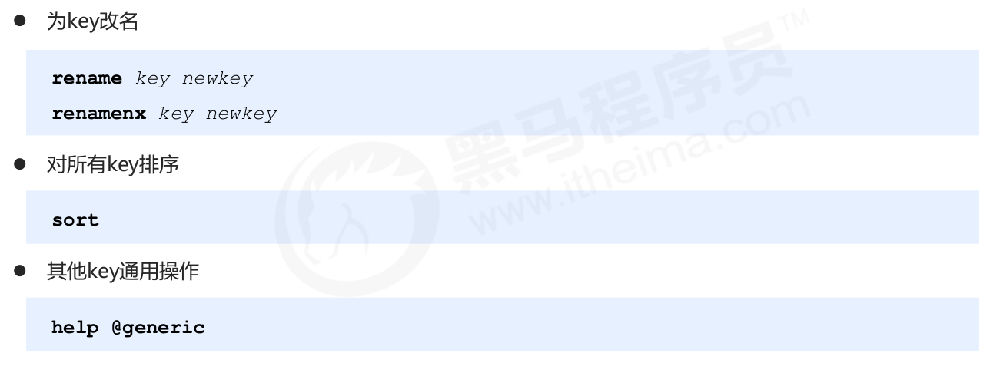

# 通用命令的分类

- key的通用命令
- db的通用命令

# key通用命令

## key自身状态的相关操作

- 删除key
- 判断key是否存在
- 获取key对应的value的类型

## key的时效性控制

- 设置key的有效期
- 获取key剩下的有效时间
- 设置key为永久

对于ttl，如果不存在key，返回-2，如果这个key是持久的，那么返回-1.

## key的查询（模式匹配）

- 通过通配符，查找符合的keys
  - *，匹配任意个数的字符
  - ？，匹配任意一个字符
  - [xx]，匹配括号中出现的任意一个字符

## key其他操作

- key更名
  - rename，如果newname存在，那么这个key对应的值被覆盖
  - renamenx，只有newname对应的key不存在，才能更名成功
- key对应的value排序
  - sort 只能对list，sorted_set和set排序，而且对应的元素能够转变为数值，否则无法排序。此外，排序不影响原来的存储的顺序。
- 查找对key的其他通用操作

# 数据库通用操作

## key的重复问题

- key由程序员定义
- redis在使用过程中,伴随着操作数据量的增加,会出现大量的数据以及对应的key
- 数据不区分种类、类别混杂在一起,极易出现重复或冲突

## 解决方案

- redis为每一个服务提供了16个数据库，编号从0-15
- 每一个数据库之间的数据相互独立

## 数据库通用操作

- 切换数据库
- 其他操作
  - quit，退出
  - ping，测试与服务器是否联通
  - echo msg，回显
- 移动数据
- 清除数据
  - 获取当前数据库中key的数量
  - 清除所有数据库
  - 清楚当前数据库

