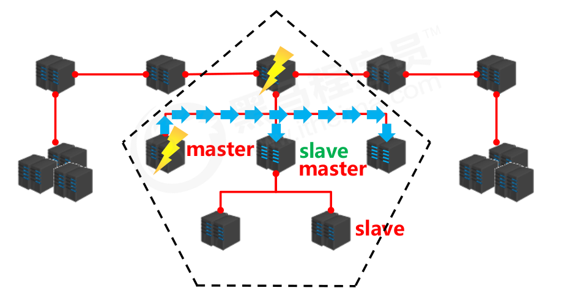
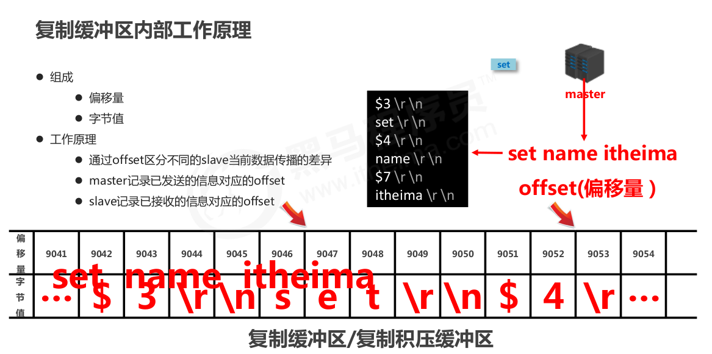

# 主从复制

## 三高架构

- 高并发
- 高性能
- 高可用

## 高可用

通过尽量缩短因日常维护操作(计划)和突发的系统崩溃(非计划)所导致的停机时间,以提高系统和应用的可用性。通过设计减小系统不可用的时间。5个9: 99.999%.


## 单个Redis存在的问题

- 机器系统故障，磁盘硬件故障，造成数据丢失。
- 单机的内存容量小。

### 解决

准备**多台redis服务器**，相互联通。将数据复制多个副本保存在不同的服务器上。并且数据是同步的。即使有其中一台服务器宕机,其他服务器依然可以继续提供服务,实现Redis的**高可用**,同时实现**数据冗余备份**。


## 架构



- 数据写：master（主服务器，主库，主节点）
  - 复制写数据
  - 执行写操作时，将出现变化的数据自动同步到slave中
  - 读数据（可以忽略）
- 数据读：slave（从服务器，从库，从节点）
  - 读数据
  - 写数据（被禁止）
  - 一个master可以有多个slave，一个slave只有一个master
- 问题：如果将master上的数据即时有效地复制到slave中


## 主从复制的作用

- 读写分离:master写、slave读,提高服务器的读写负载能力
- 负载均衡:基于主从结构,配合读写分离,由slave分担master负载,并根据需求的变化,改变slave的数量,通过多个从节点分担数据读取负载,大大提高Redis服务器并发量与数据吞吐量
- 故障恢复:当master出现问题时,由slave提供服务,实现快速的故障恢复
- 数据冗余:实现数据热备份,是持久化之外的一种数据冗余方式
- 高可用基石:基于主从复制,构建哨兵模式与集群,实现Redis的高可用方案


# 工作流程

## 3个阶段

- 建立连接阶段
- 数据同步阶段
- 命令传播阶段


## 建立连接过程


### 连接方式

- slave客户端发送
- 启动slave服务器时设定参数
- 设置配置文件


### 断开主从连接


- slave断开连接后，slave不会删除，只是不在接收master发送的数据。

### 授权访问


master可以通过三种方式设置连接密码：（1）master客户端设置；（2）启动时配置；（3）配置文件配置

slave配置连接到master的密码：（1）在配置文件中配置

在slave的客户端中使用auth，只是slave客户端连接到slave服务器的一个认证，不是slave服务器连接到master服务器中的认证。


## 数据同步阶段


- 复制缓冲区是所有slave共享的。所以在第一个slave连接时，创建缓冲区，其他slave连接时不创建。

### 说明

- 为避免slave进行全量复制、部分复制时服务器响应阻塞或数据不同步,建议关闭此期间的对外服务

```shell
slave-serve-stale-data yes|no
```

- 数据同步阶段,master发送给slave信息可以理解master是slave的一个客户端,主动向slave发送命令
- 多个slave同时对master请求数据同步,master发送的RDB文件增多,会对带宽造成巨大冲击,如果master带宽不足,因此数据同步需要根据业务需求,适量错峰
- slave过多时,建议调整拓扑结构,由一主多从结构变为树状结构,中间的节点既是master,也是slave。注意使用树状结构时,由于层级深度,导致深度越高的slave与最顶层master间数据同步延迟较大,数据一致性变差,应谨慎选择


## 命令传播阶段

- 当master数据库状态被修改后,导致主从服务器数据库状态不一致,此时需要让主从数据同步到一致的状态,同步的动作称为命令传播
- master将接收到的数据变更命令发送给slave，slave接收到命令后执行命令

### 命令传播阶段的网络环境

- 命令传播阶段出现了断网现象
  - 网络闪断闪连 忽略
  - 短时间网络中断 部分复制
  - 长时间网络中断 全量复制


### 部分复制三个核心要素

- (主，从)服务器的运行id （run_id)，标识服务器身份
- 主服务器的复制积压缓冲区（只有一个）
- 主从服务器的复制偏移量

### 服务器运行ID

- 概念：服务器运行ID是每一台服务器每次运行的身份识别码,一台服务器多次运行可以生成多个运行id

- 组成：运行id由40位字符组成,每个字符是一个随机的十六进制字符。

  例如:fdc9ff13b9bbaab28db42b3d50f852bb5e3fcdce

- 运行id被用于在服务器间进行传输,识别身份。如果想两次操作均对同一台服务器进行,必须每次操作携带对应的运行id,用于对方识别

- 实现方式:运行id在每台服务器启动时自动生成的,master在首次连接slave时,会将自己的运行ID发送给slave,slave保存此ID,通过info Server命令,可以查看节点的runid

### 复制积压缓冲区

- 概念：复制缓冲区,又名复制积压缓冲区,是一个先进先出(FIFO)的队列,用于存储服务器执行过的命令,每次传播命令,master都会将传播的命令记录下来,并存储在复制缓冲区。复制缓冲区默认数据存储空间大小是1M,由于存储空间大小是固定的,当入队元素的数量大于队列长度时,最先入队的元素会被弹出,而新元素会被放入队列



- 由来:每台服务器启动时,如果开启有AOF或被连接成为master节点,即创建复制缓冲区
- 作用:用于保存master收到的所有指令(仅影响数据变更的指令,例如set,select)
- 数据来源:当master接收到主客户端的指令时,除了将指令执行,会将该指令存储到缓冲区中

### 主从服务器复制偏移量offset

- 概念：一个数字，描述复制缓冲区中的指令字节位置
- 分类：
  - master复制偏移量:记录发送给所有slave的指令字节对应的位置(多个)
  - slave复制偏移量:记录slave接收master发送过来的指令字节对应的位置(一个)
- 数据来源：
  - master端:发送一次记录一次
  - slave端：接收一次记录一次
- 作用:同步信息,比对master与slave的差异,当slave断线后,恢复数据使用


