# 缓存预热

## 问题

服务器启动后迅速宕机

## 问题排查

- 请求数量较高
- 主从之间数据吞吐量较大，数据同步操作频度较高

## 解决方案

### 前置准备工作

1. 日常例行统计数据访问记录，统计访问频度较高的热点数据
2. 利用LRU数据删除策略，构建数据留存队列 例如：storm与kafka配合

### 准备工作

1. 将统计结果中的数据分类，根据级别，redis优先加载级别较高的热点数据
2. 利用分布式多服务器同时进行数据读取，提速数据加载过程
3. 热点数据主从同时预热

### 实施

1. 使用脚本程序固定触发数据预热过程
2. 如果条件允许，使用了CDN（内容分发网络），效果会更好

## 总结

缓存预热就是系统启动前，提前将相关的缓存数据直接加载到缓存系统。避免在用户请求的时候，先查询数据库，然后再将数据缓存的问题！用户直接查询事先被预热的缓存数据！


# 缓存雪崩

## 问题

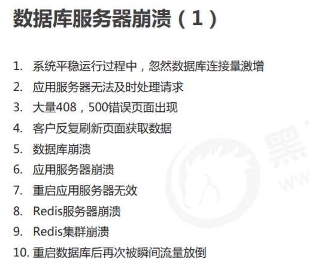

## 问题排查

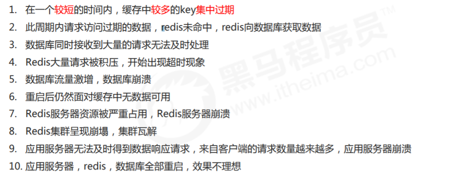

## 问题分析

- 短时间内
- 大量的key过期

## 解决方案

### 避免预防

1. 更多的页面静态化处理
2. 构建多级缓存架构：Nginx缓存+redis缓存+ehcache缓存
3. 检测Mysql严重耗时业务进行优化;对数据库的瓶颈排查：例如超时查询、耗时较高事务等
4. 灾难预警机制
   1. 监控redis服务器性能指标
   2. CPU占用、CPU使用率
   3. 内存容量
   4. 查询平均相应时间
   5. 线程数
5. 限流、降级；短时间范围内牺牲一些客户体验，限制一部分请求访问，降低应用服务器压力，待业务低速运转后再逐步放开访问

### 解决方法

1. LRU和LFU切换
2. 数据有效期策略调整
   1. 根据业务数据有效期进行分类错峰，A类90分钟，B类80分钟，C类70分钟
   2. 过期时间使用固定时间+随机值的形式，稀释集中到期的key的数量
3. 超热数据使用永久key
4. 定期维护（自动+人工）对即将过期数据做访问量分析，确认是否延时，配合访问量统计，做热点数据的延时
5. 加锁（慎用）

## 总结

缓存雪崩就是瞬间过期数据量太大，导致对数据库服务器造成压力。如能够有效避免过期时间集中，可以有效解决雪崩现象的出现 （约40%），配合其他策略一起使用，并监控服务器的运行数据，根据运行记录做快速调整。


# 缓存击穿

## 问题

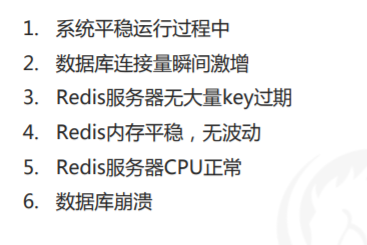

## 问题排查

- Redis的某一个key过期，这个key的访问量巨大
- 多个数据请求从服务器直接压到Redis后，均未命中
- Redis在短时间内发起了大量对数据库中同一数据的访问

## 问题分析

- 单个key高热数据
- 这个key过期

## 解决方案

1. **预先设定** 以电商为例，每个商家根据店铺等级，指定若干款主打商品，在购物节期间，加大此类信息key的过期时长 注意：购物节不仅仅指当天，以及后续若干天，访问峰值呈现逐渐降低的趋势
2. **现场调整** 监控访问量，对自然流量激增的数据延长过期时间或设置为永久性key
3. **后台刷新数据** 启动定时任务，高峰期来临之前，刷新数据有效期，确保不丢失
4. **二级缓存** 设置不同的失效时间，保障不会被同时淘汰就行
5. **加锁** 分布式锁，防止被击穿，但是要注意也是性能瓶颈，慎重！

## 总结

缓存击穿就是单个高热数据过期的瞬间，数据访问量较大，未命中redis后，发起了大量对同一数据的数据库访问，导致对数据库服 务器造成压力。应对策略应该在业务数据分析与预防方面进行，配合运行监控测试与即时调整策略，毕竟单个key的过期监控难度 较高，配合雪崩处理策略即可。


# 缓存穿透

## 问题

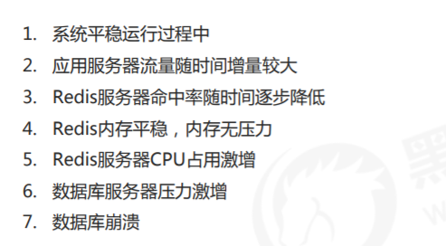

## 问题分析

- 获取的数据在数据库中也不存在，数据库查询未得到对应数据
- Redis获取到null数据未进行持久化，直接返回
- 下次此类数据到达**重复**上述过程
- 出现黑客攻击服务器

## 问题排查

- Redis大面积未命中
- 出现非正常URL访问

## 解决方案

1. 缓存null 对查询结果为null的数据进行缓存（长期使用，定期清理），设定短时限，例如30-60秒，最高5分钟
2. 白名单策略 
   1. 提前预热各种分类数据id对应的bitmaps，id作为bitmaps的offset，相当于设置了数据白名单。当加载正常数据时，放 行，加载异常数据时直接拦截（效率偏低） 
   2. 使用布隆过滤器（有关布隆过滤器的命中问题对当前状况可以忽略）
3. 实施监控 实时监控redis命中率（业务正常范围时，通常会有一个波动值）与null数据的占比  非活动时段波动：通常检测3-5倍，超过5倍纳入重点排查对象  活动时段波动：通常检测10-50倍，超过50倍纳入重点排查对象 根据倍数不同，启动不同的排查流程。然后使用黑名单进行防控（运营）
4. key加密 问题出现后，临时启动防灾业务key，对key进行业务层传输加密服务，设定校验程序，过来的key校验 例如每天随机分配60个加密串，挑选2到3个，混淆到页面数据id中，发现访问key不满足规则，驳回数据访问

## 总结

缓存穿透访问了不存在的数据，跳过了合法数据的redis数据缓存阶段，每次访问数据库，导致对数据库服务器造成压力。通常此类 数据的出现量是一个较低的值，当出现此类情况以毒攻毒，并及时报警。应对策略应该在临时预案防范方面多做文章。 无论是黑名单还是白名单，都是对整体系统的压力，警报解除后尽快移除。


# 性能指标监控

## 监控指标

- 性能指标
- 内存指标
- 基本活动指标
- 持久性指标
- 错误指标

### 性能指标

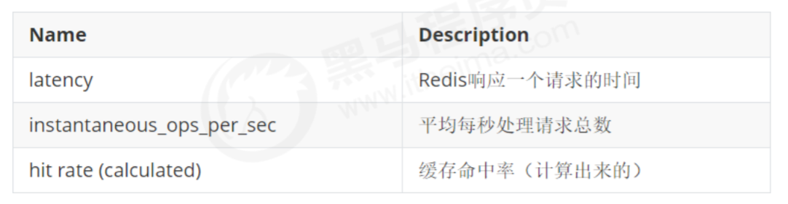

### 内存指标

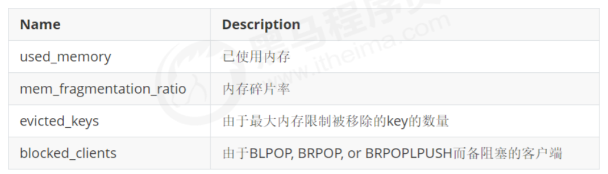

### 基本活动指标

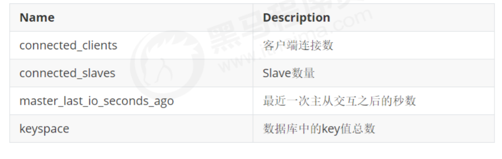

### 持久性指标

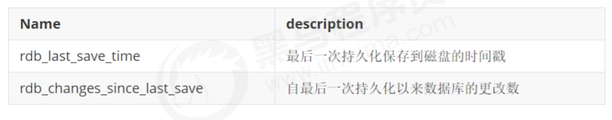

### 错误指标

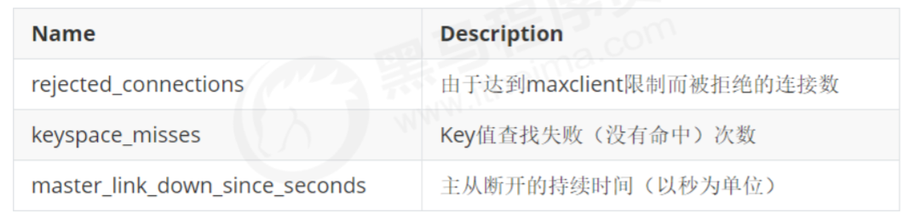


## 命令

### redis-benchmark

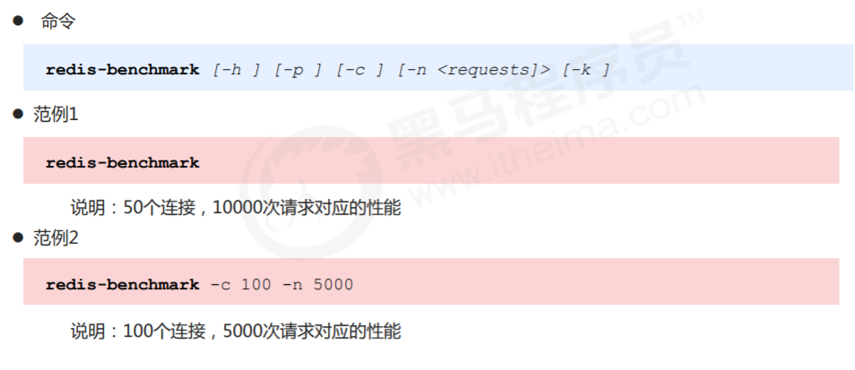

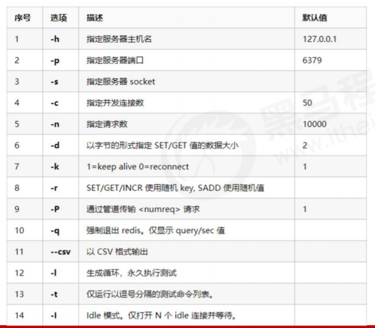

### redis-cli内命令

#### monitor

打印服务器调试信息

#### showlog

```C
showlog [operator]
    get : 获取慢查询日志
    len : 获取慢查询日志条目数
    rest : 重置慢查询日志
```

**相关配置**

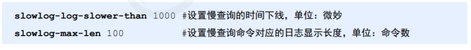

