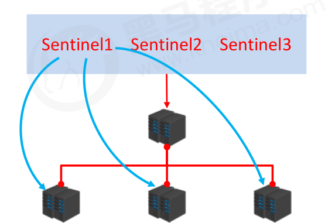

# 哨兵

## master宕机时

需要先人工关闭master和slaves，然后找一个slave作为master，修改其他slave的配置，启动新的master和其他slaves，新的slaves连接到新的master中，并开始全量复制和部分复制。

### 问题

- 手工操作比较繁琐
- slaves关闭期间，数据服务不能相应
- 不知道如何选择一个slave作为master
- 修改配置后，原始的master恢复了怎么解决。

## 哨兵是什么

哨兵是一个分布式系统，用于对主从结构中的每一台服务器进行**监控**。当出现故障时通过**投票机制选择**新的master并将所有slave连接到新的master。哨兵也是一个redis服务器，只不过它不提供数据服务。并且哨兵的数量通常为奇数。

## 哨兵的作用

### 监控

- 不断地检查master和slaves是否正常运行
- master存活检测，master和slave运行状况检测

### 通知（提醒）

- 当被监控的服务器出现问题时，向其他哨兵、客户端发送通知。

### 自动故障转移

- 断开master和slave的连接，选取一个slave作为master，将其他slave连接到新的master，并告知客户端新的服务器地址

# 启用哨兵模式

## 配置文件

``sentinel.conf``

## 配置项

## 启动哨兵

``redis-sentinel sentinel-端口号.conf``

# 哨兵工作的原理

## 监控阶段

### 获取各个节点的信息

- 获取各个sentinel的状态（是否在线） ping
- 获取master的状态（master的属性：run id，role，各个slave详细信息）info
- 根据master中slave的信息获取各个slave的状态（runid， rolw，master_host, master_port, offset,...） info

### 过程

1. 启动哨兵，哨兵连接上master后发送info指令，获取master的状态信息。
2. 哨兵和master之间创建cmd连接方便发送指令。同时在哨兵端保存了所有信息包master/slaves/sentinels,在master端也保存了所有信息包括master/slaves/sentinels
3. 哨兵根据slave信息连接到每一个slave中，并且通过info指令获取slave的状态信息。
4. 启动第二个哨兵也会自动去连接master,发送info指令，会发现master已经和其他哨兵连接过同时建立cmd连接，此时哨兵端保存信息包括master/slave/sentinels(包括之前连接的哨兵)，两个哨兵之间也会建立连接。
5. 其他哨兵启动也进行同样操作。
6. 多个哨兵形成一个网络，相互发布和订阅信息。

### SentinelState和SentinelRedisInstance的关系

- sentinelState包含了sentinelRedisInstance

## 通知阶段

## 自动故障转移流程

1. 其中一个sentinel向master发送信息，一段时间内master没有回应，标记状态SRI_S_DOWN(主观下线)
2. sentinel在自己内网中告诉其他哨兵，master挂了。其他哨兵也去连接master,半数以上的哨兵发现master挂了，那就是真的挂了，状态改成SRI_O_DOWN（客观下线）
3. 所有的哨兵**先推选出一个哨兵领导**，哨兵领导根据自己的原则从所有的slave中**挑选出新的master**,其他slave切换新的master,故障恢复后原master作为slave

### 新master选择原则

- 在线的
- 相应慢的排除
- 与原来的master断开时间长的排除
- 优先原则
  - 优先级
  - offset
  - runid

### 新master和新slave建立连接

- 向新master发送slaveof no one
- 向其他slave发送slaveof 新masterIP 端口

## 总结

