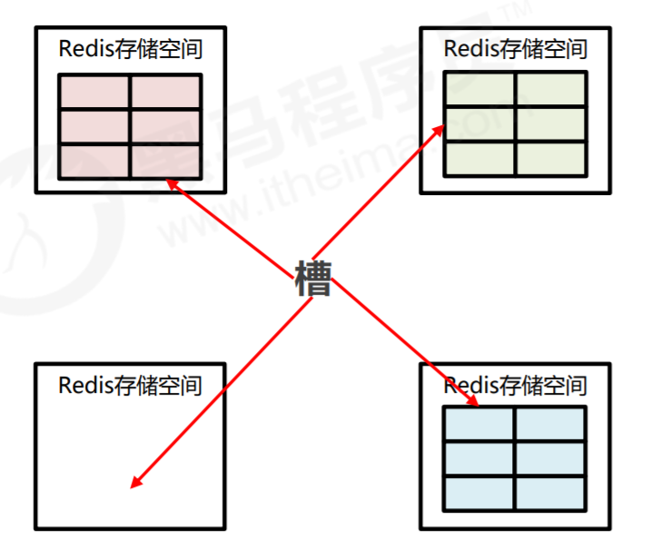
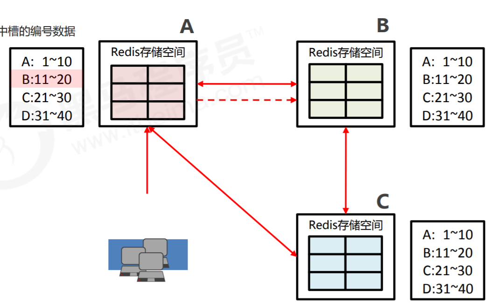
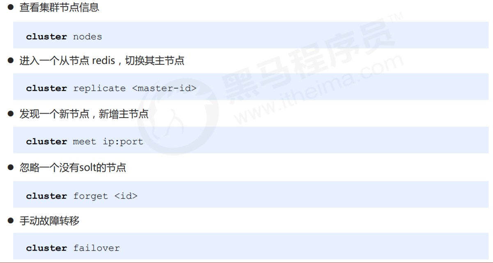
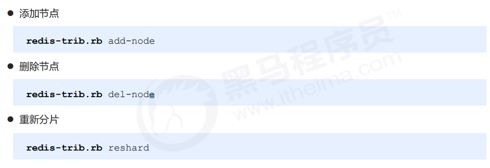

# 集群简介

## 是什么

集群就是通过网络将若干台计算机连接起来，并且提供统一的管理方式，使其对外呈现单机的服务效果。

## 作用

- 分散单台服务器的**访问**压力，实现负载均衡
- 分散单台服务器的**存储**访问压力，实现可扩展性
- 降低单台服务器宕机带来的业务灾难

# 结构设计

1. 将所有的存储空间计划切割成16384份（槽），每台主机保存一部分 每份代表的是一个存储空间，不是一个key的保存空间
2. 通过算法设计，计算出key应该保存的位置
3. 将key按照计算出的结果放到对应的存储空间

# 可扩展

- 增加节点时，已有的节点将一部分槽划分给新的节点
- 去掉节点时，被去掉的节点的槽分配给剩下的节点

# 集群内部通讯设计

- 各个节点之间相互通信，保存这各个库（节点）中槽的编号数据
- 客户端连接到某一个节点，获取某一个key对应的value
- 如果命中，直接返回
- 如果未命中，则告知客户端该数据的位置
- 客户端根据位置重定向到另一个节点，获取数据。

# 集群搭建

## 搭建方式

- 原生安装（单条命令）
  - 配置服务器（3主3从）
  - 建立通信（Meet）
  - 分槽（Slot）
  - 搭建主从（master-slave）
- 工具安装（批处理）

## 配置文件

- 添加节点

  ``cluster-enabled yes|no``

- cluster配置文件名，该文件属于自动生成，仅用于快速查找文件并查询文件内容

  ``cluster-config-file <filename>``

- 节点服务响应超时时间，用于判定该节点是否下线或切换为从节点

  ``cluster-node-timeout <milliseconds>``

- master连接的slave最小数量

  ``cluster-migration-barrier <count>``

## Cluster节点操作命令

## redis-trib命令

