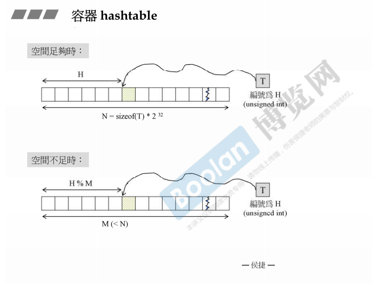
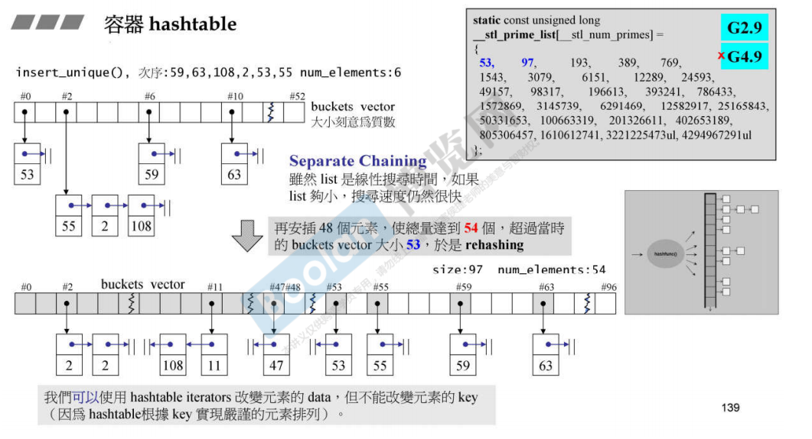
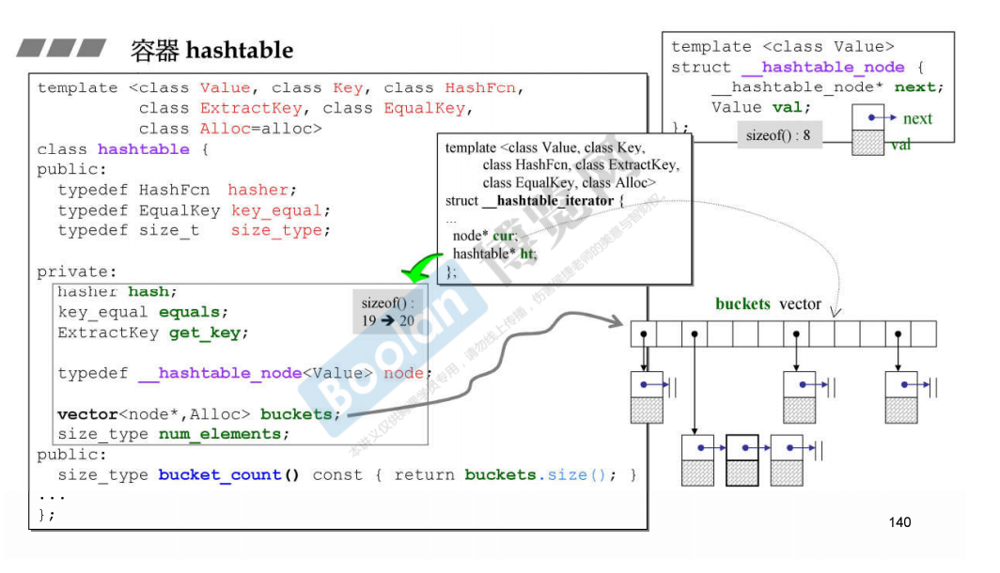
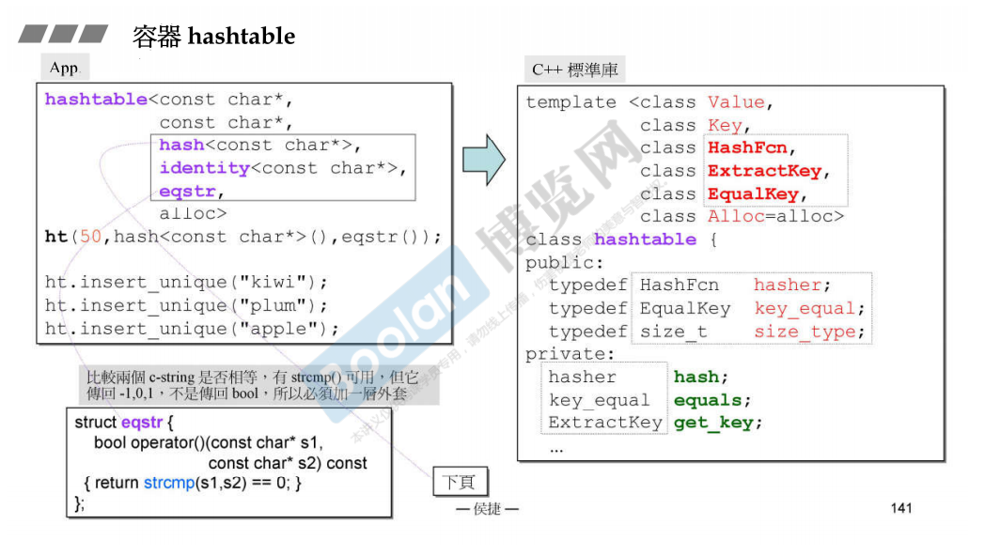
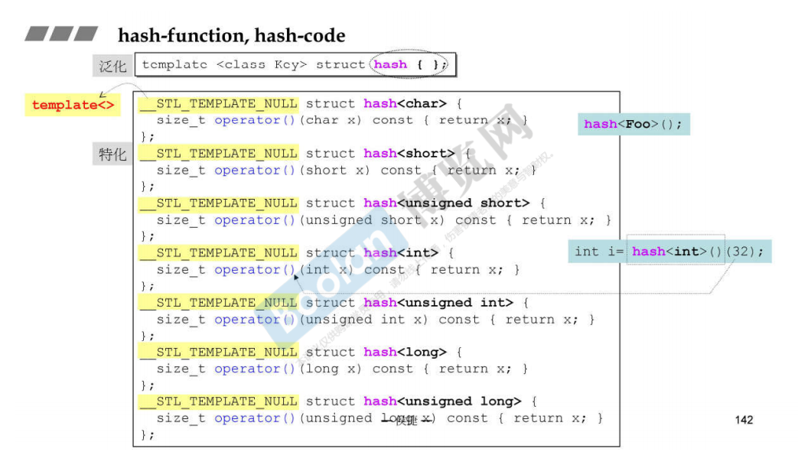
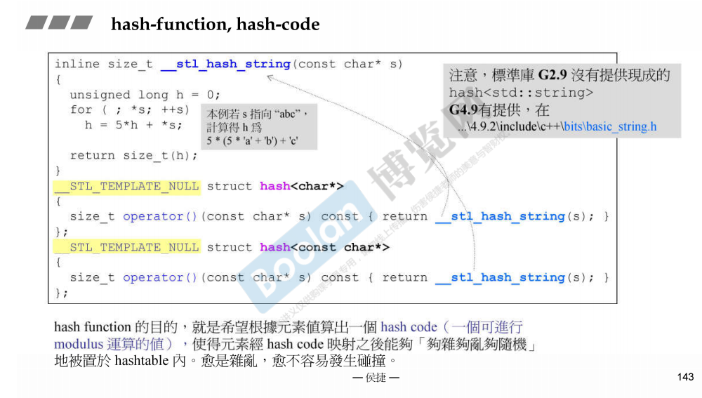

# Hashtable及相关容器

- 如果存放元素的buckets足够多时（内存足够大时）那么直接将元素放入即可，但是空间可能不足，bucket的数量不够，所以一个桶可能放置了多个元素，这些元素使用链表链接起来

- 有一个bucket vector用来保存每一个链表的地址，bucket的大小刻意为1个质数。当元素个数大于bucket的个数时，需要重新将bucket的个数增大为与原来大小两倍最接近的质数，然后对所有元素重hash，确定新的放置的bucket。

- hashtable的成员：注意如果一个类的大小为0，那么它的对象的大小为1.
- 

- 需要提供的模板参数如下
- 

- 标准库提供了对基本类型的hash函数，对于传入的整数值，直接返回。通过特化实现基本类型的hash函数

- hash函数的目的，就是根据元素计算出一个hash code，元素根据hash code放置到hashtable中。