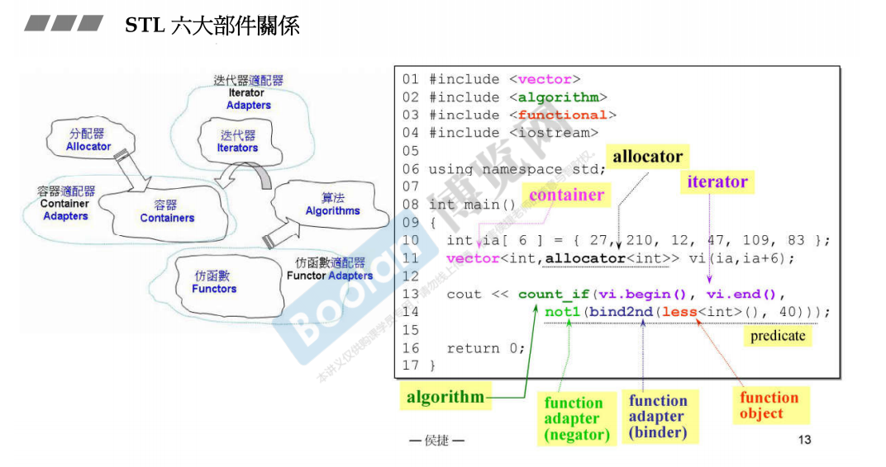
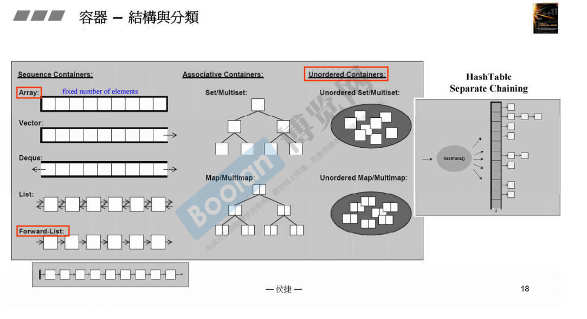
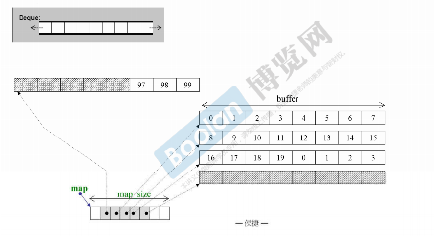
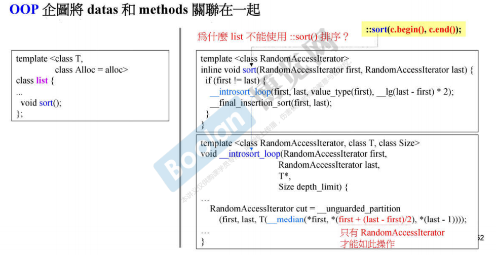
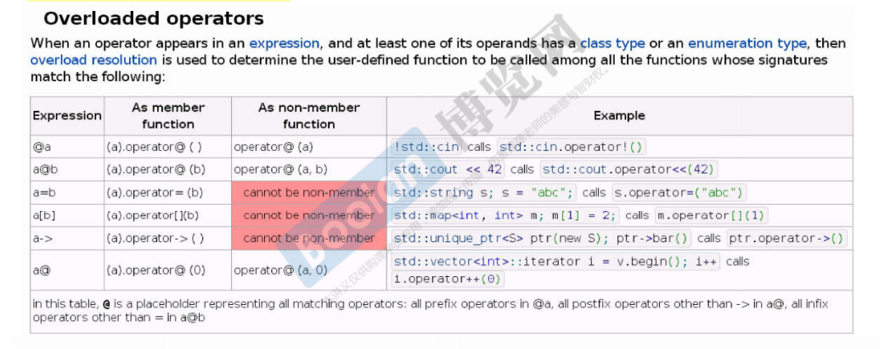
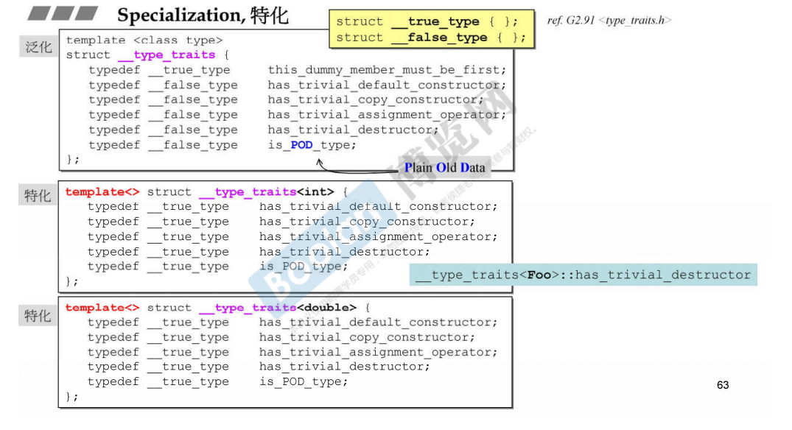
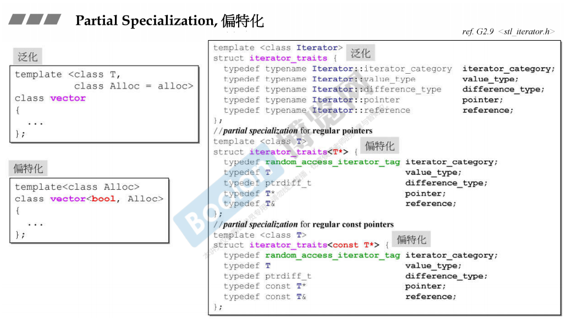
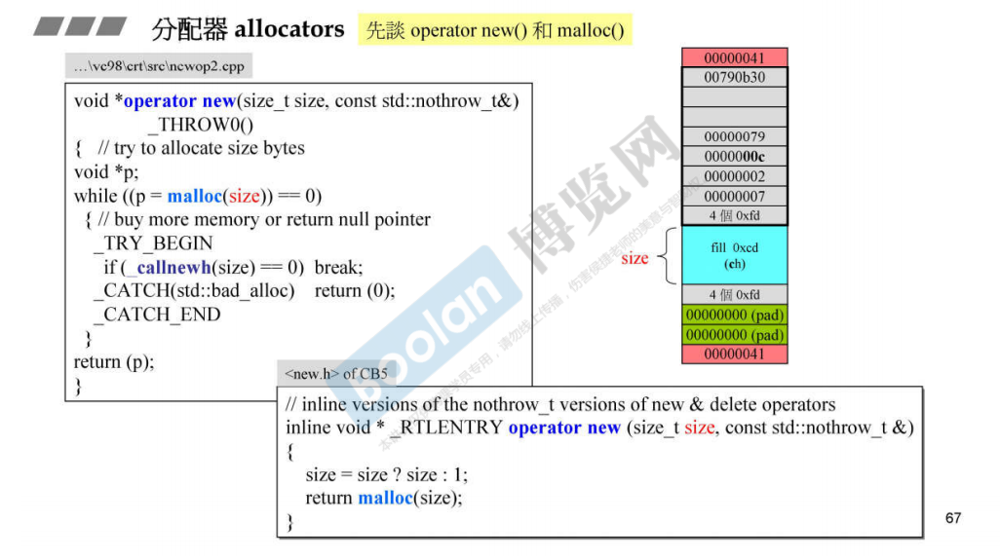
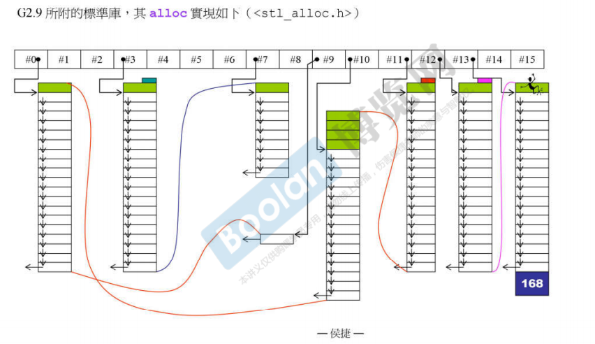
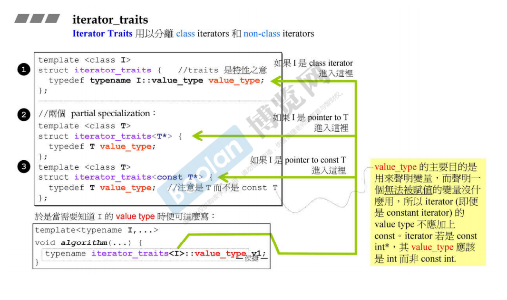

# STL

## 六大部件

* 容器
* 分配器
* 迭代器   沟通容器和算法的桥梁
* 算法
* 适配器

   * 容器适配器

   * 仿函数适配器

   * 迭代器适配器
* 仿函数

## 容器分类

* 序列式容器
* 关联式容器

   * 有序     底层使用RB树

   * 无序     底层使用Hash，hash使用链地址法解决hash冲突

### 序列式容器

* array

   * 长度固定不可变的数组
* vector

   * 长度可变的数组，当容量不足时，以两倍大小扩展容量
* list

   * 双向链表
* forward\_list

   * 单向链表        从头插入 push\_front\(\)
* deque

   * 双端容器

   * 使用一个map记录每个buffer的地址，buffer保存数据，向前向后插入时，如果buffer已满，那么申请一个新的buffer，map记录新的buffer的位置

   

* stack

   * 栈，先进后出，使用deque实现，相当于容器适配器，没有提供迭代器，不支持遍历
* queue

   * 队列，先进先出，使用deque实现，容器适配器，没有提供迭代器，不支持遍历

### 关联式容器

* multset

   * 使用RBtree，内部已经有排序规则，所以插入时不需要指定位置

   * 值可以重复
* multimap

   * 使用RBtree，内部有序，所以插入时不需要指定位置

   * 保存键值对，按照键进行排序，键可以重复

   * 不支持通过\[\]插入数据
* set

   * 使用RBtree，值不可以重复
* map

   * 使用RBtree，值不可以重复
* unordered\_map

   * 使用Hash，确定存储位置，使用连地址法解决hash冲突

   * 桶比数据元素要多，否则以两倍大小重新开辟一块内存空间作为桶，对数据重新hash，放置到新的桶中
* unordered\_set

   * 使用Hash，同上
* unordered\_multimap

   * 使用hash，不支持\[\]插入数据
* unordered\_multiset

   * 使用hash
* 关联式容器自带find成员函数，通过使用容器内部存储的规则，实现快速的查找，比使用算法库中的find函数（顺序查找）要快
* 非标准库关联式容器

   * hash\_set

   * hash\_map

   * hash\_multimap

   * hash\_multiset

### 分配器allocator

为容器的内存分配和释放提供支持。提供两个方法

1. .allocate\(n\) 分配n个单位的内存
1. deallocate\(p, n\) 释放从p开始的n个单位的内存

不要直接使用分配器，因为释放内存的时候，需要记录下自己申请了多少个单位的内存单元

## OOP  vs  GP

* OOP是面向对象，试图把数据和方法放在一起
* GP泛型编程，把数据和方法实现分离，通过某一东西建立联系；使得各个部分可以相对独立地开发

注：

* 不能进行随机访问/随机存取的容器，不能使用算法库中的sort函数
* 由于list容器不支持随机访问，所以自身带有sort函数，不能使用算法库中的sort函数

算法库中的算法最终设计的对对象的操作，无非就是比较对象的大小，所以

1. 需要指定比较的方法，使用普通函数/函数对象（仿函数）
1. 重载对象的<运算符

### 类模板/函数模板/成员模板

* 类模板**​**

   * 需要显式指定类模板参数，因为不能从对象定义中推导出模板参数
* 函数模板

   * 可以通过传入的参数进行自动类型的推导

   * 可以显式地指定模板参数

### 模板的泛化和特化

特化包含：（时间或者空间更加有效率）

* 全特化：对所有模板参数进行绑定     特征：template<\>
* 偏特化：

   * 参数部分被绑定

   * 范围上的特化

## 分配器

### operator new / operator delete

operator new实际上底层调用C的malloc函数，delete实际上调用C的free函数

malloc函数分配的内存除了实际所需要的内存，还包括了其他overhead开销，与内存管理有关

* VC6，BC5，G2.9 的allocator使用::operator new和::operator delete完成allocate和deallocate，没有任何特殊操作
* G2\.9并没有使用allocator，而是使用alloc

* G4\.9使用std:allocator, 没有任何特殊操作，原有的alloc变成了\_\_gun\_cxx::\_\_pool\_alloc<typename\>

## Iterator traits

* iterator需要提供5中associated types

   * iterator\_category     迭代器的类型

   * value\_type     元素类型

   * pointer

   * reference

   * difference\_type   iterator距离的类型
* 算法根据iterator的信息，决定怎么使用迭代器来高效实现算法，iterator必须能够回答算法提出的问题
* 传入算法的可能是指针，也可能是原生指针。class iteration能够直接回答算法的提问，但是原生指针non class iteration不能回答问题，所以就需要用到萃取机iterator  traits。用于分离class iterator和non\-class iterator，使用偏特化实现目标，应付原生指针的问题

- iterator_traits将容器的**迭代器**的嵌套类型作为自己的嵌套类型，通过这样告知算法。

