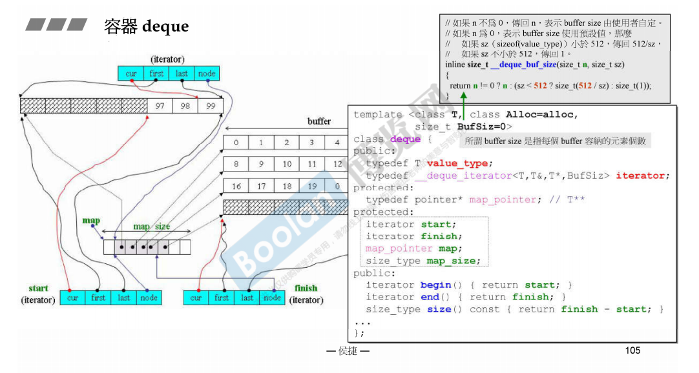
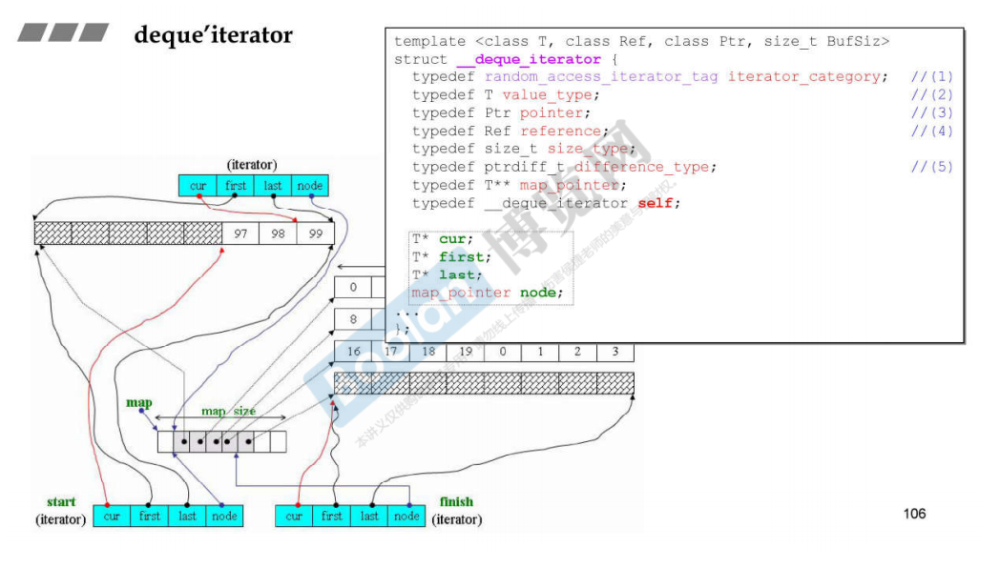
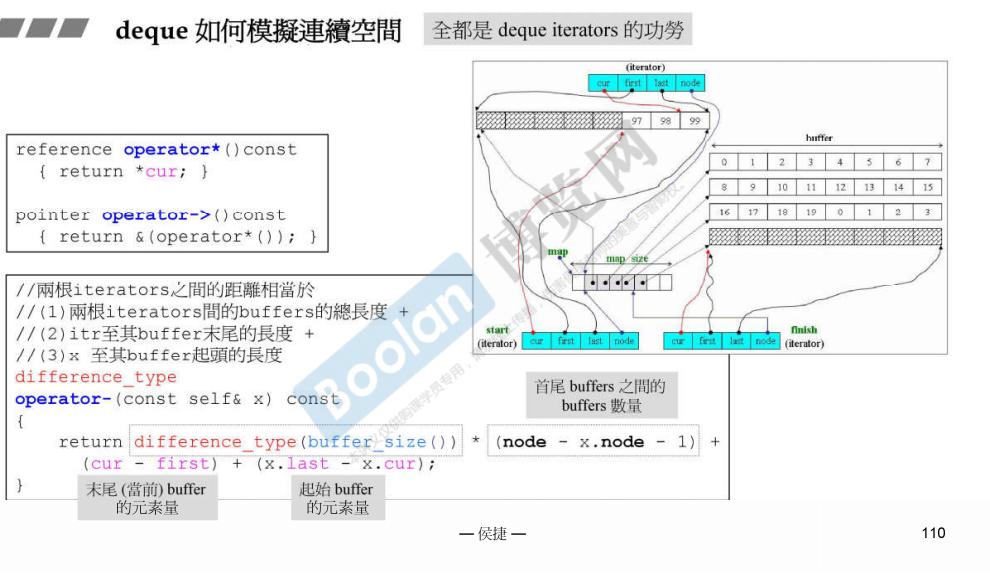
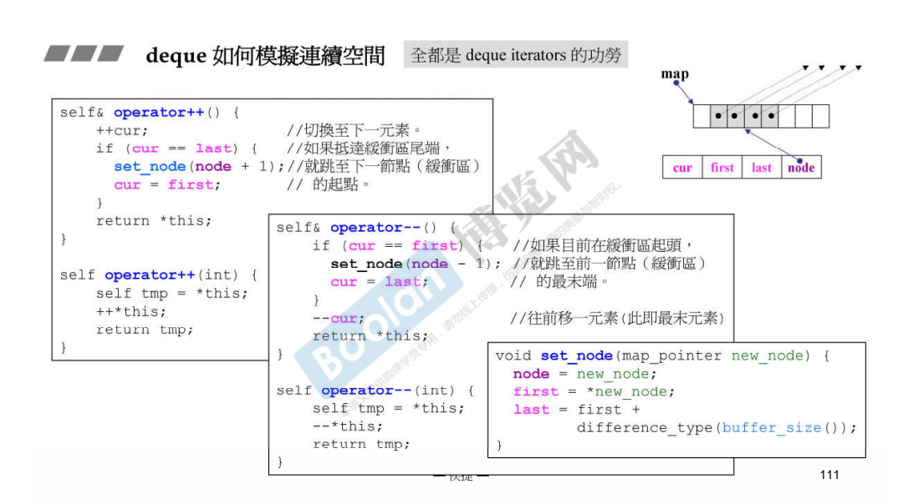
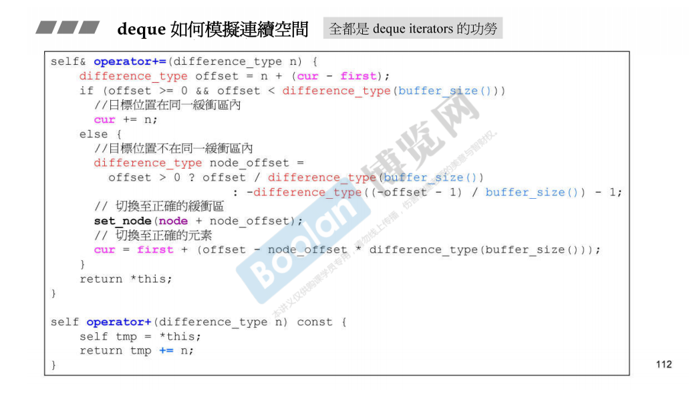
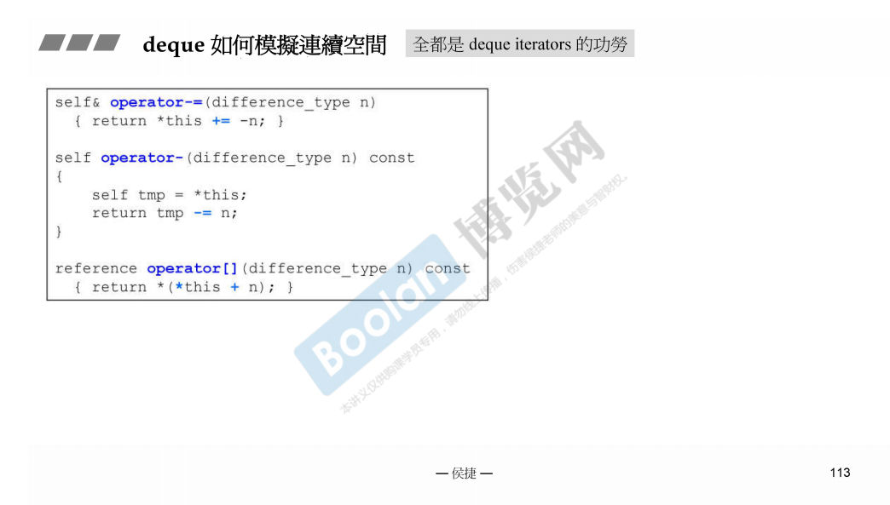
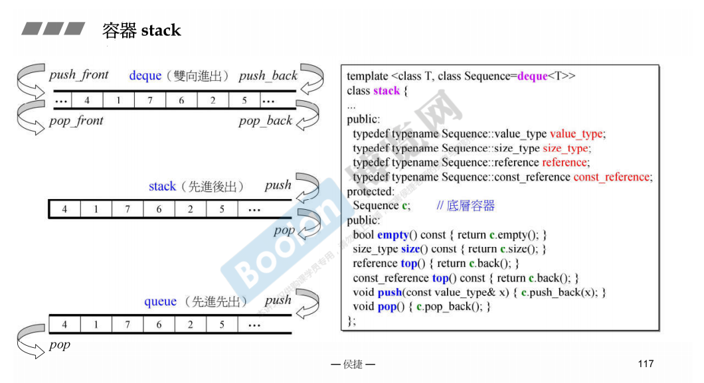

# deque，stack，queue容器

## deque

- deque是双端容器，可以向两端进行扩充。deque对外表现得元素是连续存储的，实际上元素是分段储存的，段里的元素是连续存储的。这一个段叫做buffer，需要一个数组保存这些buffer的首地址，这个数组保存的是指针，deque用一个T**的变量保存这个数组的起始位置，称为“控制中心”，map。deque类内部保存了map的地址，start和finish两个迭代器，一个map的大小。

- 当map的大小不足的时候，申请另一个大小为原map大小2倍的空间，然后将原map中的内容拷贝到新的空间的中间部分，使得左右两端剩下差不多的位置。
- 当插入时，段已满时，新开一个段，map中相应位置保存指向这个段的指针
- G2.9版本可以指定buffer的大小，默认为0，实际上如果没有指定buffer的大小（buffer可以容纳的元素的个数，而不是字节数），那么就将需要存储的元素的大小和512比较，如果大于512，那么一个buffer能够存储一个元素，否则存储512/sizeof(元素)个元素，G4.9版本不能指定buffer的大小。
- 每个迭代器包含4个指针，段的起始，段的结束，段的地址在map中的存储的位置，cur当前指向的元素

- deque的insert操作，需要判断是不是插入头部还是尾部，如果是，则调用push_front或者push_back方法，否则，需要计算插入位置分别和头部位置和尾部位置的距离，根据距离确定移动前面的元素还是移动后面的元素（取距离小的一边）
- deque模拟连续的空间，由于迭代器的实现，可以随机存取，所以重载了[]运算符，而且它的迭代器不只有--/++操作，也可以直接+n/-n。-n是通过+ -n来实现的。+n需要判断先判断是否需要跨buffer，然后判断跨越多少buffer等。

## queue，stack

- queue和stack默认使用deque作为底层容器，也就是deque的对象作为queue和stack的一个成员
- 由于queue和stack本身的特性，所以不提供迭代器，不支持遍历，否则破坏了自身的特性
- queue和stack的操作，实际上是调用底层容器相应的操作。

- queue和stack称为容器适配器
- list和deque都可以作为queue和stack的底层容器，vector可以作为stack的底层容器，只要提供了相应的方法，一个容器就能够作为底层容器

- 编译器并不会进行完全全面性的检查，用到多少才检查多少。也就是编译时，如果调用某个方法的时候，底层容器并不能提供相应方法时，就会报错。