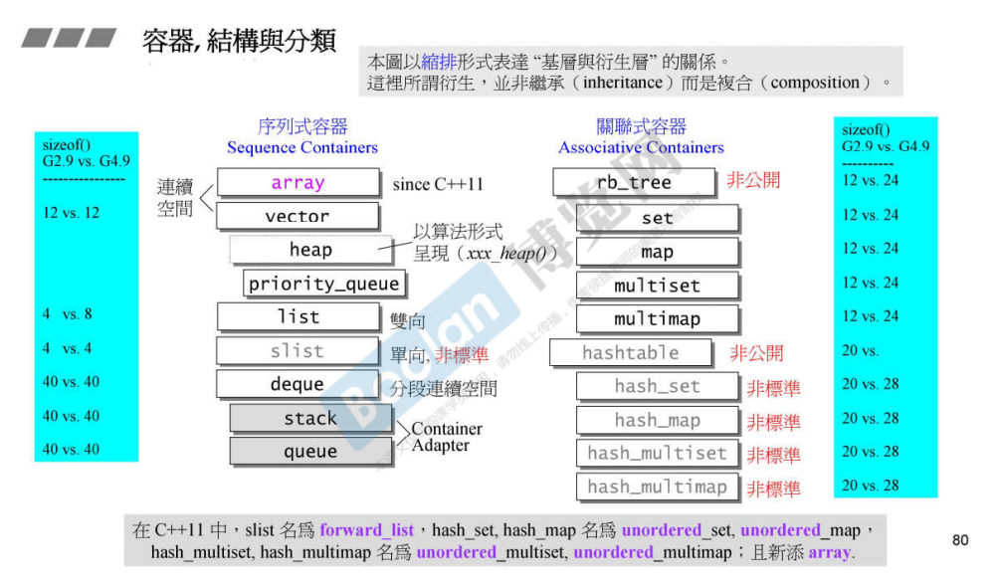
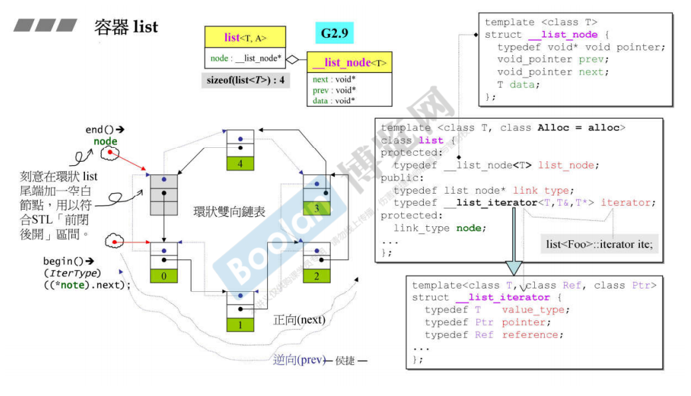
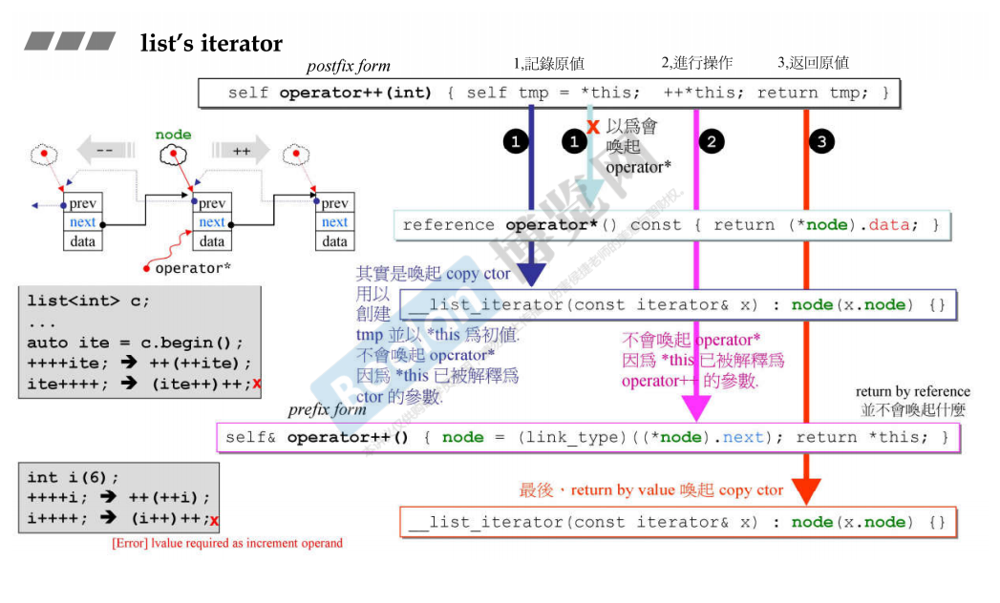
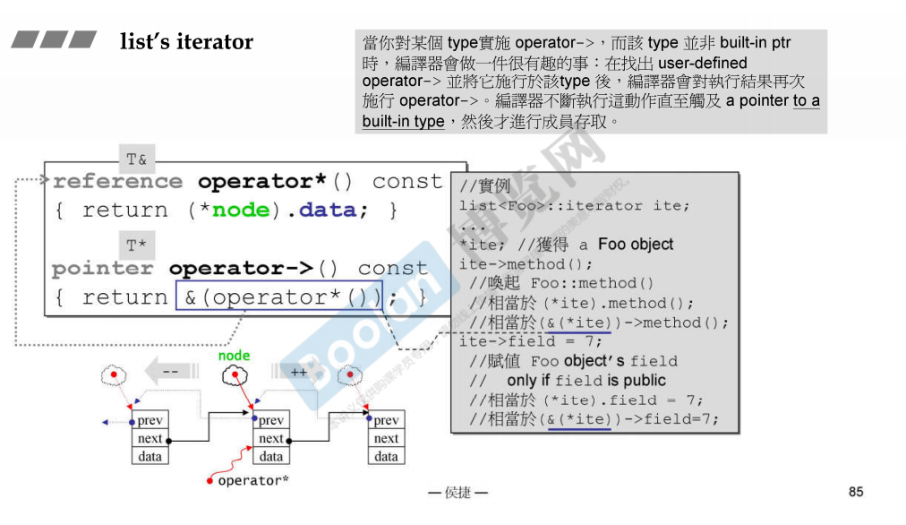
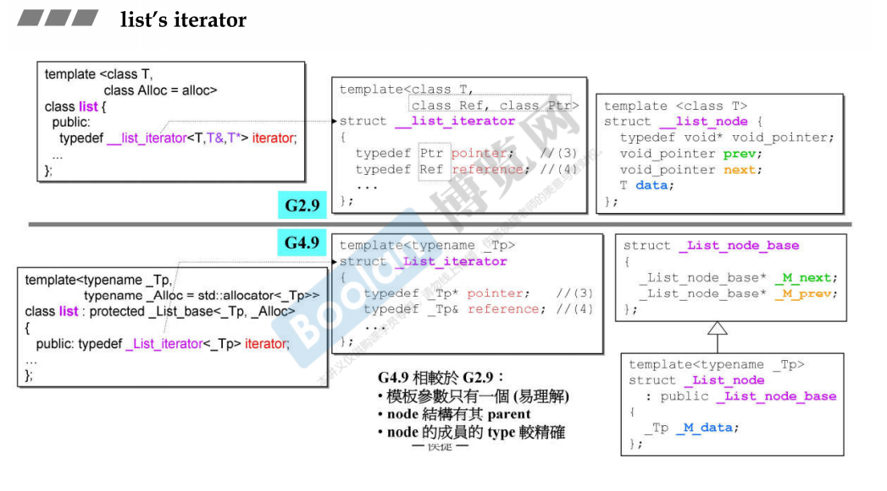
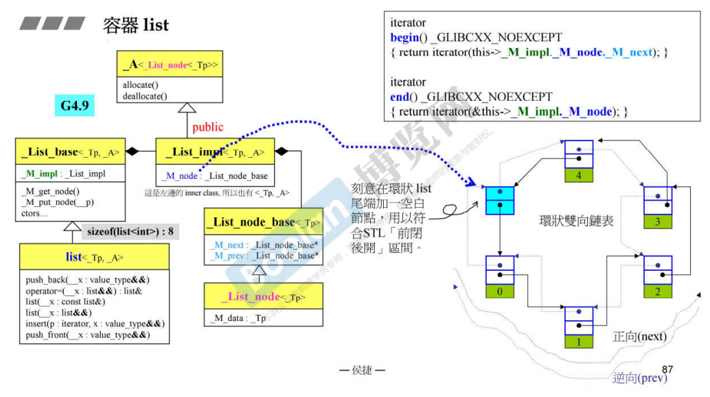

# list容器

- list是循环双向链表，包含一个空白节点连接到链表的尾部，符合STL的迭代器的前闭后开的区间性质
- G2.9版本的list容器中包含了指向之恶个空白节点的指针，

- list的节点包含三个域，两个指针域以及一个数据域，list类定义一个嵌套类型：iterator
- 由于list容器的元素不是连续存储的，所以迭代器只能++或者--

- this指针是iterator的指针，不是iterator本身，所以对this解引用并不会调用iterator重载的*号运算符
- 前++和后++返回的类型不一致，前++返回的是引用，后++返回的是值
- 如果一个type的->操作得到的不是内置的指针对象，那么编译器会对结果继续执行->运算，知道得到的结果是内置的指针类型

- G4.9版本，iterator模板的参数只有一个，而不是3个；node类的成员的类型较正确

- G4.9版本list容器直接包含空白节点，这个空白节点没有数据域；list容器而不是保存指向这个空白节点的指针

