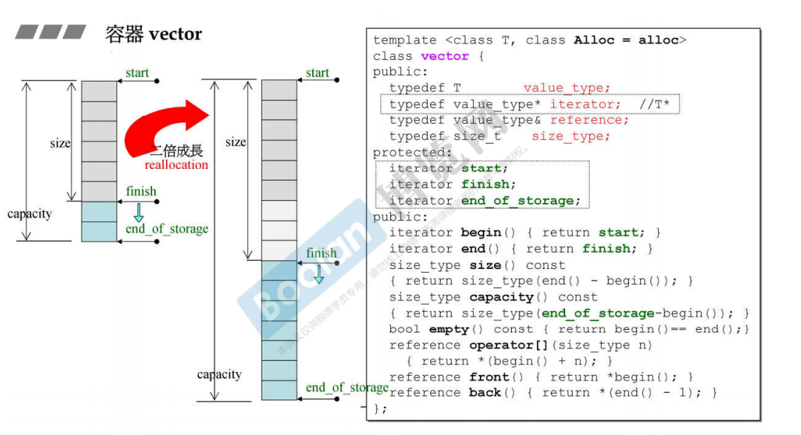
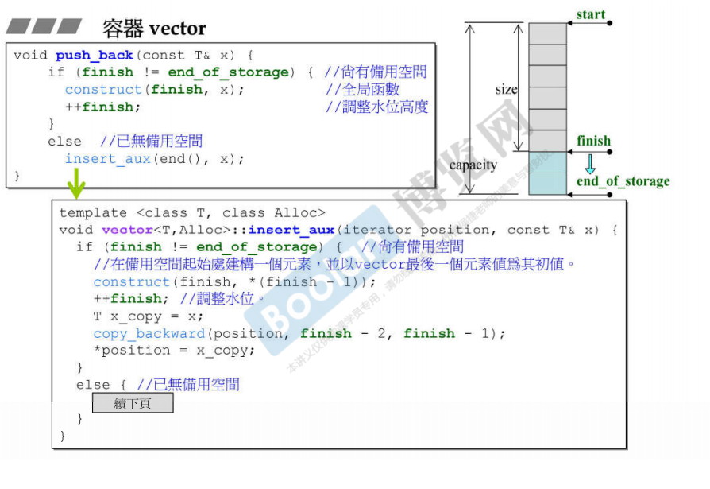
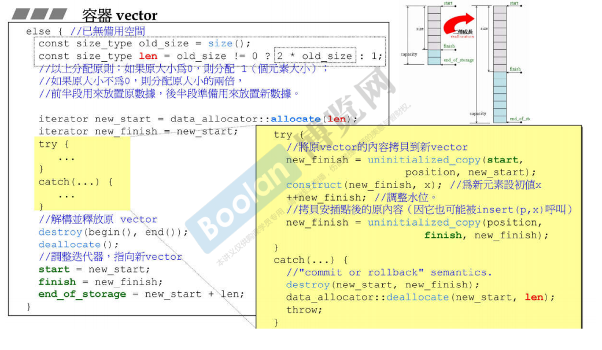
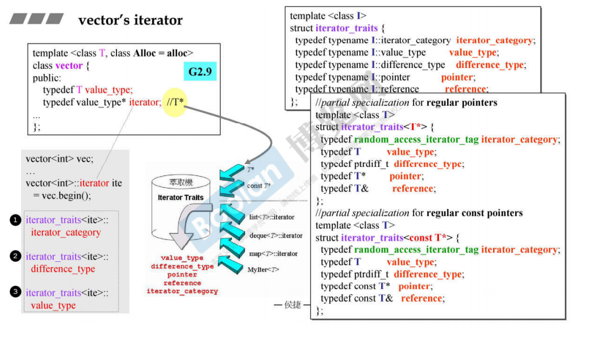
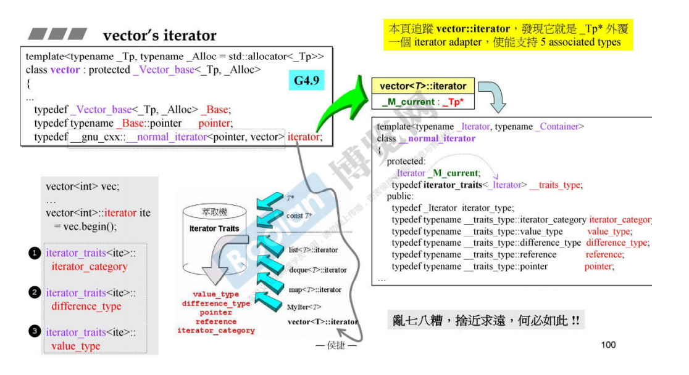
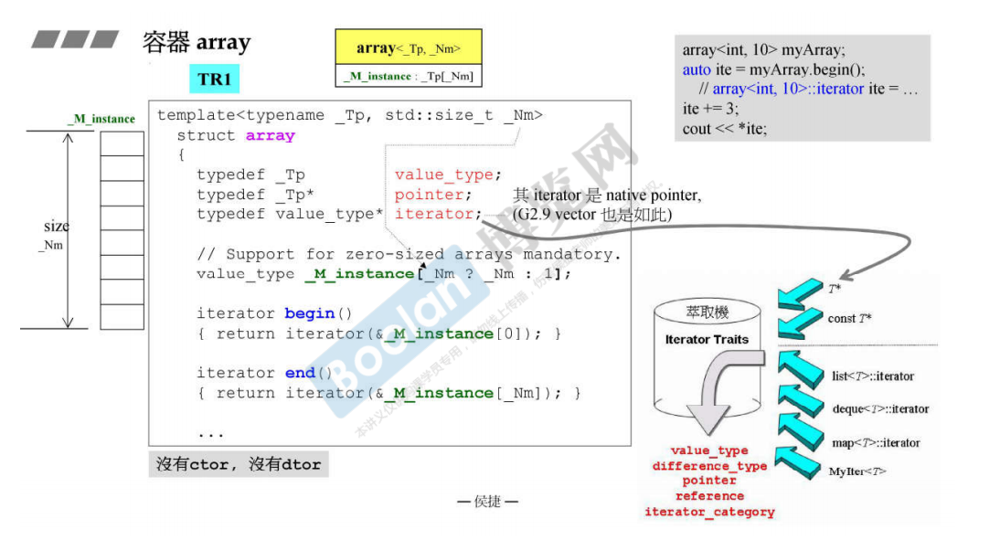
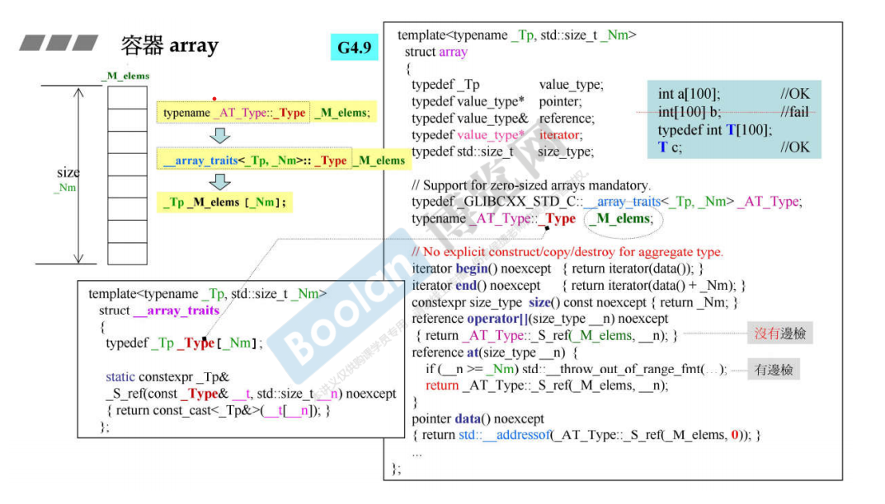
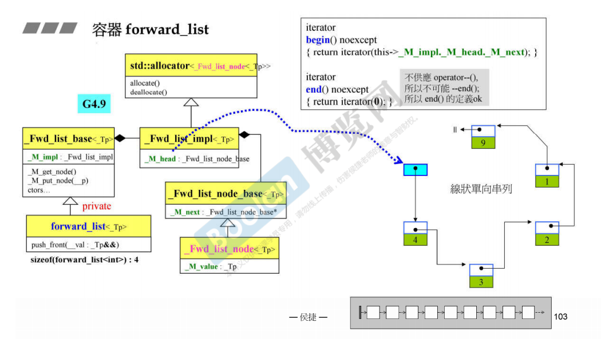

# vector，array和forward\_list

## vector

* 动态数组，当空间不足时，空间两倍进行扩展
* 迭代器就是储存类型的指针
* 由于元素是连续存储的，所以重载了\[\]运算符

* push\_back\(\)和insert\(\)函数，需要先判断是否还有备用空间，如果没有备用空间，那么申请原空间大小两倍的新空间，将原空间的元素和插入的元素拷贝到新的空间里面，拷贝的过程需要调用元素的构造函数，最后原空间上的元素调用自身的析构函数，最终释放原空间。所以空间扩展时，设计大量的拷贝构造函数和析构函数的调用，开销大。

* G2\.9版本的vector iterator实际上是一个指针，所以萃取器使用的是偏特化。

* G4\.9版本的vector iteration封装了指针称为一个类，迭代器适配器，所以直接支持5种associate types

## array

* 不需要构造函数也不需要析构函数
* array内部直接使用数组，相当于封装了数组
* 迭代器实际上就是指针

## forward\_list

* 包含一个头节点（只有指针域），指针域内部保存了指向第一个节点的指针
* end\(\)得到的是NULL,
* 由于是单向链表，所以迭代器不支持\-\-操作

