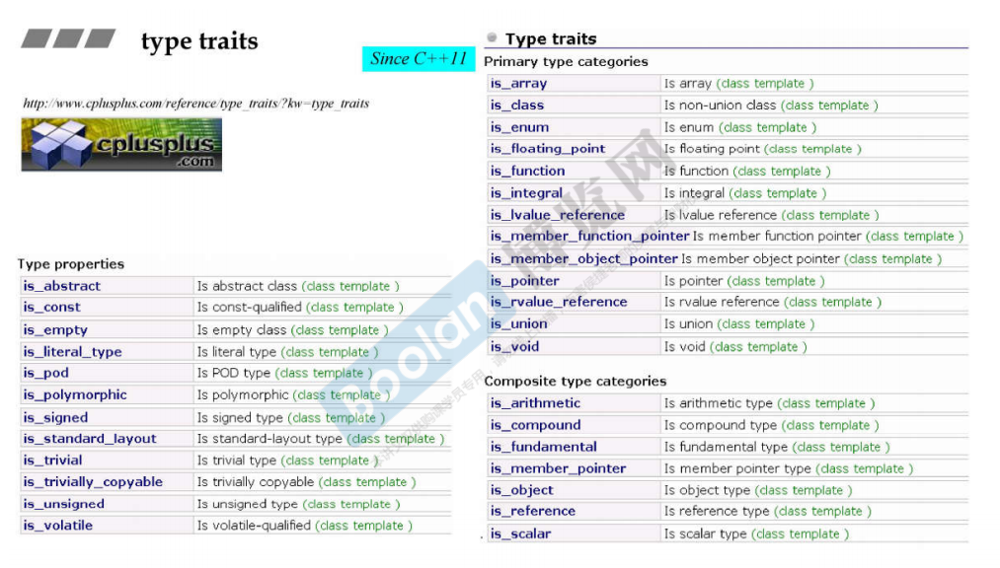
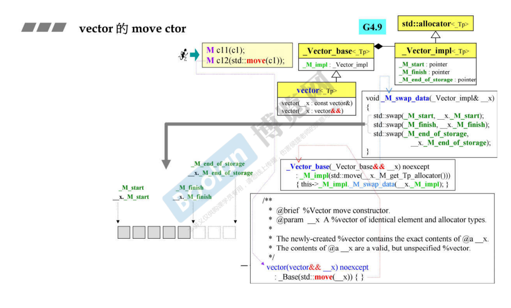

# 体系结构和内核代码

## hash function

G2.9有两种形式，G4.9增加一种形式，传入容器模板参数是一个类型，所以普通函数要取它的类型

- 仿函数
- 普通函数 返回类型(*)(参数类型)
- 利用std中的hash函数的偏特化

一个万用的hash function，使用到可变参数模板，模板的参数个数可变，通过函数重载确定执行哪一个。

如上图，当传入n个参数的时候，初始化seed为0，然后调用（seed，n个参数）作为参数，调用“2”函数，“2”函数使用seed和第一个参数hash改变了seed的值后，再调用（seed,n-1个参数）。这个步骤一直执行，知道剩下一个参数，调用对应的hash_val函数，最终得到seed作为hash的结果。

G4.9提供了对string类型的hash函数

## tuple

不同类型的数据的组合

初始化方法，元素访问方法，等操作

tuple的实现，使用了可变参数模板，并且去除head的类型，递归地继承参数为剩下的类型（tail）的类模板。在每一个继承阶段，都取出一个head类型，这个类型的变量作为这个继承层次的类的成员。

## type traits

G2.9版本的能够提供的信息只有几个，而且自定义的类型还要自己通过偏特化来实现自己的type traits。这样比较麻烦。（POD是指只有数据没有方法的类型）

C++11之后，提供了多种多用的type traits类，能够提供的消息就更多了。这些都是类模板，通过传入我想要的类型作为模板实参，得到具体的type traits类，这个类中定义了static类型的变量，取出这个变量的值，就能取出消息的结果。

通过偏特化来去除const和volatile关键字。通过偏特化来继承对应的类，然后能够提供正确的消息。

通过偏特化来，指明相应的类型的信息。is_intergral这个类通过类型继承相应的类。从而能够提供对应的信息。

其中有些函数不一定出现在标准库源代码中，可能是在编译器编译时提供。

## cout

变量和函数遵从单定义规则，也就是只能定义一次，在多个文件声明。文件中定义的非const全局变量和函数默认是extern的。const的全局变量默认是static的，所以如果让这个const变量的链接性为外部，那么需要显式加上extern。

extern 修饰 变量声明：声明变量，说明这个变量定义在别的文件中查找。extern不可以省略。

extern 修饰 变量定义：定义变量，并且显式指定变量的链接性为extern。extern可以省略。

extern 修饰 函数声明：声明函数，说明这个函数的定义在别的文件中查找。extern可以省略。

extern 修饰 函数定义：定义函数，并且显式指定函数的链接性为extern，extern可以省略

头文件中，一般只放函数，变量，类的声明，而不能放定义。inline函数定义可以放。const变量定义可以放。static变量可以放。因为const和static变量的链接性是内部的。

cout是一个对象，不是一个类。上图中extern _IO_ostream_withassign cout只是声明，不是定义。

## move copy

move copy能够带来性能的提升，当经常进行构造析构的时候（对于vector来说更加显著）

move copy实际上进行的是对指针的浅拷贝，并没有动态申请内存。所以效率比较快。而普通的copy进行的是深拷贝，需要动态申请一块新的内存空间，所以比较慢。move copy实际上就是将别人堆上的资源“移动到”我当前这个容器，然后原来的容器的指针置为NULL。所以这个原来的容器后面不要再去使用，或者这个原来容器是临时对象，就会隐式调用move copy。move copy的参数是一个右值引用类型。

如果传入的是临时对象，那么调用move copy，否则调用一般的copy。也可以显式的通过std::move来调用move copy。

vector的move ctor是将容器里面的迭代器进行交换了。

string也是可以moveable的。也就是通过“浅拷贝，移动资源归属”的方式赋值或构造。