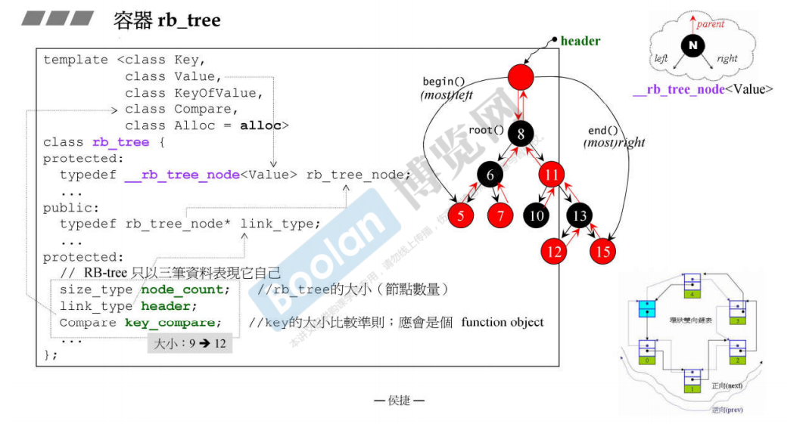
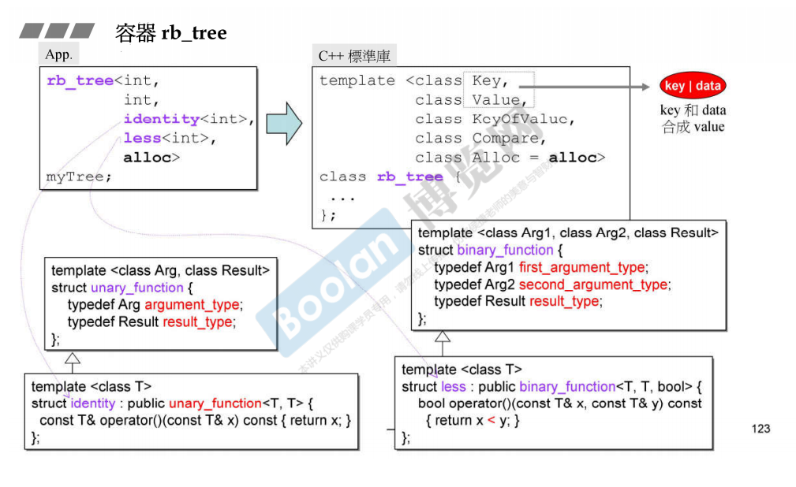
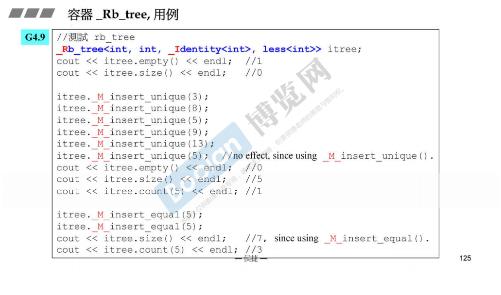
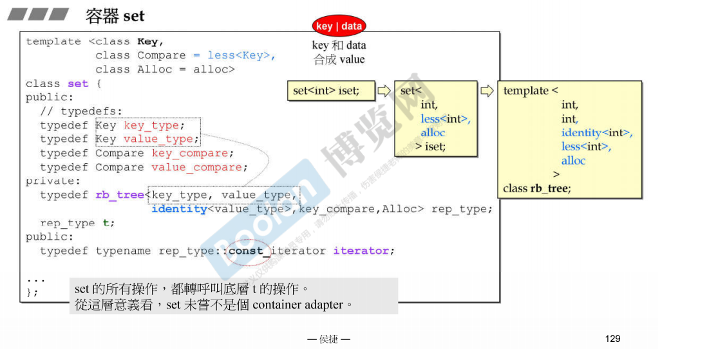
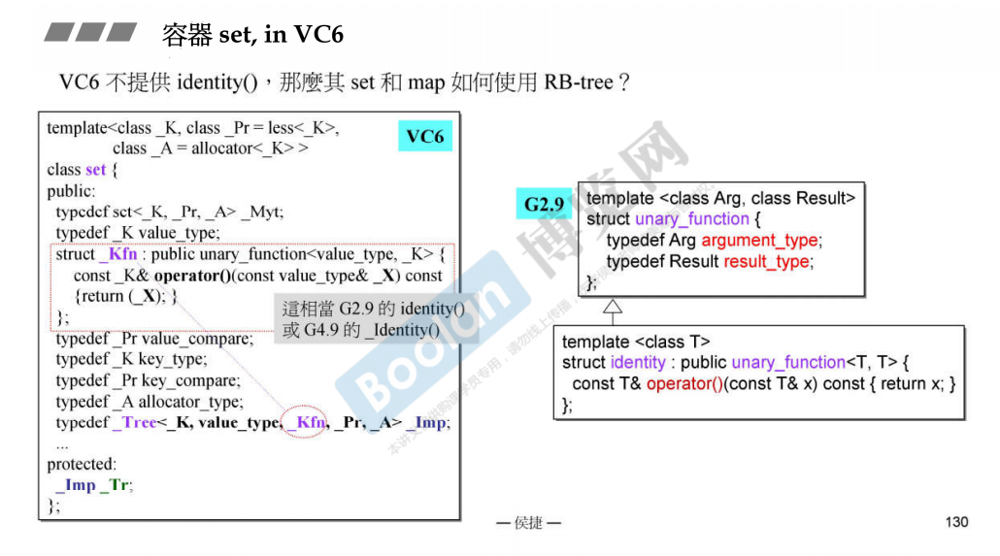
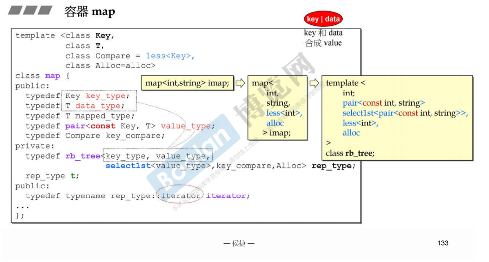
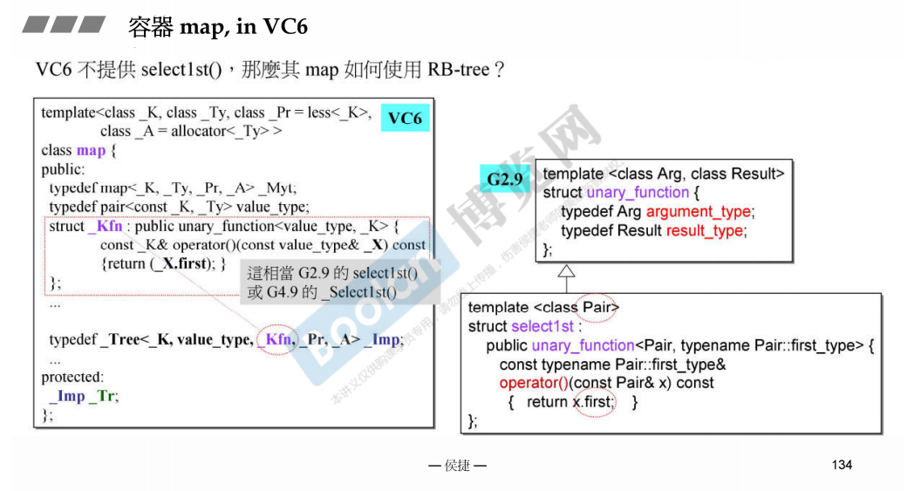
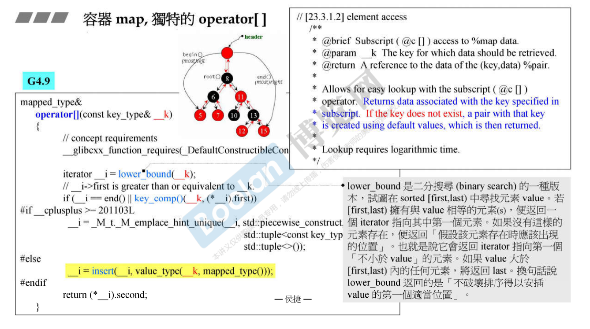

# 关联式容器

## rb\_tree

* 红黑树是一个平衡的二叉搜索树，排列规则有利于插入insert和search，并且保持适度平衡，无任何节点过深
* rb\_tree提供遍历和迭代器，可以用\+\+，\-\-操作
* 不应该使用迭代器修改红黑树的值，但是编程层面并没有阻止，因为rb\_tree作为map的底部支持容器，map的键不可变，但是值可以变
* rb\_tree提供两种insert操作，insert\_unique和insert\_equal,前一值为一，插入重复的值不会有什么操作，后一支持插入相同的值
* G2\.9的rb\_tree有一个header节点，rb\_tree保存节点个数，指向header节点的指针，header节点有指向最左/最右节点的指针，以及指向root节点的指针。
* 大小为0的类的对象的大小为1，根据内存对齐，使得大小变为4

* rb\_tree的参数，Value包括了key和data，KeyOfValue指明哪一个才是key

* G4\.9的改变，G4.9的rb\_tree直接保存了header节点，而不是保存指向header节点的指针

## set，multset

- set/multiset使用rb_tree作为底层容器，也就是说rb_tree是set/multiset的一个成员变量。容器中元素是有序排列的，排列的依据是key，实际上key和value的值是同一个。set/multiset相应的方法实际上调用的是tb_tree相应的方法。所以set/multiset可以说是一种容器适配器
- 提供迭代器，可以遍历。从头开始遍历到尾，得到的元素是有序的。
- 不能通过迭代器改变元素的值，因为这个迭代器是const类型 const iterator（注意与const_iterator区分：这里的意思是iterator本身是const）

- set插入实际上调用的是rb_tree的insert_unique;multiset的insert调用的是rb_tree的insert_equal
- G2.9提供一个非标准的identity仿函数类，用于识别value中哪个才是key；VC6在set内部定义了一个嵌套类型，用这个嵌套类型等价于identity这个类

- 容器实现了自己的find方法，根据rb_tree的有序结构，查找效率更高；闭算法库中的find要好，因为这个find使用的只是顺序查找

## map,multimap

- 以红黑树作为底层结构，元素自动排序，排序规则是key
- 提供迭代器，能够遍历，遍历的结果有序
- 不能使用迭代器修改key的值，但是可以用来修改data的值，因为内部将key的类型定义为const类型，所以不能通过迭代器修改key的值

- map插入使用rb_tree的insert_unique;multimap插入使用的是rb_tree的insert_equal；
- G2.9提供非标准库中的select1st仿函数类，VC6在容器内部定义第个嵌套类型

- multimap不提供[]操作，map提供[]操作，[]在首先需要调用lower_bound试图查找，如果找到了则返回，否则创建一个新的元素插入到map中，再返回这个值。使用[]插入元素比使用insert插入元素的速度满，因为[]首先需要使用lower_bound进行查找。

