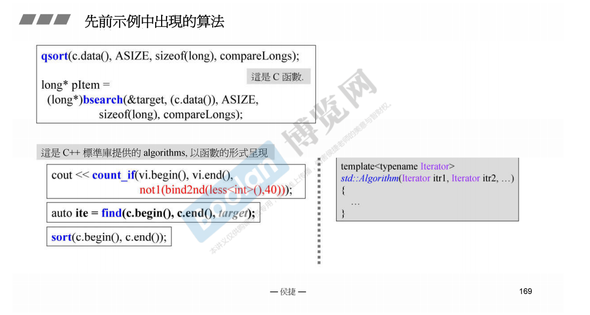
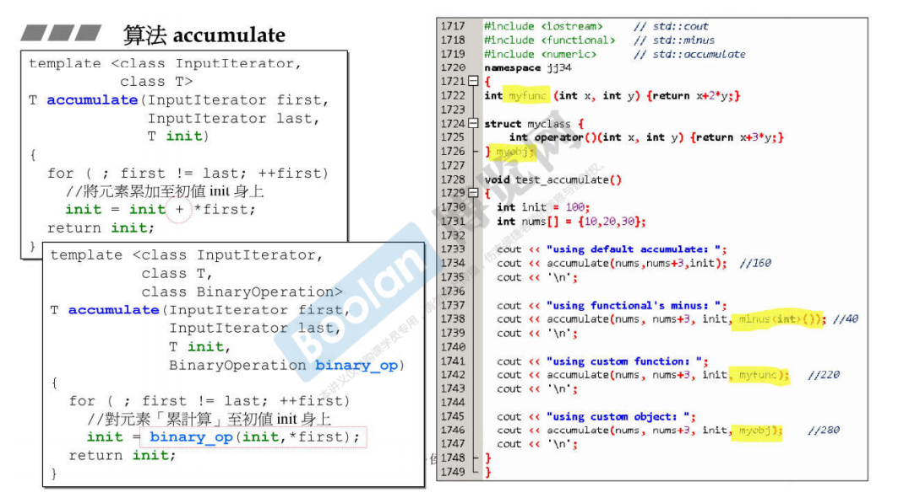
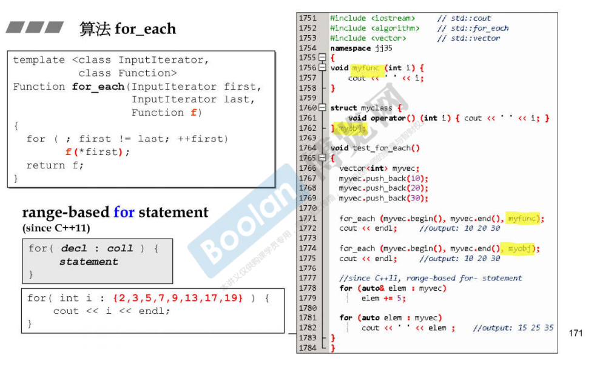
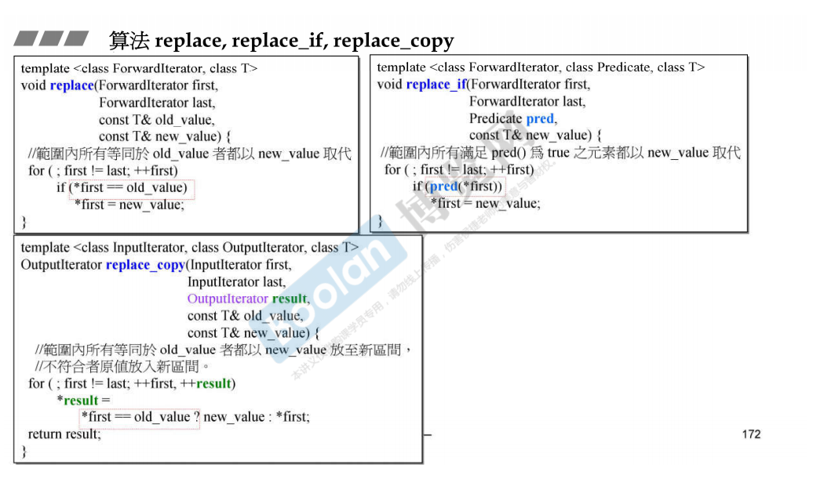
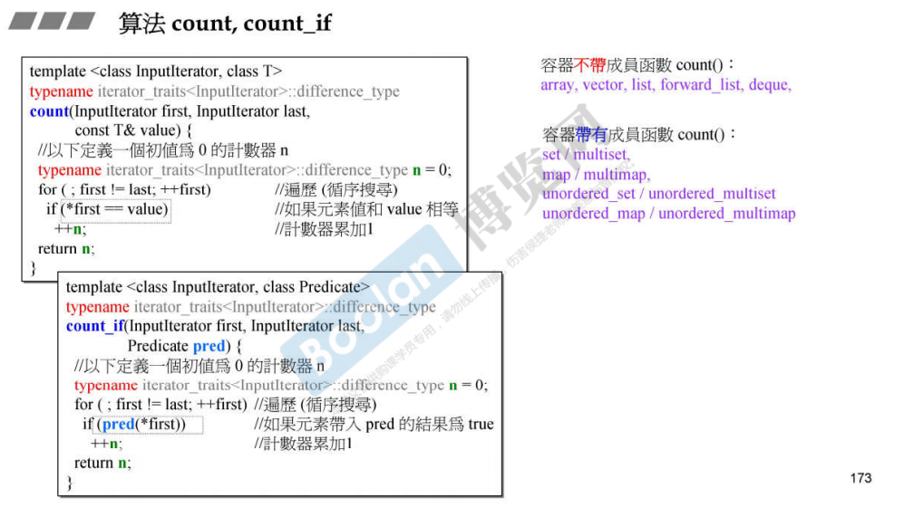
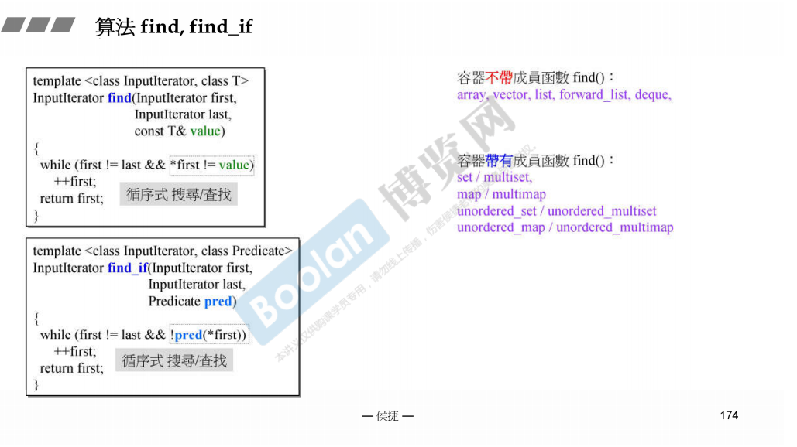
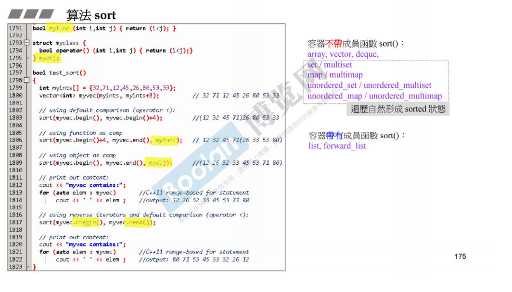
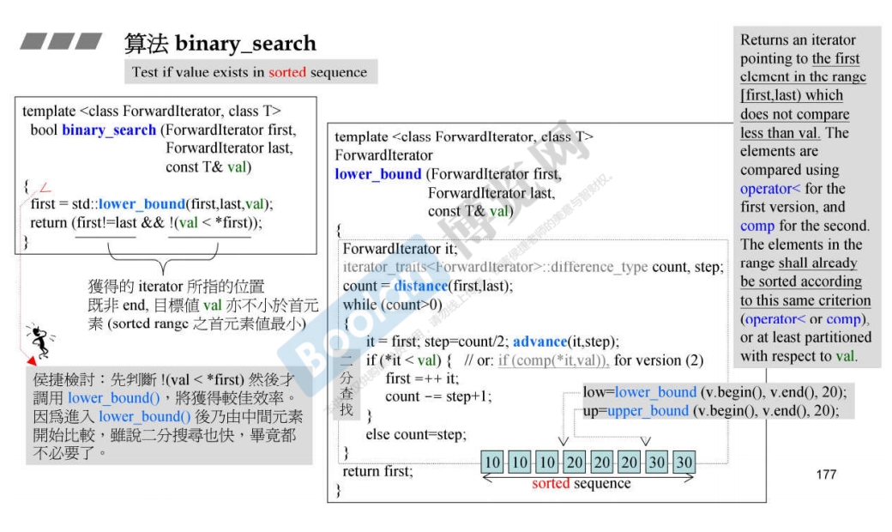
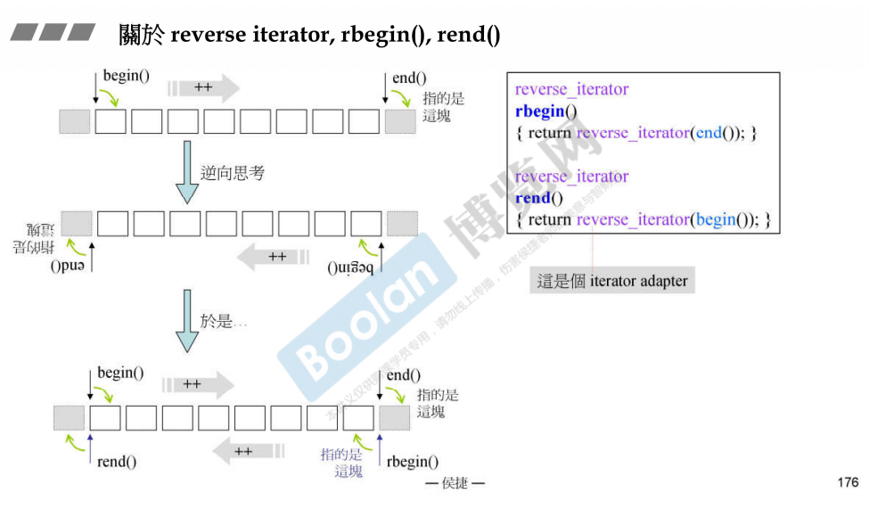
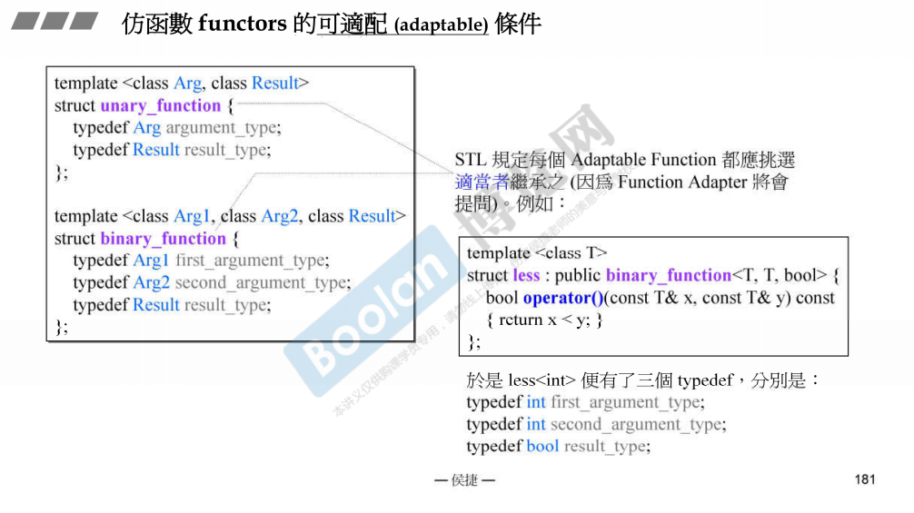

# 算法和仿函数

## 算法

### STL算法的形式

- 前面两个参数是迭代器，指明操作的区间

### 一些算法

- accumulate

- for_each

- replace : 将指定的旧值用新值替代
- replace：将满足条件的值用新值替代
- replace_copy：将等于旧值的以新值放置新的区间

- count，count_if, 注意关联式容器有自己的count函数

- find，find_if,注意关联式容器有自己的find方法

- sort，list和forward_list有自己的sort方法，关联式容器不应该调用sort方法

- binary_search

### 关于rbegin(),rend()

- rbegin()指向的位置和end()一致，rend()得到的位置和begin()指向的位置一致，但是通过

## 仿函数

- 自定义的仿函数如果没有继承binary_function或者unary，那么这个仿函数就没有融入到STL中，这个仿函数就不能被适配，不能是使用适配器。

- unary_function和binary_function定义了一些类型，从而让适配器可以向仿函数进行提问。