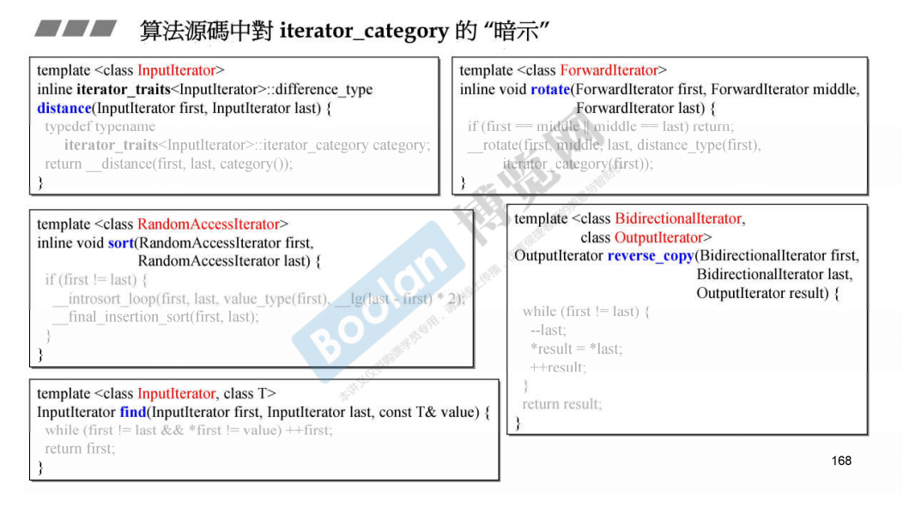

# 迭代器分类

- 容器对算法是透明的，算法所需要的信息从迭代器中取得，迭代器需要回答算法的提问，才能配合算法执行对应的操作

- 迭代器类型有5种，迭代器类型定义为struct或者class，而不是整数，有几个方面的考虑
  - 根据这个迭代器的类型，可以进行函数重载，根据这个类型调用相应的函数
  - 由于迭代器类型具有继承关系，所以如果一个函数的参数不含有某一个迭代器类型的参数，而只含有它的父类迭代器的参数，那么就会传入这个迭代器类型参数的时候，就使用迭代器类型为父类迭代器的函数

- 算法根据迭代器的类型和数据的类型，用不同方法实现。通过type_traits询问关于数据类型的信息，这个信息包含“赋值操作是否trival（重要）”，第一层只是函数的重载

- 下图，第一层是对函数的重载，后面使用iterator_traits和type_traits也是使用了函数重载决定使用哪个方法

- 下图中，两个函数根据iterator_tag进行了重载，右边的iterator是forward_iterator可以读，左边是output_iterator不可以读，可以写。所以进行重载。

- 算法源码中并没有强制规定传入的迭代器的类型，只是使用模板参数名称暗示传入的迭代器应该是什么类型

