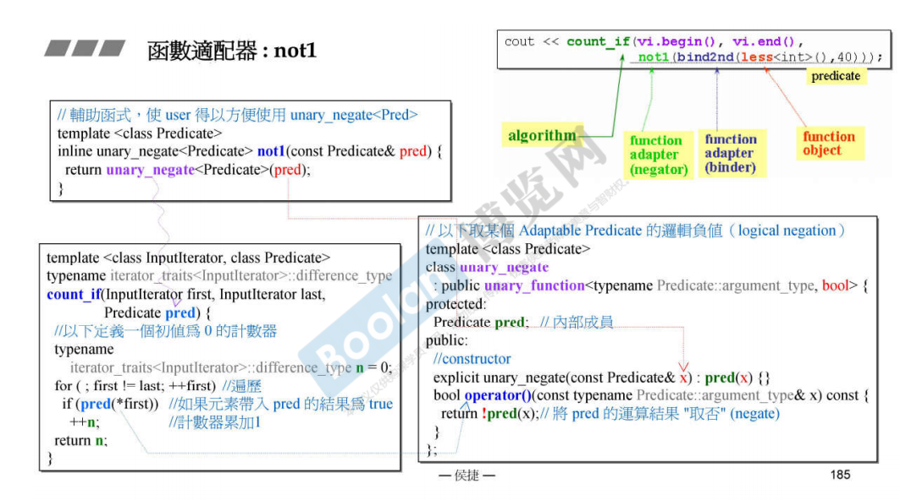
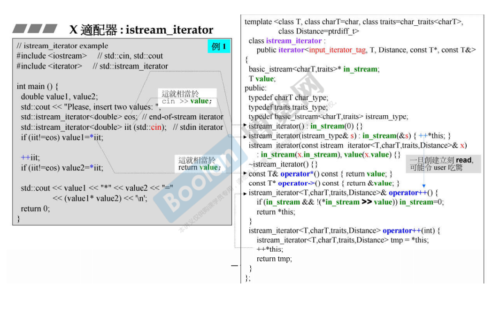

# 适配器

改造东西的功能，适配器的种类

- 迭代器适配器
- 容器适配器
- 函数适配器

适配器是一个class，他将被适配的东西作为了自己的成员（复合类型），将被适配的东西保存起来

## 函数适配器

函数适配器需要一个**辅助函数**，这个辅助函数可以获取传入的**函数的类型**，然后通过这个类型，询问函数得到一些信息，eg，得到这个函数的参数的类型。辅助函数根据这个类型实例化一个函数适配器对象，需要传入这个函数对象以及绑定的参数，这些东西都作为这个函数适配器对象的成员。函数适配器需要提问函数获得函数参数的类型以及返回值的类型，然后重载()运算符。同时这个函数适配器也不要继承binary_function或者unary_function，使得它也能够被适配（能够回答**别的函数适配器**对它的提问）。

### binder2nd

### not1

### bind

可以绑定的类型

- 普通函数的参数
- 函数对象的参数
- 成员函数的参数（成员函数有一个隐式的参数this指针）
- 成员变量（谁的）
- 

占位符std::placeholder, 提供_1, _2, 等等。

## 迭代器适配器

### reverse_iterator

传入的iterator作为这个适配器的成员，保存起来。+操作变成-操作，-操作变为+操作。iterator的5中associated types作为reverse_iterator的associated types。

### inserter

对于copy函数来说，copy操作是对相应位置进行赋值而不是插入。如果对象位置没有分配足够的空间，就会出错。inserter通过修饰迭代器，将赋值操作改变为插入操作。在copy函数不变的情况下，insert_iterator重载了=运算符，使得=操作变成了insert操作。

## X 适配器

### ostream_iterator

### istream iterator

istream iterator一创建就读取值，如果没有值可以读取，就一直阻塞。如果创建了这个对象，然后输出某些东西要求输入值，没有输入值之前会一直阻塞，然后输入东西之后，这个提示才被输出！