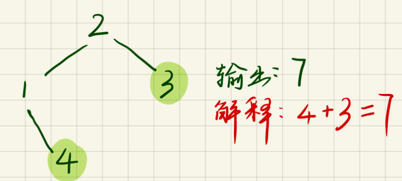

# 贪心思想

每次操作都是局部最优，然后最后的操作是全局最优；贪心算法一般用来解决需要 “找到要做某事的最小数量” 或 “找到在某些情况下适合的最大物品数量” 的问题，且提供的是无序的输入。

* **​小的值用小的值覆盖（1）**
* **重叠区间（2，3），对区间的按照结尾的大小进行排序**

## 题目

1. [分发饼干](https://leetcode-cn.com/problems/assign-cookies/)   时间复杂度O\(nlogn\)   
1. [无重叠区间](https://leetcode-cn.com/problems/non-overlapping-intervals/) 时间复杂度O\(nlogn\) 根据区间尾进行排序，区间结尾越小，留下的空间越多
1. [根据身高重建队列](https://leetcode\-cn.com/problems/queue\-reconstruction\-by\-height/)  时间复杂度\(n^2\)
1. [买卖股票的最佳时机](https://leetcode-cn.com/problems/best-time-to-buy-and-sell-stock/) 时间复杂度O\(n\) 
1. [买卖股票的最佳时机 II](https://leetcode-cn.com/problems/best-time-to-buy-and-sell-stock-ii/)  时间复杂度O\(n\) 
1. [种花问题](https://leetcode-cn.com/problems/can-place-flowers/)
1. [判断子序列](https://leetcode-cn.com/problems/is-subsequence/)\(双指针，指向不同数组，同向移动\)
1. [用最少数量的箭引爆气球](https://leetcode-cn.com/problems/minimum-number-of-arrows-to-burst-balloons/)
1. [非递减数列](https://leetcode-cn.com/problems/non-decreasing-array/)
1. [子数组最大的和](https://leetcode-cn.com/problems/maximum\-subarray/description/) 
1.  [划分字母区间](https://leetcode-cn.com/problems/partition-labels/description/)  双指针问题，根据条件扩展右边界指针  

 


# 链表

- 什么时候使用增加头节点
  - 同一对头部位置的插入删除操作和其他位置的插入删除操作
  - 同一对空链表和非空链表的处理
- 删除某个位置的节点/向某个位置插入节点，就需要获得这个位置的前一个节点的指针，使用头节点统一操作
- 如果只是修改某个节点的值，则只需要获取这个节点的指针
- 注意新链表的链尾指针为NULL
- 对于指针p，p非空则当前节点非空，可以拿到这个节点的next指针；p->next非空则下一个节点非空，可以取得下一个节点的next指针p->next->next但是不知道是否为空
- 链表可以使用递归方法来处理
- 与对称相关的题目，可以使用**反转链表**的操作（回文题目）

## 题目

- [反转链表](https://leetcode-cn.com/problems/reverse-linked-list/) 由于只涉及头部插入，所以不需要头节点，Time:O(n), Space:O(1)
- [相交链表](https://leetcode-cn.com/problems/intersection-of-two-linked-lists/) 题目假定两个链表一定有交点，如果需要判断是否有焦点，（1）可以判断两个链表最后一个节点是否为同一个节点；（2）可以将第二个链表链接到第一个链表尾部; Time:O(n),Space:O(1)
- [合并两个有序链表](https://leetcode-cn.com/problems/merge-two-sorted-lists/) T:O(n+m), S:O(1); 使用头节点，同一空链表和非空链表的操作
- [删除排序链表中的重复元素](https://leetcode-cn.com/problems/remove-duplicates-from-sorted-list/) 使得每一个数字只出现一次 T:O(n), S:O(1)
- [删除链表的倒数第N个节点](https://leetcode-cn.com/problems/remove-nth-node-from-end-of-list/) 删除倒数第n个节点，就需要得到倒数第n+1个节点 T:O(n), S:O(1)
- [两两交换链表中的节点](https://leetcode-cn.com/problems/swap-nodes-in-pairs/) 递归方法T:O(n),S:O(n),递归使用的堆栈也算空间复杂度；迭代方法：T:O(n),S:O(1),为了使得代码和思路更加清晰，定义更多的指针变量保存next值
- [数相加 II](https://leetcode-cn.com/problems/add-two-numbers-ii/) 由于数字是从高位到低位链接，所以要从链表尾部进行处理；一种想法是将链表反转，将低位放置在前面，然后再相加，另一种方法是使用栈保存数，栈顶的数就是相对低位的数，T:O(max(m,n)),S:O(m+n)
- [回文链表](https://leetcode-cn.com/problems/palindrome-linked-list/) 只要是涉及链表需要反转/部分反转才能进行下去的题目，那么就是用链表反转方法。T:O(n), S:O(1)
- [分隔链表](https://leetcode-cn.com/problems/split-linked-list-in-parts/) T:O(n),需要修改链表的节点就要获得这个节点。
- [奇偶链表](https://leetcode-cn.com/problems/odd-even-linked-list/) 指针之间的操作 （多用指针变量替代next，使得变得更清晰）


# 树

- 由于树是递归定义的，所以大多数情况下可以使用递归算法

- 注意题目如果涉及叶子节点，只有node非空，同时左右子为空，才是子节点，注意判断方式
- 一棵树，如果需要访问到所有的节点，那么时间复杂度就是O(n),如果是访问一半中的一半有一半最终访问到1个值，那么时间复杂度为O(logn)
- 判断一个叶子节点是否为左/右节点，需要知道这个节点的父节点，通过该节点与父节点的左右指针比较，确定是左是右
- 树里面找路径，找高度深度，找一些和，都是使用递归

## 题目

### 使用递归

- [二叉树的最大深度](https://leetcode-cn.com/problems/maximum-depth-of-binary-tree/) 自下而上的递归，T:O(n), S:O(n),O(logn)
- [平衡二叉树](https://leetcode-cn.com/problems/balanced-binary-tree/) 自下而上的递归，T:O(n), S:O(n)
- [二叉树的直径](https://leetcode-cn.com/problems/diameter-of-binary-tree/) 自下而上的递归，T:O(n), S:O(n), 取得是max和节点左右路径和之间的最大值，返回的是左右路径最大值+1
- [翻转二叉树](https://leetcode-cn.com/problems/invert-binary-tree/)  自顶向下的递归，T:O(n), S:O(n)
- [合并二叉树](https://leetcode-cn.com/problems/merge-two-binary-trees/) 自顶向下，T:O(n), S:O(n)
- [路径总和](https://leetcode-cn.com/problems/path-sum/) 自底向上递归，T:O(n),S:O(n),注意如何判断子节点；因为先得到左右子树的结果，然后再能得到当前节点的结果，所以一定要自底向上递归。（到达叶子节点）
- [路径总和 III](https://leetcode-cn.com/problems/path-sum-iii/) （不一定到达叶子节点），包含了自顶而下和自底向上。一个节点有两种状态，是起始节点，不是起始节点，分两种情况进行处理。如果不是起始节点，那么再去交给左右子节点分为是否起始节点来判断。如果它是起始节点，那么它的子节点对路径在这个子树来说，也是起始节点。

```C++
class Solution {
public:
    // 每个节点有两种可能，一种是包含在路径在，另一种是不包含在路径上
    // 如果这个节点在路径上，相当于将这个节点作为根节点，从根节点开始寻找
    // 如果不在路径上，那么看他的左右节点如何（左右节点也要判断是否在路径上）
    int pathSum(TreeNode* root, int sum) {
        if(root==NULL) return 0;
        int cnt = 0;
        cnt = pathSumStart(root, sum) + pathSum(root->left, sum) + pathSum(root->right, sum);
        return cnt;
    }
    int pathSumStart(TreeNode* root, int sum){
        if(root==NULL) return 0;
        int cnt = 0;
        if(root->val == sum) cnt++;
        cnt += pathSumStart(root->left, sum-root->val) + pathSumStart(root->right, sum-root->val);
        return cnt;
    }
};
```

- [另一个树的子树](https://leetcode-cn.com/problems/subtree-of-another-tree/) 这道题的结构和上一题的解答类似：当前节点有两种情况：1.以当前节点为起点；2.不以当前节点为起点，以当前节点的左子树/右子树上的某一点为起点

```C++
class Solution {
public:
    bool isSubtree(TreeNode* s, TreeNode* t) { // 以树中某一点为起点的情况
        if(s==NULL) return false;
        return isSubtreeStart(s, t) || isSubtree(s->left, t) || isSubtree(s->right, t);
    }
    bool isSubtreeStart(TreeNode* s, TreeNode* t){//以当前点为起点的状况
        if(s==NULL && t==NULL) return true;
        else if(s!=NULL && t!=NULL){
            if(s->val == t->val) return isSubtreeStart(s->left, t->left) && isSubtreeStart(s->right, t->right);
            else return false;
        }
        else return false;
    }
};
```

- [对称二叉树](https://leetcode-cn.com/problems/symmetric-tree/) 将判断二叉树是否为对称二叉树，拆分为判断两颗二叉树是否对称
- [二叉树的最小深度](https://leetcode-cn.com/problems/minimum-depth-of-binary-tree/) 与最大深度比较，如果使用最大深度的方法，会出错，因为如果一个节点只有一个子树，那么这个节点的深度就是1，但是这个节点并不是叶子节点。所以最正确的做法是需要判断节点是否为叶子节点。

```C++
// 我的解法，注意判断是否为叶子节点，
class Solution {
public:
    int minDepth(TreeNode* root) {
        if(root==NULL) return 0;
        return minD(root);
    }
    int minD(TreeNode* root){ // 保证传入的root非空
        if(root->left==NULL && root->right==NULL) return 1;
        else if(root->left==NULL && root->right!=NULL)  return 1+minD(root->right);
        else if(root->left!=NULL && root->right==NULL) return 1+minD(root->left);
        else return min(minD(root->left), minD(root->right)) + 1;
    }
};
```

```C++
class Solution {
public:
    int minDepth(TreeNode* root) {
        if(root==NULL) return 0;
        int leftD = minDepth(root->left);
        int rightD = minDepth(root->right);
        if(leftD == 0 || rightD == 0) return leftD+rightD+1; // 叶子节点 或者 只有一个子树
        else return min(leftD, rightD)+1; // 有两个子树
    }
};
```

- [左叶子之和](https://leetcode-cn.com/problems/sum-of-left-leaves/) 难点在于如何判断是左节点。自底向上递归。
- [最长同值路径](https://leetcode-cn.com/problems/longest-univalue-path/) 与上面[另一个树的子树](https://leetcode-cn.com/problems/subtree-of-another-tree/) 和 [路径总和 III](https://leetcode-cn.com/problems/path-sum-iii/) 的做法一致，当前节点可能在路径上，或者不在路径上，这个路径经过左/右子树的某个节点；另一种做法是代码2

```C++
class Solution {
public:
    // 以当前节点为开始 // 或者以当前节点的左/右子树中某一个节点为起点
    int longestUnivaluePath(TreeNode* root) {
        if(root==NULL) return 0;
        int cur_node_cnt = longestStartWith(root->left, root->val) + longestStartWith(root->right, root->val);
        int left_cnt = longestUnivaluePath(root->left);
        int right_cnt = longestUnivaluePath(root->right);
        return max(max(left_cnt, right_cnt), cur_node_cnt);
    }
    int longestStartWith(TreeNode* root, int val){
        if(root==NULL) return 0;
        if(root->val!=val) return 0;
        return max(longestStartWith(root->left, val), longestStartWith(root->right, val))+1;
    }
};
```

```C++
// 设置一个全局变量，用来保存结果（用到两边的函数的返回值）
// 但是函数返回的是二叉树某一边的最大情况
class Solution {
public:
    int path;
    int longestUnivaluePath(TreeNode* root) {
        if(root==NULL) return 0;
        path = 0;
        dfs(root);
        return path;
    }
    int dfs(TreeNode* root){
        if(root==NULL) return 0;
        int leftL = dfs(root->left);
        int rightL = dfs(root->right);
        int leftLen = root->left && root->left->val == root->val?leftL+1:0;
        int rightLen = root->right && root->right->val == root->val?rightL+1:0;
        path = max(path, leftLen+rightLen); // 用到两边的返回值
        return max(leftLen, rightLen); // 只用到一边的返回情况
    }
};
```

- [打家劫舍 III](https://leetcode-cn.com/problems/house-robber-iii/) , 注意的问题我的错误：我以为只要分奇偶层，对奇偶层的数进行累加就行，实际上是错误的，可能为了能够取得最大值，如下图。由这道题目引申出一个**启发：rob计算的不一定是从当前这个节点开始的结果，包含这个节点，而是从这个节点及其以下的范围开始的结果，不一定包含这个节点。**

```C++
class Solution {
public:
    unordered_map<TreeNode*, int> m;
    int rob(TreeNode* root) {
        if(root==NULL) return 0;
        // 从当前节点开始，但是不一定偷
        if(m.find(root)!=m.end()) return m[root];
        int val = root->val;
        if(root->left) val += rob(root->left->left) + rob(root->left->right);
        if(root->right) val += rob(root->right->left) + rob(root->right->right);
        int val2 = rob(root->left) + rob(root->right);
        m[root] = max(val, val2);
        return max(val, val2);
    }
};
```

- [二叉树中第二小的节点](https://leetcode-cn.com/problems/second-minimum-node-in-a-binary-tree/) 根节点就是最小节点。需要判断左子树的根节点的值是否和根节点值相等 

### 树的遍历

#### 层序遍历

层序遍历使用队列

- [二叉树的层平均值](https://leetcode-cn.com/problems/average-of-levels-in-binary-tree/) T:O(n),S:O(n)
- [找树左下角的值](https://leetcode-cn.com/problems/find-bottom-left-tree-value/) 

#### 前中后序遍历

- [二叉树的前序遍历](https://leetcode-cn.com/problems/binary-tree-preorder-traversal/) 前序的非递归写法
- [二叉树的中序遍历](https://leetcode-cn.com/problems/binary-tree-inorder-traversal/) 中序非递归写法
- [二叉树的后序遍历](https://leetcode-cn.com/problems/binary-tree-postorder-traversal/) 使用两个栈，一个栈用来保存节点被访问过的次数，达到两次时，那么就应该出战了

```C++
// 两个栈的方法
class Solution {
public:
    vector<int> postorderTraversal(TreeNode* root) {
        vector<int> ans;
        stack<TreeNode*> st;
        stack<bool> flag; // 判断第几次访问这个点 // 节点第二次被访问到那么就应该出栈了
        while(root || st.size()){
            while(root){
                st.push(root);
                flag.push(false);
                root = root->left;
            }
            TreeNode* node = st.top();
            bool f = flag.top(); flag.pop();
            if(f == false){
                flag.push(true);
                root = node->right;
            }
            else{
                st.pop();
                ans.push_back(node->val);
            }
        }
        return ans;
    }
};
```

后序遍历的顺序：左->右->中; 前序遍历的顺序为：中->左->右，如果我们修改前序遍历的规则为：中->右->左,那么这个遍历的结果和后序遍历的结果恰恰相反。

```C++
class Solution {
public:
    vector<int> postorderTraversal(TreeNode* root) {
        vector<int> tmp;
        stack<TreeNode*> st;
        while(root || st.size()){
            while(root){
                st.push(root);
                tmp.push_back(root->val);
                root = root->right;
            }
            TreeNode* node = st.top(); st.pop();
            root = node->left;
        }
        return vector(tmp.rbegin(), tmp.rend());
    }
};
```

#### 二叉搜索树

二叉搜索树，二叉有序树，肯定要用到有序的信息。

- [修剪二叉搜索树](https://leetcode-cn.com/problems/trim-a-binary-search-tree/) 启发：当我们访问到一个节点的时候，这个节点有两种情况：1，节点保留，2.节点不被保留，但是这个节点以下的某一个节点被保留（也就是对这个节点的子树递归调用函数判断），拆分为小问题。

```C++
class Solution {
public:
    TreeNode* trimBST(TreeNode* root, int L, int R) {
        if(root == NULL) return NULL;
        else if(root->val<L) return trimBST(root->right, L, R);
        else if(root->val>R) return trimBST(root->left, L, R);
        else{
            root->left = trimBST(root->left, L, R);
            root->right = trimBST(root->right, L, R);
            return root;
        }
    }
};
```

- [二叉搜索树中第K小的元素](https://leetcode-cn.com/problems/kth-smallest-element-in-a-bst/) 
- [把二叉搜索树转换为累加树](https://leetcode-cn.com/problems/convert-bst-to-greater-tree/) 
- [ 二叉搜索树的最近公共祖先](https://leetcode-cn.com/problems/lowest-common-ancestor-of-a-binary-search-tree/) 利用有序的信息，从顶向下确定两个节点的位置（由于这里的树为搜索二叉树，可以利用有序的信息）
- [二叉树的最近公共祖先](https://leetcode-cn.com/problems/lowest-common-ancestor-of-a-binary-tree/) 自底向上递归
- [将有序数组转换为二叉搜索树](https://leetcode-cn.com/problems/convert-sorted-array-to-binary-search-tree/) 由于数据可以随机访问，所以分为长度尽可能相等的两半，分别建立左右子树
- [有序链表转换二叉搜索树](https://leetcode-cn.com/problems/convert-sorted-list-to-binary-search-tree/) 使用**快慢指针**找到中间节点
- [两数之和 IV - 输入 BST](https://leetcode-cn.com/problems/two-sum-iv-input-is-a-bst/) 两数之和等于某个数，而且有序，可以使用双指针。
- [二叉搜索树的最小绝对差](https://leetcode-cn.com/problems/minimum-absolute-difference-in-bst/) 利用二叉搜索树中序遍历的结果是有序的特性，在中序遍历时计算gap。
- [二叉搜索树中的众数](https://leetcode-cn.com/problems/find-mode-in-binary-search-tree/) 利用到BST中序遍历有序的特性，在中序遍历的过程中解决问题。（记录前一个节点指针）

#### 前缀树

前缀树每一个节点只保存一个部分，然后还需要一个值，eg.bool标志是否为结束。

注意不是节点标志**部分**，而是边标记**部分**。

- [实现 Trie (前缀树)](https://leetcode-cn.com/problems/implement-trie-prefix-tree/) 每个节点保存指向叶子节点的指针。一开始就有一个root节点。每个节点都有一个bool的标志表明是否到此结束。
- [键值映射](https://leetcode-cn.com/problems/map-sum-pairs/) 前缀树以边代表 值的部分， 而不是以节点 代表值的部分。所以一开始就有一个root节点。


# 栈和队列

- 利用栈先进后出的特性，利用队列先进先出的特性。
- 按照题目条件，可以要维持一个单调的栈或者队列。用的多的是单调下降的栈或者单调上升的栈。
- 栈和队列保存的不一定是值，可能是这个值的下标。

## 题目

- [用栈实现队列](https://leetcode-cn.com/problems/implement-queue-using-stacks/) 用两个栈实现，一个栈用来push，另一个栈用来pop
- [用队列实现栈](https://leetcode-cn.com/problems/implement-stack-using-queues/) 使用一个队列即可，需要将入栈的元素放到队列的队头处，那么先将这个元素入队，然后将位于它前面的元素出队再入队，那么就能将插入的元素放置到队头处。

- [最小栈](https://leetcode-cn.com/problems/min-stack/) 使用两个栈，一个来保存数，一个用来保存当前为止的最小值。
- [有效的括号](https://leetcode-cn.com/problems/valid-parentheses/) 使用栈来进行括号的匹配。
- [每日温度](https://leetcode-cn.com/problems/daily-temperatures/) **数组中元素与下一个比它大的元素之间的距离** 使用单调递减的栈，并且栈保存的是下标。
- [下一个更大元素 II](https://leetcode-cn.com/problems/next-greater-element-ii/) **循环数组中比当前元素大的下一个元素** 循环数组，原来从0->size-1，现在从0->2*size-1;


# 哈希表

- 使用unordered_map或者unordered_set来保存信息，方便快速用来**查找**。
- 与**查找**相关的题目

## 题目

- [两数之和](https://leetcode-cn.com/problems/two-sum/) 注意这里的数组不是有序数组，一种方法是先排序后通过双指针的方式找答案，时间复杂度为O(nlogn)。另一种方法，可以使用unordered_map记录数出现的位置，通过这个map查找目标的数，速度快，时间复杂度为O(n),空间复杂度为O(n)。可以边遍历的时候，边将元素加入到map中。这样就避免了map中找到的是同一个位置的数，避免了保存同一个数的不同位置。

```C++
class Solution {
public: // 一边遍历，一边加入map中。避免多次遍历，避免了记录同一个数出现的不同位置。避免了判断是否是同一个数。
    vector<int> twoSum(vector<int>& nums, int target) {
        unordered_map<int,int> num_loc;
        int size = nums.size();
        for(int i = 0; i < size; i++){
            int t = target - nums[i];
            if(num_loc.find(t) != num_loc.end()) return {num_loc[t], i};
            num_loc[nums[i]] = i;
        }
        return {-1, -1};
    }
};
```

- [存在重复元素](https://leetcode-cn.com/problems/contains-duplicate/)  使用set来去重，或者使用set来查找。
- [最长和谐子序列](https://leetcode-cn.com/problems/longest-harmonious-subsequence/) 使用map。1.方便查找。2.记录数字及其出现的次数。
- [最长连续序列](https://leetcode-cn.com/problems/longest-consecutive-sequence/) 使用set记录出现的数，方便查找。确定序列第一个数：具体表现为n-1不在set中。


# 字符串

- 判断一个字符串是否包含另一个字符串
- 判断一个字符串是否是另一个串的子序列（各个字符之间不一定连续）

## 题目

- [字符串循环移位包含]([https://github.com/CyC2018/CS-Notes/blob/master/notes/Leetcode%20%E9%A2%98%E8%A7%A3%20-%20%E5%AD%97%E7%AC%A6%E4%B8%B2.md#1-%E5%AD%97%E7%AC%A6%E4%B8%B2%E5%BE%AA%E7%8E%AF%E7%A7%BB%E4%BD%8D%E5%8C%85%E5%90%AB](https://github.com/CyC2018/CS-Notes/blob/master/notes/Leetcode 题解 - 字符串.md#1-字符串循环移位包含)) 循环移位，将原串*2
- [字符串循环移位]([https://github.com/CyC2018/CS-Notes/blob/master/notes/Leetcode%20%E9%A2%98%E8%A7%A3%20-%20%E5%AD%97%E7%AC%A6%E4%B8%B2.md#1-%E5%AD%97%E7%AC%A6%E4%B8%B2%E5%BE%AA%E7%8E%AF%E7%A7%BB%E4%BD%8D%E5%8C%85%E5%90%AB](https://github.com/CyC2018/CS-Notes/blob/master/notes/Leetcode 题解 - 字符串.md#1-字符串循环移位包含)) 将串划分为多个部分，各个部分分别反转，然后整个串反正
- [字符串中单词的翻转]([https://github.com/CyC2018/CS-Notes/blob/master/notes/Leetcode%20%E9%A2%98%E8%A7%A3%20-%20%E5%AD%97%E7%AC%A6%E4%B8%B2.md#1-%E5%AD%97%E7%AC%A6%E4%B8%B2%E5%BE%AA%E7%8E%AF%E7%A7%BB%E4%BD%8D%E5%8C%85%E5%90%AB](https://github.com/CyC2018/CS-Notes/blob/master/notes/Leetcode 题解 - 字符串.md#1-字符串循环移位包含))
- [有效的字母异位词](https://leetcode-cn.com/problems/valid-anagram/) 
- [最长回文串](https://leetcode-cn.com/problems/longest-palindrome/) 只要字符出现的次数是偶数，每个字符有偶数个就能组合成回文串。然后最中间还能放一个字符。
- [同构字符串](https://leetcode-cn.com/problems/isomorphic-strings/) 记录字符上一次出现的位置，如果两个字符上一次出现的位置一样，那么就属于同构。
- [回文子串](https://leetcode-cn.com/problems/palindromic-substrings/) 从某个字符为中心字符，向左/右两边扩展，判断是否为回文串。
- [回文数](https://leetcode-cn.com/problems/palindrome-number/) 先判断是否为0，是否为负数，或者是否为10的倍数，然后判断这个数的后面一般进行反转，判断反转后的结果和前面一半是否相等。
- [计数二进制子串](https://leetcode-cn.com/problems/count-binary-substrings/) 记录连续的0/1的长度，然后取两者的最小值。


# 位运算

- 异或 得到相异 的位置
- n ^ (n-1) 得到n的第1个为1的位置后面的数字。
- n ^ (-n) 得到n的右边第一个为1的位置。
- n ^ n的结果为0
- mask的计算
  - 要得到第i位（从0数起），将1相左移动i位， 1<<i;
  - 要得到0到i位为1的mask，将1向左移动i+1位，再减去1，(1<<(i+1))-1;
  - 要得到0到i位为0，其他位为1的mask，将1向左移动i+1位，再减去1，再取反，～(（1<<(i+1)）-1)

## 题目

- [汉明距离](https://leetcode-cn.com/problems/hamming-distance/) 通过异或
- [只出现一次的数字](https://leetcode-cn.com/problems/single-number/) 通过异或，相同的数异或的结果为0
- [缺失数字](https://leetcode-cn.com/problems/missing-number/) 找出缺失的数组，可以将出现的数字变成出现两次，没有出现的数字出现1次。那么就可以使用 第二题的方法找到这个原来没有出现的数。
- [只出现一次的数字 III](https://leetcode-cn.com/problems/single-number-iii/) 将数字划分为两组，依据是这两个只出现一次的数异或后的结果的最右面为1的位，这些数的这个位是否为1.
- [颠倒二进制位](https://leetcode-cn.com/problems/reverse-bits/) ×2+n%2, n/=2;
- [2的幂](https://leetcode-cn.com/problems/power-of-two/) 判断1是否出现并且只出现一次 可以使用n&(n-1)找到除最右1的部分，只要这部分为0，那么说明1只出现1次，否则1出现多次
- [4的幂](https://leetcode-cn.com/problems/power-of-four/) 判断1是否出现并且只出现一次，并且1只出现奇数位置。
- [交替位二进制数](https://leetcode-cn.com/problems/binary-number-with-alternating-bits/) 


- [数字的补数](https://leetcode-cn.com/problems/number-complement/) 
- [两整数之和](https://leetcode-cn.com/problems/sum-of-two-integers/) 
- [最大单词长度乘积](https://leetcode-cn.com/problems/maximum-product-of-word-lengths/) 使用“位”来代表是否含有某个字符。然后通过&运算判断是否有公共字符。
- [比特位计数](https://leetcode-cn.com/problems/counting-bits/) 对于数字 6(110)，它可以看成是 4(100) 再加一个 2(10)，因此 dp[i] = dp[i&(i-1)] + 1;


# 二分查找

- 使用条件：数据有序/或者几乎有序，然后在这个数组里面查找某个值或者最大值或者最小值
- while条件是否包含=？
  - 如果left或者right的变化都是mid+、-1，那么whlie条件包括=
  - 如果left或者right的变化其一是mid，那么while条件不包括=
  - 当包含=时，退出循环时，left比right大，且left指向的是满足right变化条件的最左的值。right所指向的是满足left变化的最右的值。
  - 当不包含=时，退出while循环时，left和right的值是相等的。（这个位置的值已经判断了是否符合某些要求）
- 划分后如何选择其中一半继续
  - 需要清楚left和right是直接mid还是mid+-1
  - 如果是等于mid+-1，那么从0到left-1，从right+1到n-1是满足条件的，但是left和right指向的还需要判断。
  - 如果right和left的变化是直接是等于mid，那么从0到left，从right到n-1是满足条件的。
  - 选择某一半的方法：根据题意；mid的元素和周围元素的关系；

## 题目

- [求开方](https://leetcode-cn.com/problems/sqrtx/description/)
- [大于给定元素的最小元素](https://leetcode-cn.com/problems/find-smallest-letter-greater-than-target/description/)
- [有序数组的 Single Element](https://leetcode-cn.com/problems/single-element-in-a-sorted-array/description/)
- [第一个错误的版本](https://leetcode-cn.com/problems/first-bad-version/description/)
- [旋转数组的最小数字](https://leetcode-cn.com/problems/find-minimum-in-rotated-sorted-array/description/)
- [查找区间](https://leetcode-cn.com/problems/find-first-and-last-position-of-element-in-sorted-array/)
- [数组中的第K个最大元素O(n)](https://leetcode-cn.com/problems/kth-largest-element-in-an-array/)


# 双指针、滑动窗口

双指针：两个数指向不同的位置，根据状况移动其中一个指针。

- 左右指针双向移动 left->  <-right 作用在同一个数组中
- 左右指针同向移动 left-> right-> 作用在同一个数组中/不同数组中

## 题型

对称交换（反转）（相向）；有序数组两值之和（相向）；判断是否回文（相向）；合并数组（两数组，同向）；快慢指针；判断是否为子序列（同数组同向）

## 题目

- [有序数组的 Two Sum O(n)](https://leetcode-cn.com/problems/two-sum-ii-input-array-is-sorted/submissions/)
- [两数之和 II - 输入有序数组O(sqrt(n))](https://leetcode-cn.com/problems/sum-of-square-numbers/submissions/)
- [反转字符串中的元音字母O(n)](https://leetcode-cn.com/problems/reverse-vowels-of-a-string/submissions/)
- [验证回文字符串 ⅡO(n)](https://leetcode-cn.com/problems/valid-palindrome-ii/description/)
- [合并两个有序数组O(m+n)](https://leetcode-cn.com/problems/merge-sorted-array/submissions/)
- [环形链表（快慢指针）](https://leetcode-cn.com/problems/linked-list-cycle/)
- [通过删除字母匹配到字典里最长单词（同数组同向）O(nm)](https://leetcode-cn.com/problems/longest-word-in-dictionary-through-deleting/description/); 判断一个字符串是否为另一个字符串的子序列串
- [按颜色进行排序](https://leetcode-cn.com/problems/sort-colors/description/) O(n) 三个指针，1个指针指向前面位置，3指针指向最后位置，2指针在1-3指针之间移动。1和3指针相向移动


# 排序

快速排序的思想;桶排序（有多个因素参与排序，但是每个因素有优先级，eg，因素a，b，如果a1<a2或者a1>a2就已经确定顺序，但是当a1=a2时，就需要使用b确定大小）；

## 使用的算法

快排、堆排序、桶排序

## 题型

求前K大、小的数

### 题目

- [数组中的第K个最大元素O(n)](https://leetcode-cn.com/problems/kth-largest-element-in-an-array/)

1）快速选择 n + n/2 + n/4 + n/8 + …. = O(n) 使用快速排序中的partition函数；left和right的变化是定位到“不确定”的那一部分，例如left，k，loc，right，那么left-loc这部分不确定，所以right=loc-1；left，loc，k，right，那么loc到right这部分不确定，所以left=loc+1。

（2）堆排序，找最大K个使用小顶堆（去除小值，堆头为当前最小值），找最小的K个，使用大顶堆（去除大值，堆头为当前的最大值）空间复杂度O(K),时间复杂度为O(K+(n-k)logk)

- 桶排序

- [前 K 个高频元素](https://leetcode-cn.com/problems/top-k-frequent-elements/)

  (1)使用桶排序，根据出现的次数分桶，时间O(n)空间O(n)

  (2)堆排序，需要指定排序规则。

- [根据字符出现频率排序](https://leetcode-cn.com/problems/sort-characters-by-frequency/description/) O(n) + O(n) + O(n)


# 数组和矩阵

与之相关的题型：

- 双指针；
- 有序数组的查找；
- - 将数组中的数放回到对应的下标的位置；eg，数字1放到下标为1的位置。通常数组的长度为n，包含的数为0到n-1或者1到n；然后找重复出现的数字。

## 题目

- [移动零](https://leetcode-cn.com/problems/move-zeroes/)  一个指针指向当前可以放数据的位置，另一个指针遍历数组（二分法：分为下标的二分和值域的二分）。
- [重塑矩阵](https://leetcode-cn.com/problems/reshape-the-matrix/)
- [最大连续1的个数](https://leetcode-cn.com/problems/max-consecutive-ones/) 判断连续相等，使用``num[i-1] == num[i]``
- [搜索二维矩阵 II](https://leetcode-cn.com/problems/search-a-2d-matrix-ii/) 
- [有序矩阵中第K小的元素](https://leetcode-cn.com/problems/kth-smallest-element-in-a-sorted-matrix/) 有序矩阵中查找，使用二分法
- [错误的集合](https://leetcode-cn.com/problems/set-mismatch/) 将数放回到对应下标的位置。
- [ 寻找重复数](https://leetcode-cn.com/problems/find-the-duplicate-number/) 鸽笼原理+二分法
- [优美的排列 II](https://leetcode-cn.com/problems/beautiful-arrangement-ii/) 按照需要构造
- [数组的度](https://leetcode-cn.com/problems/degree-of-an-array/) 
- [托普利茨矩阵](https://leetcode-cn.com/problems/toeplitz-matrix/) 
- [数组嵌套](https://leetcode-cn.com/problems/array-nesting/) 
- [最多能完成排序的块](https://leetcode-cn.com/problems/max-chunks-to-make-sorted/)

```C++
class Solution {
public:
    int maxChunksToSorted(vector<int>& arr) {
        int cnt = 0;
        int size = arr.size();
        int cur_mx = -1;
        for(int i = 0; i < size; i++){
            cur_mx = max(cur_mx, arr[i]); // 不断更新这个最右值
            if(i == cur_mx) cnt++;
        }
        return cnt;
    }
};
```


# 图

- 一些图的问题，可以归结为DFS或者BFS的遍历问题，图的遍历需要用到visited数组记录是否访问过
- 找图有多少个连通子图
  - 有向图
  - 无向图
  - BFS；DFS；并查集
- 判断图是否存在环
  - 有向图
    - 使用拓扑排序 O(V+E)
    - 使用DFS O(V+E)
  - 无向图
    - 使用拓扑排序
      1. 求出所有顶点的度
      2. 删除度小于等于1的顶点和与该顶点相关联的边，将和这些边相关联的顶点的度-1
      3. 如果还有度小于等于1的顶点，重复2
      4. 判断图中是否还剩下顶点，是则表示有环。否则表示没有环。
    - 使用DFS
    - 使用BFS
    - 并查集
  - 拓扑排序	O(V+E)
  - DFS O(V+E)

## 题目

### 二分图（遍历）

- [判断二分图](https://leetcode-cn.com/problems/is-graph-bipartite/) 使用DFS或者BFS遍历，并且记录遍历过程中标记的颜色。注意一个图可能不联通。

### 拓扑排序

- [课程表](https://leetcode-cn.com/problems/course-schedule/) 记录每个点的入度，入度为0的点可以被访问。判断被访问的点数和总的点数的关系。
- [课程表 II](https://leetcode-cn.com/problems/course-schedule-ii/) 同上，使用一个vector记录访问的顺序。

### 并查集

- [冗余连接](https://leetcode-cn.com/problems/redundant-connection/) 使用并查集，可以将多个节点划分为多个集合，vector的下标代表节点号，值代表它的父节点。当下标等于值的时候，这个节点是代表节点。初始时，每个点的代表节点是自己本身。最终，代表节点相同的节点属于同一个集合。
  - 


# 分治

- 分治，通常使用递归方法，将大问题分解为2个及以上的小问题，先解决小问题，然后将小问题得到的结果汇总后，作为当前这个大问题的结果。
- 步骤：
  1. 大问题划分为小问题
  2. 递归求解小问题
  3. 结合小问题的结果作为大问题的结果
  4. 返回大问题的结果
  5. 可以看到，这是一个自底向上的递归

## 题目

- [为运算表达式设计优先级](https://leetcode-cn.com/problems/different-ways-to-add-parentheses/) 先划分为多个小问题，逐个击破；递归方法需要有
- [不同的二叉搜索树 II](https://leetcode-cn.com/problems/unique-binary-search-trees-ii/) 


# 数学

## 最大公约数最小公倍数

- [计数质数](https://leetcode-cn.com/problems/count-primes/)

## 进制转换

- [七进制数](https://leetcode-cn.com/problems/base-7/)

- [数字转换为十六进制数](https://leetcode-cn.com/problems/convert-a-number-to-hexadecimal/) int和unsigned int在内存的表示是一样的，但是解析的方法不一样。将负数赋值给unsigned int变量，其实只是将负数的内存表示直接写到unsigned int所在的内存中。

- [Excel表列名称](https://leetcode-cn.com/problems/excel-sheet-column-title/)

## 阶乘

- [阶乘后的零](https://leetcode-cn.com/problems/factorial-trailing-zeroes/)统计阶乘的二进制表示的尾部有多少个0（尾部的1的位置）

## 字符串加减法

- [二进制求和](https://leetcode-cn.com/problems/add-binary/) 
- [字符串相加](https://leetcode-cn.com/problems/add-strings/)

## 相遇问题

- [最少移动次数使数组元素相等 II](https://leetcode-cn.com/problems/minimum-moves-to-equal-array-elements-ii/)  这是个典型的相遇问题，移动距离最小的方式是所有元素都移动到中位数。（1）可以先排序，（2）使用快速选择的方法找到中位数。

## 多数投票问题

- [多数元素](https://leetcode-cn.com/problems/majority-element/)  先对数组排序，最中间那个数出现次数一定多于 n / 2。可以利用 Boyer-Moore Majority Vote Algorithm 来解决这个问题，使得时间复杂度为 O(N)。可以这么理解该算法：使用 cnt 来统计一个元素出现的次数，当遍历到的元素和统计元素不相等时，令 cnt--。如果前面查找了 i 个元素，且 cnt == 0，说明前 i 个元素没有 majority，或者有 majority，但是出现的次数少于 i / 2，因为如果多于 i / 2 的话 cnt 就一定不会为 0。此时剩下的 n - i 个元素中，majority 的数目依然多于 (n - i) / 2，因此继续查找就能找出 majority。

## 其他

- [有效的完全平方数](https://leetcode-cn.com/problems/valid-perfect-square/) 
- [ 3的幂](https://leetcode-cn.com/problems/power-of-three/) 
- [除自身以外数组的乘积](https://leetcode-cn.com/problems/product-of-array-except-self/)
- [三个数的最大乘积](https://leetcode-cn.com/problems/maximum-product-of-three-numbers/) 


# 搜索

- 主要有，图的遍历通常需要设置一个visited数组，标记哪些节点已经被访问过，避免重复访问某些节点。将问题抽象为图的遍历问题，（1）确定什么是节点，（2）确定什么是边。对于入队、进行下一次递归：先判断是否符答案，并先标记被访问，而不是出队、进入下一递归才判断和标记。
- 和连通图个数等有关的问题，可以使用BFS或者DFS来求得。
  - BFS，通常使用队列，非递归。
    - 可以用来求解**无权图**的最短路径
    - 需要使用标记（全局）判断节点是否被访问过。
  - DFS，通常使用递归，进入函数才设置visited
    - 求解可达性问题，从起始节点到能够遍历的节点，他们之间是可达的。
    - 需要使用标记（全局）判断节点是否被访问过；
    - 可能需要使用标记（局部：当前遍历的路线）判断是否在当前的遍历路线中被访问过。
  - 回溯，通常使用递归。通常需要求解**排列组合**问题（得到所有结果），所以回溯法在得到一个满足的结果时，通常不会立刻返回结束，而是继续求解，找到其他满足的解。回溯也需要设置一个visited数组，但是这个数组的标记是**局部**的，也就是标记的是这一次的搜索路线上的节点是否访问过，当开始另一个搜索路线时，前面的搜索路线访问过的节点需要置为未被访问，恢复原来的状态。
    - 在访问一个新元素进入新的递归调用时，需要将**新元素标记为已经访问**，这样才能在继续递归调用时不用重复访问该元素；
    - 但是在递归返回时，需要将元素**标记为未访问**，因为只需要保证在一个递归链中不同时访问一个元素，可以访问已经访问过但是不在当前递归链中的元素。

## 题目

### BFS

### DFS

- [岛屿的最大面积](https://leetcode-cn.com/problems/max-area-of-island/) 最大的连通图，可以使用BFS和DFS
- [岛屿数量](https://leetcode-cn.com/problems/number-of-islands/) 
- [朋友圈](https://leetcode-cn.com/problems/friend-circles/) 
- [被围绕的区域](https://leetcode-cn.com/problems/surrounded-regions/) 和下面的题，解决方法是一样的。也是从“入海口”点向四周搜索联通的节点。
- [太平洋大西洋水流问题](https://leetcode-cn.com/problems/pacific-atlantic-water-flow/) 

### 回溯

- [电话号码的字母组合](https://leetcode-cn.com/problems/letter-combinations-of-a-phone-number/) 
- [复原IP地址](https://leetcode-cn.com/problems/restore-ip-addresses/) 
- [ 单词搜索](https://leetcode-cn.com/problems/word-search/) 
- [二叉树的所有路径](https://leetcode-cn.com/problems/binary-tree-paths/) 
- [全排列](https://leetcode-cn.com/problems/permutations/)
- [全排列 II](https://leetcode-cn.com/problems/permutations-ii/)
- [组合](https://leetcode-cn.com/problems/combinations/) 
- [组合总和](https://leetcode-cn.com/problems/combination-sum/) 
- [组合总和 II](https://leetcode-cn.com/problems/combination-sum-ii/) 
- [组合总和 III](https://leetcode-cn.com/problems/combination-sum-iii/)
- [子集](https://leetcode-cn.com/problems/subsets/) 
- [子集 II](https://leetcode-cn.com/problems/subsets-ii/)
- [分割回文串](https://leetcode-cn.com/problems/palindrome-partitioning/) 
- [解数独](https://leetcode-cn.com/problems/sudoku-solver/) 不像上面那些题目需要找到所有的结果。这道题这需要找到一个结果就能返回，所以在函数设置返回值是bool，判断递归的结果是否为true，是的话就立刻返回，不用再递归下去。
- [N皇后](https://leetcode-cn.com/problems/n-queens/) 注意 是否在同一个对角线上，是判断 行之差 和 列之差 的绝对值是否相等


# 动态规划

- 动态规划，主要使用数组保存之前求过的状态，避免求解更大的问题时，重复地计算小问题。就是是大问题可以分解为小问题的组合，通过小问题的解，形成大问题的解。递归和动态规划都是将原问题拆成多个子问题然后求解，他们之间最本质的区别是，动态规划保存了子问题的解，避免重复计算。

- 动态规划分为若干维度的动态规划，
  1. 需要确定使用的是几维的数组，
  2. 需要确定数组的下标代表什么意思
     - 二维：下标代表某个范围，也就是\[x][y],而且y>=x;
     - 二维：有两个串，\[x][y]中x，y分别代表两个串的下标；
     - 一维：只有一个串，[x]代表串的x位置，x表示的位置有两种状态
       - 解包含当前这个位置，也就是说当前位置一定属于解里面
       - 解不一定包含当前这个位置。[x]只是代表从0到x这个范围里面，某些位置属于解中
  3. 确定状态转移方程，也就是大问题是如何通过小问题组合而成的。
  4. 返回什么作为结果。(1）最后的状态。（2）综合所有的状态
  5. 数组dp\[x][y]除了需要考虑x和y代表什么意思，还需要确定dp\[x][y]的值是什么意思
  
- 过程：

  1、状态定义；

  2、状态转移方程；

  3、初始化；

  4、输出；

  5、思考状态压缩。
  
- 动态规划，思考时，是将大问题划分为规模小一点的问题，再划分话规模更小的问题，知道基本问题。而其求解时，是从小问题出发，构成规模更大的问题的解，并进一步形成最终的解。思考和求解的过程，就是自顶向下划分，并且自底向上求解的递归过程。

## 题目

### 斐波那契数列

- [爬楼梯](https://leetcode-cn.com/problems/climbing-stairs/) 
- [打家劫舍](https://leetcode-cn.com/problems/house-robber/)
- [打家劫舍 II](https://leetcode-cn.com/problems/house-robber-ii/) 环形，并且不能相邻偷。所以可以划分为两个部分【0，n-2】和【1，n-1】
- 信件错排（数论）
  - n个信放进n个信封中，求全部信都放错位置的放置种数
  - 假设有n封信，第一封信可放在(2-n)的任一个信封里，共n-1种放法，设第一封信放在了第k个信封里，若此时第k封信放在了第1个信封里，则只要将剩下的n-2错排，即f(n-2)，若第k封信没有放在了第1个信封里，**可将第1封信的位置看成是“第k个位置”**，即将n-1封信错排，即为f(n-1)。由递推可得,f(n)=(n-1)*(f(n-1)+f(n-2))

- 母牛生产
  - 假设农场中成熟的母牛每年都会生 1 头小母牛，并且永远不会死。第一年有 1 只小母牛，从第二年开始，母牛开始生小母牛。每只小母牛 3 年之后成熟又可以生小母牛。给定整数 N，求 N 年后牛的数量。
  - 求第n年的牛。因为牛不会死，所以第n-1年的牛存活到第n年。同时有一批牛成熟了，其中成熟牛的数量是dp[n-3]，所以新生下dp[n-3]头牛。
  - dp[n] = dp[n-1] + dp[n-3];

###  矩阵路径

- [最小路径和](https://leetcode-cn.com/problems/minimum-path-sum/)
- [不同路径](https://leetcode-cn.com/problems/unique-paths/)

### 数组区间

- [区域和检索 - 数组不可变](https://leetcode-cn.com/problems/range-sum-query-immutable/)

- [等差数列划分](https://leetcode-cn.com/problems/arithmetic-slices/) 

### 分割整数

- [整数拆分](https://leetcode-cn.com/problems/integer-break/) 将大问题转化为小问题；n拆分为j和n-j，并且对n-j部分划分，也就是j×dp[n-j]
- [全平方数](https://leetcode-cn.com/problems/perfect-squares/)
- [解码方法](https://leetcode-cn.com/problems/decode-ways/) 
- [最长上升子序列](https://leetcode-cn.com/problems/longest-increasing-subsequence/)

### 最长递增子序列

- [最长上升子序列](https://leetcode-cn.com/problems/longest-increasing-subsequence/) 数组元素之间关注顺序（a,b,c ==> a, c）
- [最长数对链](https://leetcode-cn.com/problems/maximum-length-of-pair-chain/)  数组元素之间的顺序任意 (a, b, c ==> a, c, b)
- [摆动序列](https://leetcode-cn.com/problems/wiggle-subsequence/) 相当于求峰和谷的数量。使用两个变量up和down，记录当前位置为止的范围中，以上升结尾和下降结尾的摆动序列的最大长度。
  - 如果nums[i] > nums[i-1]，那么形成一个上升，如果上一个down是以nums[i-1]结尾，那么up = down + 1；如果down不是以nums[i-1]结尾，假设它的值为x，那么x如果大于等于nums[i-1]，那么其实这个结尾可以改为nums[i-1]，所以结果同上。如果x小于nums[i-1]，那么nums[i] > x，那么构成一次上升，所以up = down+1;
  - 如果nums[i] < nums[i-1]，那么形成一个下降。如果上一个up是以nums[i-1]结尾，那么显然down = up+1;如果up不是以nums[i-1]结尾，假设结尾的值为x。如果x小于等于nums[i-1]，那么其实这个结尾可以改为nums[i-1],所以结果同上。如果x大于nums[i-1]，那么nums[i] < x,那么构成一个下降，所以down = up + 1;

### 最长公共子序列

- [最长公共子序列](https://leetcode-cn.com/problems/longest-common-subsequence/) 两个序列，所以使用二维dp，并且下标代表各自序列的范围（不一定包含当前下标所指向的元素）

### 0-1背包问题

#### 分类

- 0-1背包问题，是从集合里**选出子集**的过程，只不过这个子集需要**满足某些条件**

- 条件
  - 在满足小于某个值的情况下，要使得另个值最大、最小
  - 在满足等于某个值的情况下，要使得另一个值最大、最小
  - 返回的是这个最大、最小的值

#### 题目

- [分割等和子集](https://leetcode-cn.com/problems/partition-equal-subset-sum/) 0-1背包，dp\[i][j]状态代表什么：i代表0-i的数，j代表和为j，dp\[i][j]代表0-i是否能够组成和为j的，false或者为true；
- [目标和](https://leetcode-cn.com/problems/target-sum/) 
- [一和零](https://leetcode-cn.com/problems/ones-and-zeroes/)
- [零钱兑换](https://leetcode-cn.com/problems/coin-change/) 注意与下题进行区分。**重点**

#### 完全背包问题

**分为有顺序，无顺序两种**，实际上有顺序型的，并不是背包问题。

- **[零钱兑换 II](https://leetcode-cn.com/problems/coin-change-2/) 重点**，计算的是组合，而不是排列；**完全背包问题**
- [单词拆分](https://leetcode-cn.com/problems/word-break/) **有顺序**
- [组合总和 Ⅳ](https://leetcode-cn.com/problems/combination-sum-iv/) **有顺序**，其实题目和**爬楼梯**题目相似。

### 股票交易

- [买卖股票的最佳时机](https://leetcode-cn.com/problems/best-time-to-buy-and-sell-stock/) 1次
- [ 买卖股票的最佳时机 II](https://leetcode-cn.com/problems/best-time-to-buy-and-sell-stock-ii/) 任意次
- [买卖股票的最佳时机 III](https://leetcode-cn.com/problems/best-time-to-buy-and-sell-stock-iii/) 最多两次
- [买卖股票的最佳时机 IV](https://leetcode-cn.com/problems/best-time-to-buy-and-sell-stock-iv/) 最多k次，背包问题
- [买卖股票的最佳时机含手续费](https://leetcode-cn.com/problems/best-time-to-buy-and-sell-stock-with-transaction-fee/) 任意次，带手续费
- [最佳买卖股票时机含冷冻期](https://leetcode-cn.com/problems/best-time-to-buy-and-sell-stock-with-cooldown/) 任意次，带冷冻期


# 一些细节 

- 对于差一问题
  - i从0开始，执行n步，每步i增1，最终i的结果为n，为n时停止
  - i从1开始，执行n步，每步i增1，最终i的结果为n+1，为n+1时停止
  - i从n开始，执行n步，每步i减1，最终i的结果为0,为0时停止
  - i从n-1开始，执行n步，每步i减1，最终i的结果为-1，为-1时停止
  - 关键是理清执行操作后，是使用操作前i的值，还是操作后i的值
  - 可以使用对应方法：进入时n已经操作次数0，进入时0，已经操作次数为n，即n+0 = 0+n; 进入时为1，则已经操作了n-1步，还需要操作1步，所以循环条件>0
  - 涉及差1
    - [删除链表的倒数第N个节点](https://leetcode-cn.com/problems/remove-nth-node-from-end-of-list/) 
- 对于链表中的指针问题，p!=NULL说明p所指向的节点非空，可以取得p->next; p->next非空则下一个节点非空，可以取得p->next->next;但是不保证p->next->next非空
- 对于递归算法，有两个处理顺序：
  - 自顶向下：也就是先处理当前的，然后在调用递归
  - 自下而上：先递归，获取递归的结果，处理完后返回
  - 既有自顶向下还有自底向上，一个暂时的结果（自顶向下），递归，递归结果影响暂时结果（自下而上），返回 [路径总和 III](https://leetcode-cn.com/problems/path-sum-iii/) 
- 函数的参数是指针，都需要判断指针是否为NULL，链表题目或者树题目
- 树的题目区分：1.以当前节点开始的范围，且包含当前节点的解，也就是解涉及当前节点；2.以当前节点开始的范围，但是解不一定包含当前节点，只是涉及这个范围中的其他节点  [打家劫舍 III](https://leetcode-cn.com/problems/house-robber-iii/)  [最长同值路径](https://leetcode-cn.com/problems/longest-univalue-path/)  [路径总和 III](https://leetcode-cn.com/problems/path-sum-iii/) ，这些题目当前节点，可以是涉及的节点，也可以只是从这个节点开始的范围里某个节点被涉及
- 对于循环移动，或者循环遍历，可以将原来的序列与原来的序列链接起来。
- 可以使用map来记录各个元素是否出现及出现的次数，如果局限于字符，那么可以用数据来表达。
- 在循环中，如果不满足条件或者退出循环时，才能更改结果。注意：**循环退出**的时候，也需要更新结果。eg. [计数二进制子串](https://leetcode-cn.com/problems/count-binary-substrings/) 

```C++
class Solution {
public:
    int countBinarySubstrings(string s) {
        int size = s.size();
        int preLen = 0;
        int curLen = 1;
        int ans = 0;
        for(int i = 1; i < size; i++){
            if(s[i] == s[i-1]){
                curLen++;
            }
            else{ // 注意：退出或者不符合条件时，才修改答案
                ans += min(preLen, curLen);
                preLen = curLen;
                curLen = 1;
            }
        }
        // 退出循环时，也需要更新结果！
        ans += min(preLen, curLen);
        return ans;
    }
};
```

- **能用除法就不要使用乘法，避免乘法的结果太低，溢出**
- 在循环中i=n-1；那么需要注意i—而不是i++；否则越界
- 题目提到数/字符的出现次数/频率，大概率需要使用字典统计出现的次数
- 注意运算符的优先级关系，位运算运算符与==运算符。
- 注意编号是从1开始还是从0开始。
- 对于题目中的输入的整数，注意整数是否包含了负数，eg.[三个数的最大乘积](https://leetcode-cn.com/problems/maximum-product-of-three-numbers/) 

