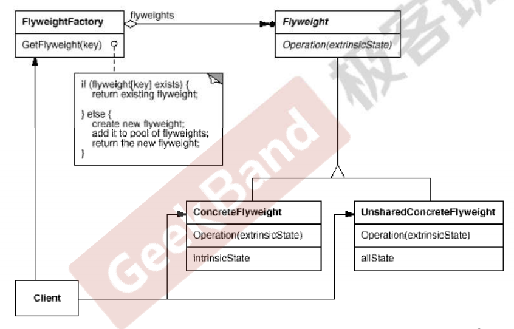

# 动机

- 在软件系统采用纯粹对象方案的问题在于大量细粒度的对象会很快充斥整个系统中，从而带来很高的运行时代价---主要指内存需求方面的代价。
- 如何在避免大量细粒度对象问题的同时，让外部客户端程序让然能够透明地使用面向对象的方式来进行操作。

# 定义

- 运用共享技术有效地支持大量细粒度的对象。

# 结构

# 要点

- 面向对象很好地解决了抽象性问题，但是作为一个运行在机器中的程序实体，我们需要考虑对象的代价问题。Flyweight主要解决的是面向对象的代价问题，一般不会触及面向对象的抽象性问题。
- Flyweight采用对象共享的做法来降低系统中对象的个数，从而降低细粒度对象给系统带来的内存压力。在具体实现方面，要注意对象状态的处理。（**共享的对象主要是只读的**）
- 对象的数量太大从而导致对象内存开销加大。什么样的数量才算大。这需要我们仔细根据具体应用情况进行评估，而不能凭空臆断。
- Flyweight是抽象享元角色。它是产品的抽象类，同时定义出对象的外部状态和内部状态（外部状态及内部状态相关内容见后方）的接口或实现；ConcreteFlyweight是具体享元角色，是具体的产品类，实现抽象角色定义的业务；UnsharedConcreteFlyweight是不可共享的享元角色，一般不会出现在享元工厂中；FlyweightFactory是享元工厂，它用于构造一个池容器，同时提供从**池**中获得对象的方法。
- **内部状态**指对象**共享**出来的信息，存储在享元对象内部并且不会随环境的改变而改变；**外部状态**指对象得以依赖的一个标记，是随环境改变而改变的、**不可共享**的状态。