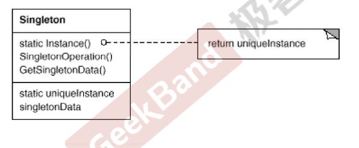

# 对象性能 模式

## 是什么

面向对象很好的解决了抽象的问题。但是不可避免的带来了一定的代价。对于通常情况来说，面向对象的成本大都可以忽略不记。但是某些情况下，**面向对象所带来的成本**必须谨慎处理。


## 典型模式

- Singleton单件模式
- Flyweight


# 单件模式

## 动机

- 在软件系统中，经常有这样一些特殊的类，必须保证它们在系统中只有一个实例，才能保证它们的逻辑正确性，以及良好的效率。
- 如何绕过常规的构造器，提供一种机制来保证一个类只有一个实例？
- 这时设计者的责任，而不是使用者的责任。


## 定义

保证一个类仅有一个实例，并提供一个该实例的全局访问点。


## 结构



- 一个静态成员函数
- 一个静态成员变量


## 要点

- Singleton模式中的实例构造器可以设置为protected以允许子类派生。
- Singleton模式一般不要支持拷贝构造函数和Clone接口，因为有可能导致多个对象实例，与Singleton模式的初衷违背。
- 如何实现多线程环境下安全的Singleton？祝阿姨对双检查锁的正确实现。


## 线程安全

- 单线程

```C++
Singleton* Singleton::getInstance() {
    if (m_instance == nullptr) {
        m_instance = new Singleton();
    }
    return m_instance;
}
```

- 多线程使用锁，开销大（读也上锁）

```C++
Singleton* Singleton::getInstance() {
    Lock lock;
    if (m_instance == nullptr) {
        m_instance = new Singleton();
    }
    return m_instance;
}
```

- 多线程使用双检查锁，有内存reorder造成的问题，也就是先分配内存，然后返回这个地址，然后才初始化。这时候如果有一个线程判断m_instance非空（但是内存还没被初始化），那么这时候返回的是未被初始化的内存的地址，就会出错。

```C++
Singleton* Singleton::getInstance() {
    
    if(m_instance==nullptr){
        Lock lock;
        if (m_instance == nullptr) {
            m_instance = new Singleton();
        }
    }
    return m_instance;
}
```

- C++11的双检查锁

```C++
std::atomic<Singleton*> Singleton::m_instance;
std::mutex Singleton::m_mutex;

Singleton* Singleton::getInstance() {
    Singleton* tmp = m_instance.load(std::memory_order_relaxed);
    std::atomic_thread_fence(std::memory_order_acquire);
    if (tmp == nullptr) {
        std::lock_guard<std::mutex> lock(m_mutex);
        tmp = m_instance.load(std::memory_order_relaxed);
        if (tmp == nullptr) {
            tmp = new Singleton;
            std::atomic_thread_fence(std::memory_order_release);
            m_instance.store(tmp, std::memory_order_relaxed);
        }
    }
    return tmp;
}
```


