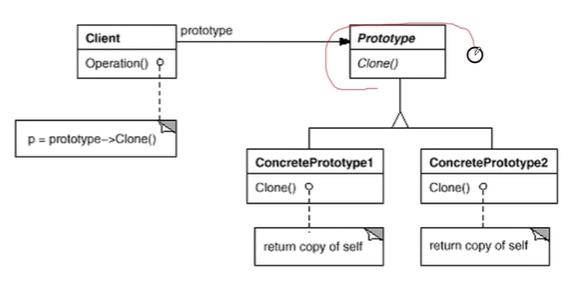

# 动机

在软件系统中，经常面临着“**某些结构复杂**的对象”的创建工作；由于需求的变化，这些对象经常面临着剧烈的变化，但是它们却拥有比较稳定一致的接口。（通过拷贝原型对象，**取得原型对象的状态**，并且使用这个状态，而不是初始状态）

# 定义

使用**原型实例**指定创建对象的**种类**，然后通过**拷贝**这些原型对象来创建新的对象（深拷贝，避免修改了原型实例）（使用时，先通过原型实例的clone函数深拷贝构造出新的同一类型的对象，然后再使用）

# 结构

# 要点

- 原型模式同样用于隔离类对象的使用者和具体类型之间的耦合关系。它同样要求这些易变类拥有**稳定的接口**。
- 原型模式对于如何创建易变类的实体对象采用**原型克隆**的方法来做。它使得我们可以非常灵活的动态创建拥有某些稳定接口的新对象。所需要的工作仅仅是注册一个新类的对象（即原型），然后在任何需要的地方clone。
- 原型模式中的clone方法可以利用某些框架中的序列化来实现。

