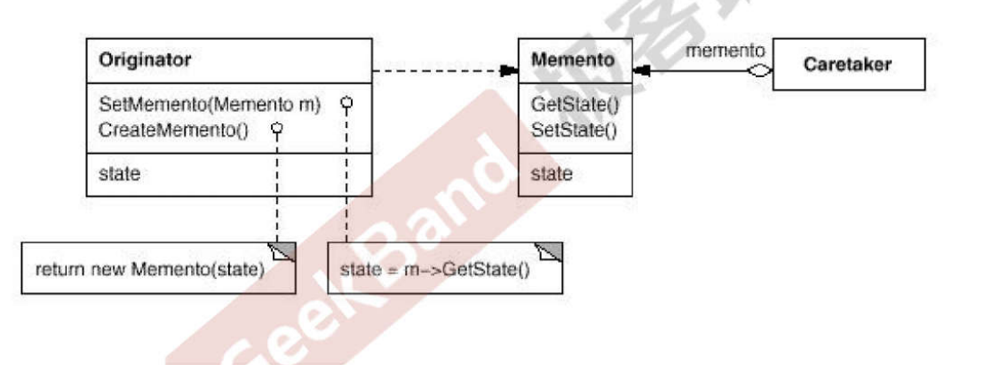

# 动机

在软件构建过程中，某些对象的状态在转换过程中，可能由于某种需要，要求程序能够回溯到对象之前处在某个时间点的状态。如果使用一些公有接口来让其他对象得到对象的状态，便会暴露对象的细节实现。

如何实现**对象状态的良好保存和恢复**？同时又不会因此而破坏对象本身的封装性。

# 定义

在不破坏封装性的前提下，**捕获**一个对象的内部状态，并在这个**对象之外保存**这个状态。这样以后就可以将该对象恢复到原先保存的状态。

# 结构

# 要点

- 备忘录存储原发器对象的内部状态，在需要时恢复原发器的状态。
- 备忘录模式的核心是信息隐藏，Originator需要向外界隐藏信息保持封装性。同时又需要将状态保存至外界。
- 由于现代语言运行时（C#,Java）都具有相当的对象**序列化**支持，因此往往采用效率较高，又较容易正确实现的序列化方案来实现备忘录模式。

