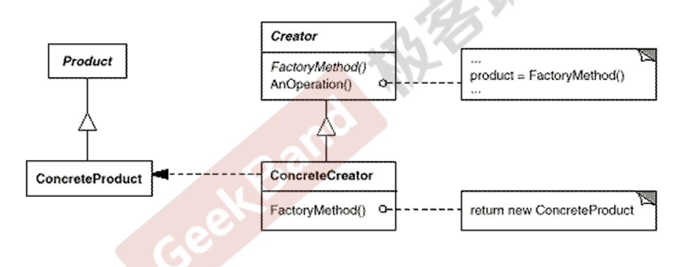

# 对象创建模式

- 绕开new，避免对象创建(new)过程中（和客户端代码）所导致的紧耦合（也就是说客户端代码依赖于new具体类），从而支持对象创建的稳定性。他是接口抽象后的第一部工作。
- 典型模式
  - 工厂方法模式
  - 抽象工厂模式
  - 构建起模式Builder
  - Prototype

# 工厂方法模式

## 动机

在软件系统中，经常面临着创建对象的工作；由于需求的变化，需要创建的对象的具体类型经常变化。

如何应对这种变化？如何绕过常规的对象创建方法(new)，提供一种“封装机制”来避免客户程序和种“具体对象创建工作”的紧耦合？

## 定义

定义一个用于创建对象的接口，让工厂**子类**决定实例化哪一个产品类。Factory Method使得一个（产品）类的实例化延迟（目的：解耦，手段：虚函数）到（具体工厂）子类。

## 结构

- Product和Creator是抽象基类，稳定。它的子类是具体类，可变化扩展

## 要点

- Factory Method模式用于隔离类对象的使用者和具体类型之间的耦合关系。面对一个经常变化的具体类型，紧耦合关系(new)会导致软件的脆弱。
- Factory Method模式通过面向对象的手法，将所要创建的具体对象工作延迟到（具体工厂）子类，从而实现一种扩展（而非更改）的策略，较好地解决了这种紧耦合关系。
- Factory Method模式解决“单个对象”的需求变化。缺点在于要求创建方法/参数相同。