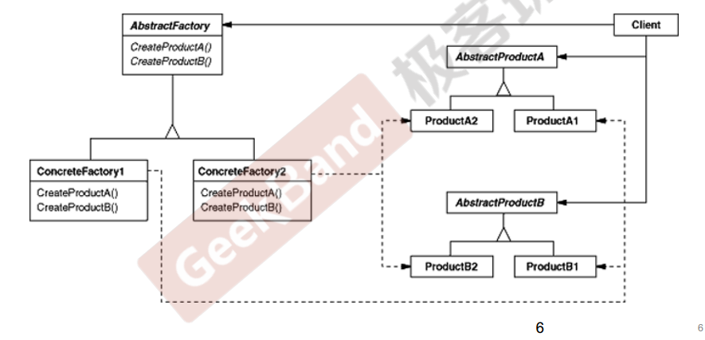

# 动机

在软件系统中，经常面临着“**一系列相互依赖的对象**”的创建工作；同时，由于需求的变化，往往存在更多系列对象的创建工作。

如何应对这种变化？如何绕过常规的对象创建方法(new)，提供一种“封装机制”来避免客户程序和这种“多系列具体对象创建工作”的紧耦合

# 定义

提供一个接口（抽象工厂类），让该**接口**负责创建一系列“相关或者相互依赖的对象”，无需指定它们具体的类（根据积累工厂指针所指向的实际的具体工厂，从而知道产品的具体类型）。

# 结构

工厂方法是抽象工厂的一个特例。如果需要创建的一系列相互依赖的对象只有一个，那么抽象工厂就变成了工厂方法。

抽象工厂的名字理解为“产品族（系列）工厂”更容易理解。

# 要点总结

- 如果没有应对“多系列对象构建”的需求变化，则没有必要使用Abstract Factory模式，这时候使用简单的工厂完全可以。
- “系列对象”指的是在某一特定系列下的对象之间有相互依赖、或作用的关系。不同系列的对象之间不能相互依赖。
- Abstract Factory模式主要在于应对**“新系列”**的需求变动（系列增加）。其缺点在于难以应对**“新对象**”的需求变动（修改某个系列中的某一个对象）。