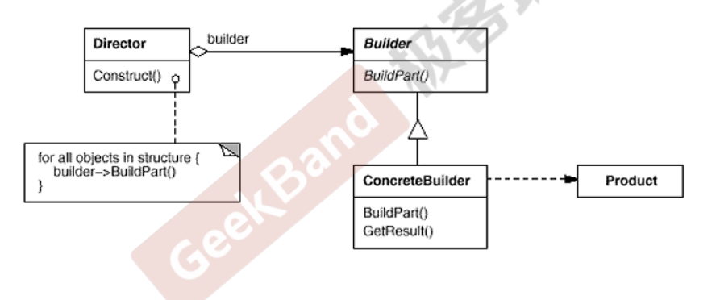

# 动机

在软件系统中，有时候面临着“**一个复杂对象”的创建工作**，其通常由各个部分的子对象用**一定的算法构成**；由于需求的变化，这个复杂对象的**各个部分经常面临着剧烈的变化**，但是将它们组合在一起的算法却相对稳定。（构建过程稳定，但是表示是变化的）

如何应对这种变化？如何提供一种“封装机制”来隔离出“复杂对象的各个部分”的变化，从而保持系统中的“稳定构建算法”不随着需求改变而改变？

# 定义

将一个**复杂对象的构建**与其**表示**相分离，使得同样的构建过程(稳定)可以创建不同的表示(变化)。（分离一个类的构建和它本身的功能）

# 结构

- **Director**表示了对象构建的过程（稳定）
- **Builder**是抽象类，表示了对象构建过程需要的各个步骤。（稳定）
- **ConcreteBuilder**是具体类，重写了对象构建过程各个步骤具体做什么。（变化）
- **Director**需要传入一个具体的Builder
- **在ConcreteBuilder里面有一个指向Product的基类指针，这个具体类对象是在ConcreteBuilder中创建的**

# 要点

- Builder 模式主要用于“**分步骤构建一个复杂的对象**”。在这其中“分步骤”是一个稳定的算法，而复杂对象的各个部分则经常变化。

- 变化点在哪里，封装哪里—— Builder模式主要在于应对“复杂对象各个部分”的频繁需求变动。其缺点在于难以应对“分步骤构建算法”的需求变动。
- 在Builder模式中，要注意不同语言中构造器内调用虚函数的差别（C++ vs. C#，Java) 。C++中构造函数调用虚函数是“**静态绑定**”