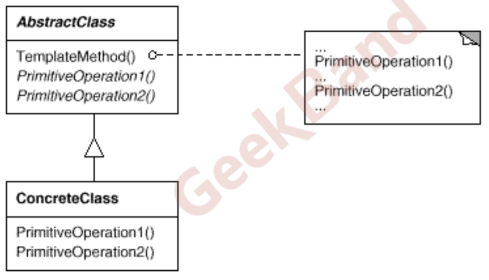

# 模式分类

## 从目的来看

- **创建型**
  - 将对象的部分创建工作延迟到子类或者其他对象，从而应对需求变化为对象创建时具体类型实 现引来的冲击。
- **结构型**
  - 通过类继承或者对象组合获得更灵活的结构，从而应对需求变化为对象的结构带来的冲击。
- **行为型**
  - 通过类继承或者对象组合来划分类与对象间的职责，从而应对需求变化为多个交互的对象带来 的冲击。

## 从范围来看

- **静态关系**  类模式处理类与子类的静态关系 **继承**
- **动态关系 ** 对象模式中处理对象间的动态关系 **组合**

## 从封装变化角度

### 组件协作

- Template Method
- Observer / Event
- Strategy

### 单一职责

- Decorator
- Bridge

### 对象创建

- Factory Method
- Abstract Factory
- Prototype
- Builder

### 对象性能

- Singleton
- Flyweight

### 接口隔离

- Facade
- Proxy
- Mediator
- Adapter

### 状态变化

- Memento
- State

### 数据结构

- Composite
- Iterator
- Chain of Resposibility

### 行为变化

- Command
- Visitor

### 领域问题

- Interpreter

# 重构获得模式

- 面向对象设计模式是好的面向对象设计。好的面向对象设计是指满足**应对变化，提高复用**的设计。
- 现代软件设计的特征是“需求的频繁变化”。设计模式的要点是 “**寻找变化点，然后在变化点处应用设计模式，从而来更好地应对需求的变化**”。“什么时候、什么地点应用设计模式”比“理解设 计模式结构本身”更为重要。
- 设计模式的应用不宜先入为主，一上来就使用设计模式是对设计 模式的最大误用。没有一步到位的设计模式。敏捷软件开发实践提 倡的“Refactoring to Patterns”是目前普遍公认的最好的使用设 计模式的方法。

# 重构关键技法

- 静态 -》 动态 
- 早绑定 -》 晚绑定 
- 继承 -》 组合 
- 编译时依赖 -》 运行时依赖 
- 紧耦合 -》 松耦合

这时同一个问题，从不同方面看

# 组件协作模式

## 是什么

现代软件专业分工之后的第一个结果是“框架与应用程序的划分”，“组件协作”模式通过晚期绑定，来实现框架与应用程序之 间的松耦合，是二者之间协作时常用的模式。

## 典型模式

- 模板方法模式
- 观察者/事件模式
- 策略模式

# 模板方法模式

## 动机

在软件构建过程中，对于某一项任务，它常常有**稳定的整体操作结构**，但各个**子步骤却有很多改变**的需求，或者由于固有的原因 （比如框架与应用之间的关系）而无法和任务的整体结构同时实现。

需要在确定稳定操作结构的前提下，来灵活应对各个子步骤的变化或者晚期实现需求

## 定义

定义一个操作中的**算法的骨架 (稳定)**，而将一些**步骤延迟 (变化)到子类**中。Template Method使得子类可以不改变 (复用)一个算法的结构即可重定义(override 重写)该算法的某些特定步骤。

- Template Method模式是一种非常基础性的设计模式，在面向对 象系统中有着大量的应用。它用最简洁的机制（虚函数的多态性） 为很多应用程序框架提供了灵活的扩展点，是代码复用方面的基本 实现结构。
- 除了可以灵活应对子步骤的变化外，“不要调用我，让我来调用 你”的**反向控制结构**是Template Method的典型应用。（**通过晚绑定机制**，虚函数/函数指针）
- 在具体实现方面，被Template Method调用的虚方法可以具有实 现，也可以没有任何实现（抽象方法、纯虚方法），**但一般推荐将它们设置为**protected方法。

- 核心是继承多态。
- 设计模式的关键是某些是稳定的，另外一些是变化的。如果都是稳定或者都是变化，就不需要设计模式。
- 子方法稳定时，可以不定义为虚函数；否则，如果变化时，定义为纯虚函数或者虚函数。

## 面向结构的软件设计流程

程序主流程 交给 Application开发人员

## 面向对象的软件设计流程

程序主流程 交给Library开发人员。使用晚绑定。

## 早绑定和晚绑定

## 结构

- 分为 **稳定部分** 和 **变化部分**

