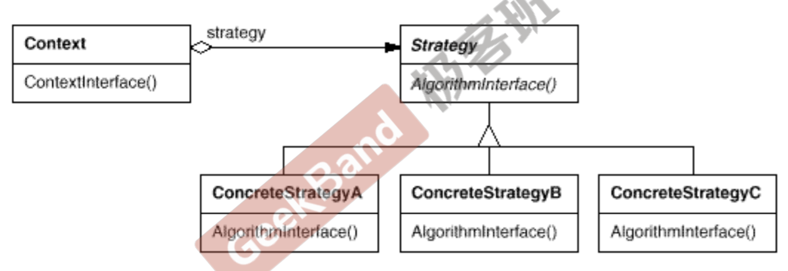

# 动机

在软件构建过程中，某些对象使用的**算法**可能**多种多样，经常改变**，如果将这些算法都编码到对象中，将会使对象变得异常复杂； 如果因为需求的改变而增加算法，就会违背开放封闭原则。而且有时候支持不使用的算法也是一个性能负担。因为不需要用到的代码也被加载到内存中，占用了空间，降低了内存的使用率。（但是策略模式能解决但是并不是为了解决不被使用的算法也加载进内存的问题）

如何在运行时根据需要透明地更改对象的算法？将算法与对象本身解耦？

# 定义

定义一系列算法，把它们一个个封装起来，并且使它们可互 相替换（变化）。该模式使得**算法（变化）**可独立于使用它的**客户程序(稳定)**而变化（扩展，子类化）。

# 结构

Context和Strategy是聚合关系，代表了整体和部分的关系，并且整体和部分的声明周期不一定相同。，Strategy是整体，Context是局部。

# 要点

- Strategy及其子类为组件提供了一系列可重用的算法，从而可以使得类型在运行时方便地根据需要在各个算法之间进行切换。
- 这里所说的可重用不是“代码”层面可重用，而是“二进制文件”层面的可重用
- Strategy模式提供了用条件判断语句以外的另一种选择，消除条件判断语句，就是在解耦合。含有许多条件判断语句（可能会增加）的代码通常都需 要Strategy模式。但是，如果ifelse的分支肯定不会变，可以不用Strategy模式。
- 如果Strategy对象没有实例变量，那么各个上下文可以共享同一个 Strategy对象，从而节省对象开销。