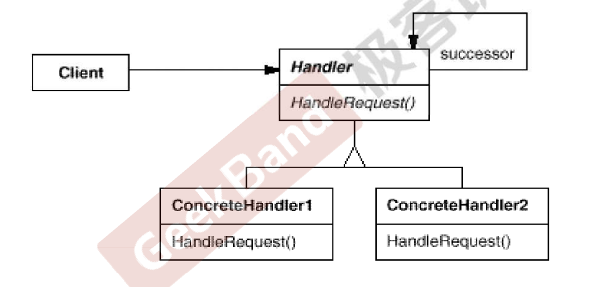
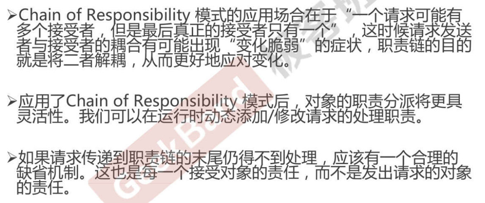

# 动机

在软件构建过程中，一个请求可能被多个对象处理，但是每个请求在运行时只能有一个接收者，如果显式指定，将必不可少地带来请求发送者和接收者的紧耦合。

如何使请求的发送者不需要指定具体的接收者？让请求的接收者自己在运行时决定来处理请求，从而使两者解耦。

# 定义

使多个对象都有机会处理请求，从而避免请求的发送者和接收者之间的耦合关系。将这些对象连成一条链，并沿着这条链传递请求，直到有一个对象处理它为止。

# 结构

# 要点

