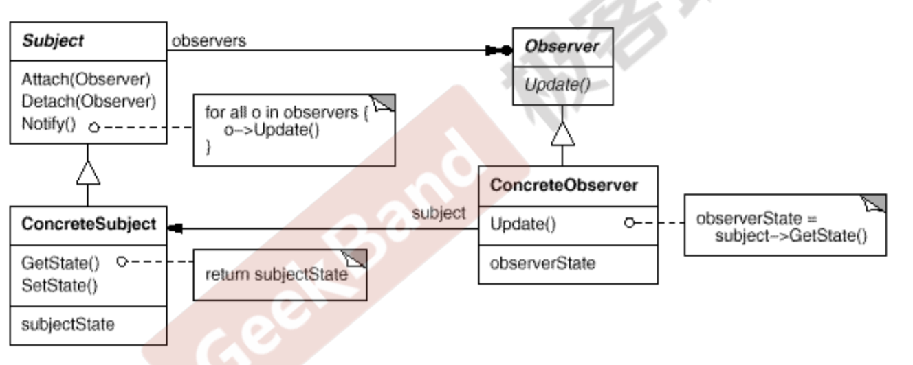

# 动机

在软件构建过程中，我们需要为某些对象建立一种“通知依赖关 系” ——一个对象（目标对象）的状态发生改变，所有的依赖对 象（观察者对象）都将得到通知。如果这样的依赖关系过于紧密， 将使软件不能很好地抵御变化。

使用面向对象技术，可以将这种依赖关系弱化，并形成一种稳定 的依赖关系。从而实现软件体系结构的松耦合。

# 定义

定义对象间的一种一对多（变化）的依赖关系，以便当一个 对象(Subject)的状态发生改变时，所有依赖于它的对象都 得到通知并自动更新。

# 结构

- 实线箭头是关联关系

# 要点

- 使用面向对象的抽象，Observer模式使得我们可以独立地改变目 标与观察者，从而使二者之间的依赖关系达致松耦合。
- 目标发送通知时，无需指定观察者（具体什么类型的观察者），通知（可以携带通知信息作 为参数）会自动传播。
- 观察者自己决定是否需要订阅通知（是否attach），目标对象对此一无所知
- Observer模式是基于事件的UI框架中非常常用的设计模式，也是 MVC模式的一个重要组成部分。