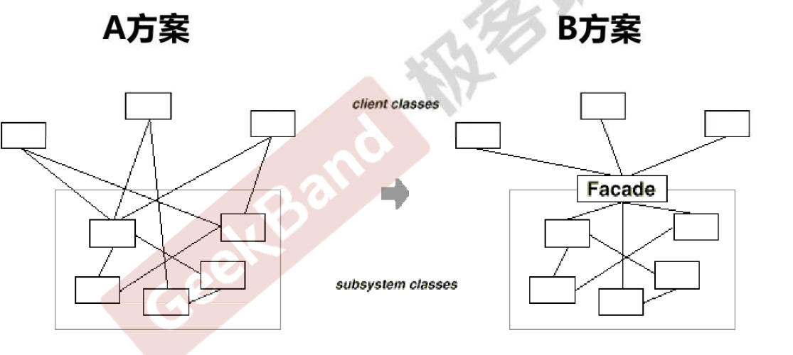
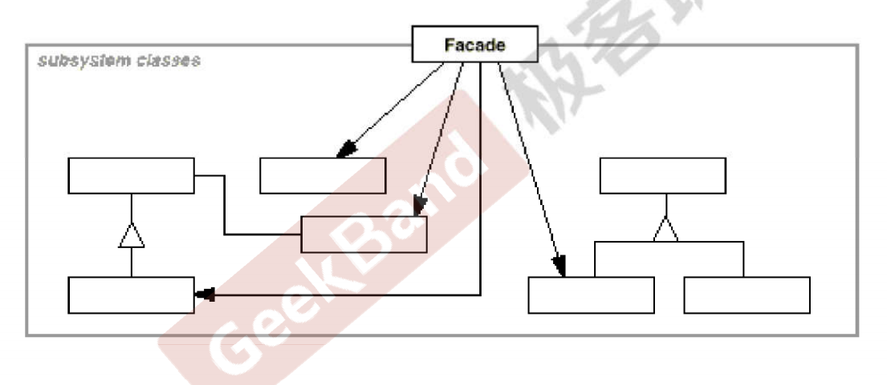

# 接口隔离 模式

## 定义

- 在组件构建过程中，某些接口之间**直接**的依赖常常会带来很多问题，甚至根本无法实现。采用添加一层间接（稳定）接口，来隔离本来互相紧密关联的接口是一种常见的解决方案。

## 典型模式

- Facade门面模式
- Proxy
- Adapter
- Mediator

# 门面模式

## 动机

- A方案中问题在于组件的客户端和组件中各种复杂的子系统有了过多的耦合，随着外部客户程序和各子系统的演化，这种过多的耦合面临很多变化的挑战。

- 如何简化外部客户端程序和系统间的交互接口？如何将外部程序的演化和内部子系统的变化之间的依赖相互解耦？

## 定义

- 为子系统中的一组接口提供一个一致（稳定）的界面，Facade模式定义了一个**高层的接口**，这个接口使得这个子系统更加容易使用（复用）

## 结构

## 要点

- 从客户程序来看，Facade模式简化了整个组件系统的接口。对于组件内部和外部客户程序，达到一种解耦作用。内部子系统的任何变化不会影响到Facade高层接口的变化。
- Facade模式更注重从架构层次取看整个系统。而不是单个类的层次。Facade很多时候更是一种架构设计模式。
- Facade模式并非一个集装箱，可以任意地放进任何多个对象。Facade模型中的组件的内部应该是“相互耦合关系比较大的一系列组件”，而不是一个简单的功能集合。